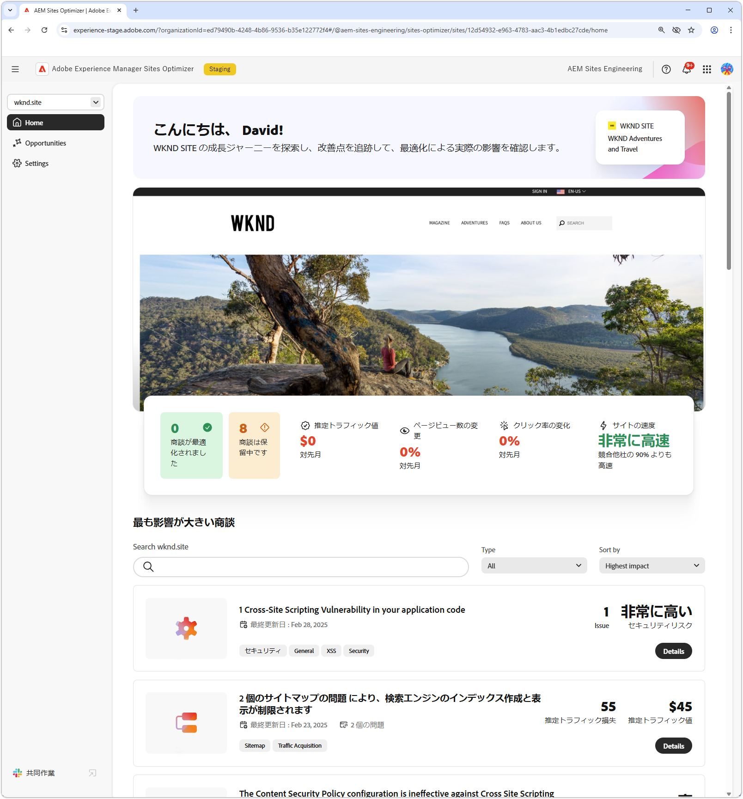
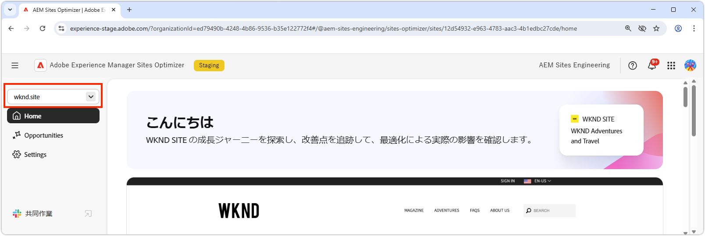
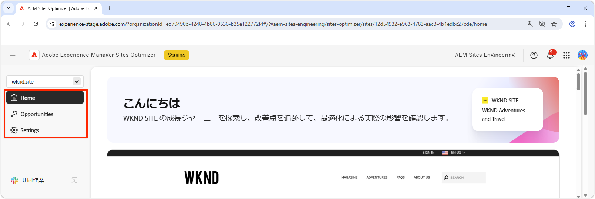
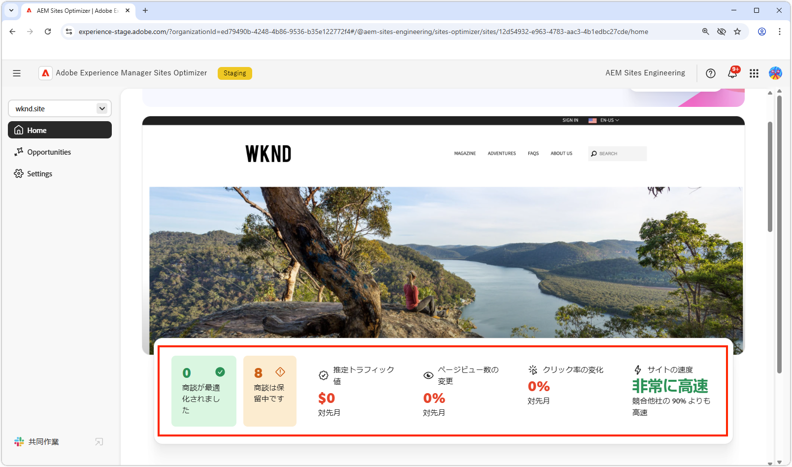
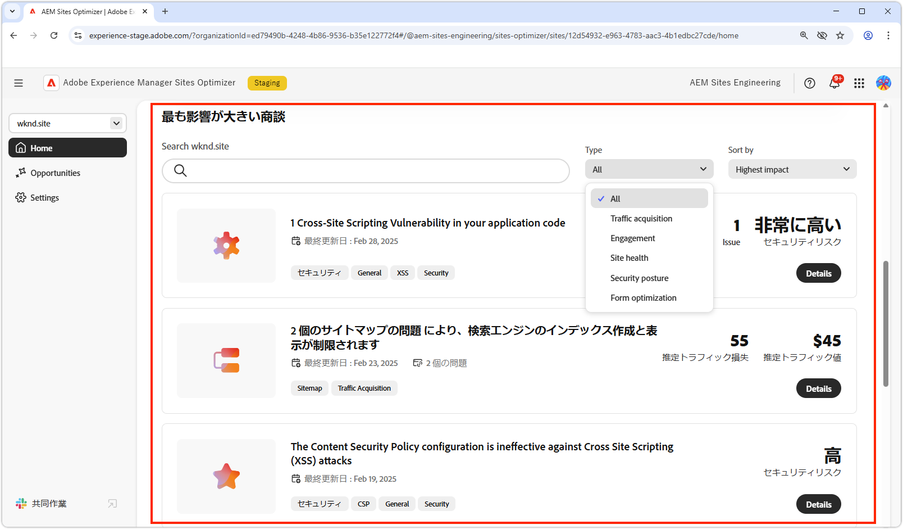
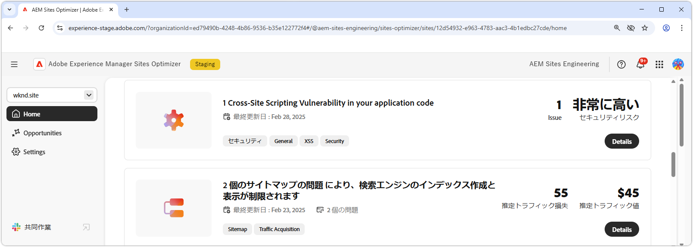

# Sites Optimizerの基本

{align="center"}

Sites Optimizer ダッシュボードには、サイトのパフォーマンスの概要と改善の機会が表示されます。

## ドメインマネージャー

{align="center"}

Domain Manager のコンテキストメニューから、評価および最適化するAEM サイトをドメインごとに選択できます。 Sites Optimizerは、[Cloud Manager](https://experienceleague.adobe.com/en/docs/experience-manager-cloud-service/content/implementing/using-cloud-manager/edge-delivery-sites/add-edge-delivery-site) に登録されているすべての実稼動AEM サイトのリストを提供します。

## ナビゲーション

{align="center"}

「ナビゲーション」セクションを使用すると、Sites Optimizer内の次のような場所から、Sites Optimizerの主要な領域にすばやく永続的にアクセスできます。

* **ホーム** - メインのダッシュボードで、サイトのパフォーマンスと改善の機会の概要を提供します。
* **機会** - Sites Optimizerによって特定された機会を表示および管理します。これには、最適化されている機会と最適化されていない機会が含まれます。
* **設定** – 監視するサイトや受け取る通知など、Sites Optimizerの設定を指定します。

## サイトの概要

{align="center"}

「サイトの概要」セクションには、サイトのパフォーマンス、Sites Optimizerが時間の経過と共にサイトを改善した方法、改善の機会のスナップショットが表示されます。 主な指標は次のとおりです。

* **最適化された機会** - ビジネスパフォーマンスを向上させるために改善された、特定された機会の数。
* **オポチュニティ保留中** – 最適化されていない可能性のある改善点の数。ビジネスが向上する領域を表します。
* **プロジェクトトラフィック値** – 先月と比較した web サイトのトラフィックの推定価値の変化で、ビジネス目標に対する Site Optimizer の貢献を測定するのに役立ちます。
* **ページビュー数の変化** - ユーザーの関心とコンテンツの有効性を反映して、サイトの閲覧頻度がパーセンテージで変化しました。
* **クリック率の変化** - ユーザーのクリック頻度の変化率。エンゲージメントとコンバージョンの可能性のシフトを示します。
* **サイト速度** - Web サイトの速度と操作性の主要な指標で、ユーザーエクスペリエンスと検索ランキングに影響を与えます。

## 影響の大きいオポチュニティ

{align="center"}

「影響の大きい機会」セクションでは、サイトのパフォーマンスに対する潜在的な影響に基づいて、改善予定の最も重大な機会がハイライト表示されます。 これらの機会はタイプ別に整理されているので、最適化作業の優先順位を簡単に付けることができます。

商談は、キーワード、タグ、URL または [ 商談タイプ ](../opportunity-types/overview.md) でフィルタリングでき、改善の最も重要な領域に集中することができます。

### オポチュニティの詳細

{align="center"}

オポチュニティごとに、問題の簡単な説明、サイトに与える可能性のある影響、詳細へのリンクが提供されます。 ステータスも確認でき、最適化されているかどうかや、まだ保留中かどうかを示します。

* **オポチュニティのタイトル** – 問題の概要と、サイトのパフォーマンスに対する潜在的な影響。
* **最終更新日** – 商談が最後にSites Optimizerによって新しいデータで更新された日付。
* **問題数** - サイトで識別された問題のインスタンスの数。
* **商談タイプ** – この商談の [ タイプ ](../opportunity-types/overview.md) この商談はその一部です – トラフィック獲得、エンゲージメント、サイトの正常性など）。

各オポチュニティの概要情報はタイプによって異なり、収益への影響、トラフィック、ユーザーエンゲージメント、セキュリティの脅威に関する詳細が含まれる場合があります。

商談の詳細を表示するには、「**詳細**」ボタンをクリックします。

Sites Optimizerのダッシュボードとレポートからオポチュニティを除外するには、「**無視**」ボタンをクリックします。
