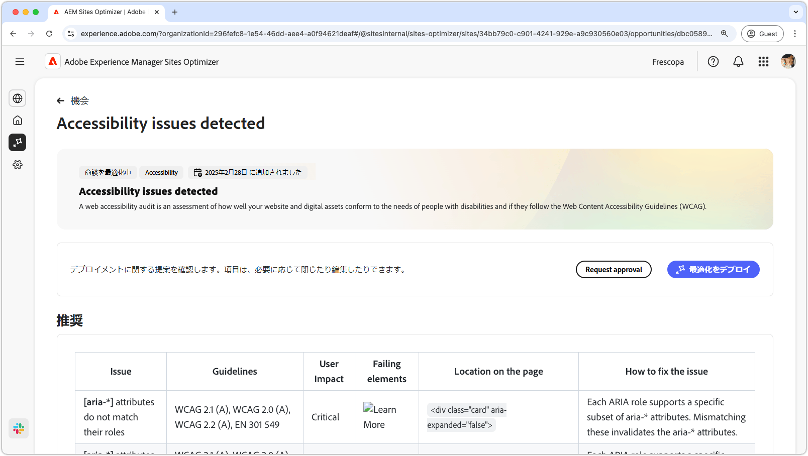
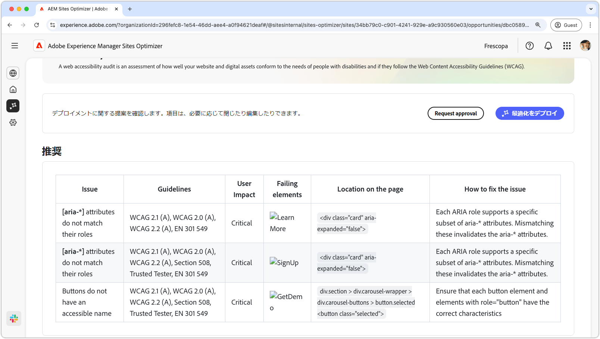
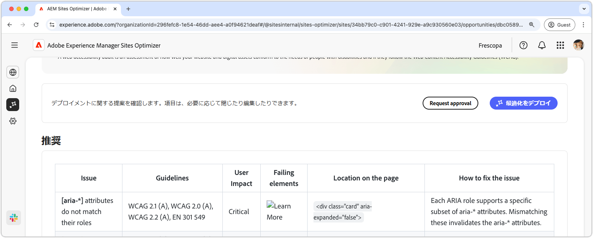

# アクセシビリティの問題の機会

{align="center"}

アクセシビリティの問題の機会では、web サイトが障害のある人物のニーズにどの程度適合しているか、また [Web コンテンツアクセシビリティガイドライン（WCAG）](https://www.w3.org/TR/WCAG21/)に準拠しているかどうかを識別します。サイトが WCAG にどの程度準拠しているかを評価することで、包括的なオンラインエクスペリエンスを作成するのに役立ちます。その結果、視覚、聴覚、認知、運動に障がいのあるユーザーがコンテンツを移動、操作し、メリットを得ることができます。この機能は、倫理的な理由から不可欠であるだけでなく、法的要件への準拠を促進し、SEO を改善し、オーディエンスのリーチを拡大して、ユーザーエクスペリエンスと業績の両方を向上できます。

## 自動特定

{align="center"}

**アクセシビリティの問題の機会**&#x200B;では、web サイトのアクセシビリティの問題が特定されます。次の内容が含まれます。

* **問題** - 特定のアクセシビリティの問題が見つかった。
* **ガイドライン** - 問題が違反している [WCAG ガイドライン ID](https://www.w3.org/TR/WCAG21/)。
* **ユーザーへの影響** - 障害のあるユーザーへの影響の評価。
* **失敗した要素** - 問題の影響を受ける web ページ上の HTML 要素。
* **ページ上の位置** - 問題の影響を受けるページ上の要素の HTML スニペット。

## 自動提案

{align="center"}

自動提案では、「**問題の解決方法**」フィールドに AI 生成レコメンデーションが提供され、問題を解決するための実行内容に関する規範的なガイダンスが提供されます。

## 自動最適化

[!BADGE Ultimate]{type=Positive tooltip="Ultimate"}

{align="center"}

Sites Optimizer Ultimate には、見つかった脆弱性に対して自動最適化をデプロイする機能が追加されています。

>[!BEGINTABS]

>[!TAB 最適化のデプロイ]

{{auto-optimize-deploy-optimization-slack}}

>[!TAB 承認のリクエスト]

{{auto-optimize-request-approval}}

>[!ENDTABS]

## 関連トピック

[フォームのアクセシビリティの問題の機会](/help/documentation/opportunities/forms-accessibility-issues.md)