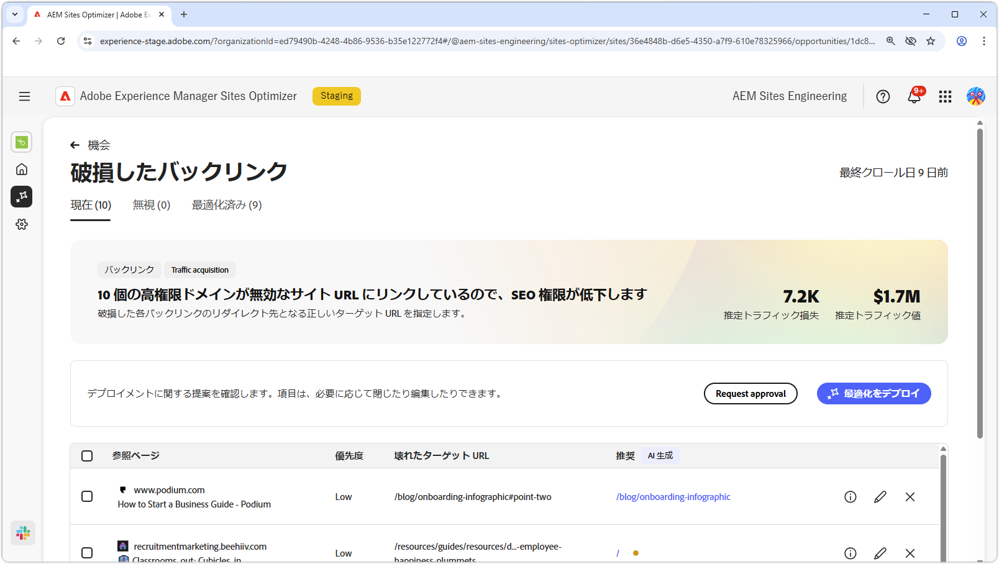
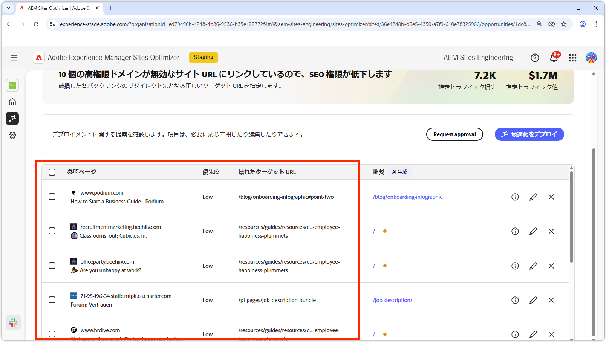
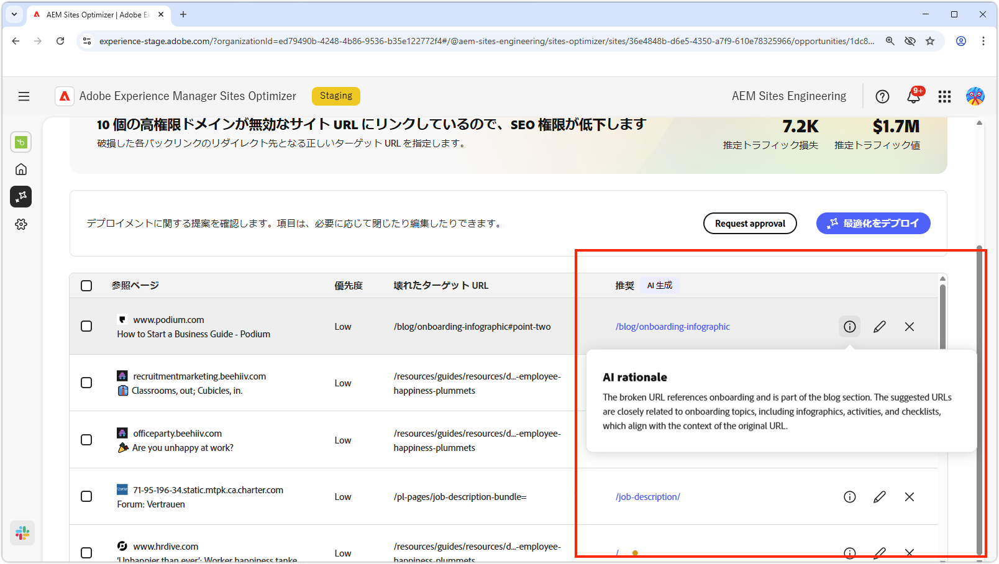
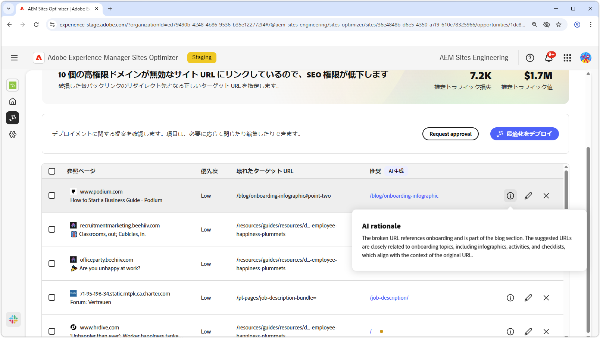
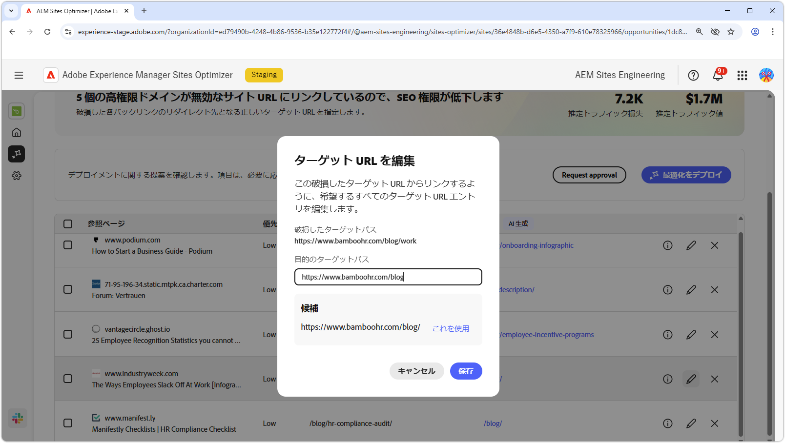
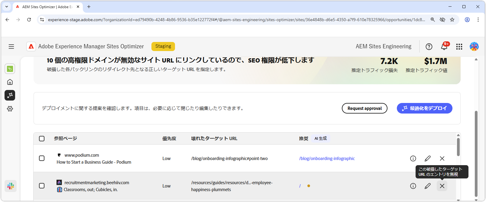
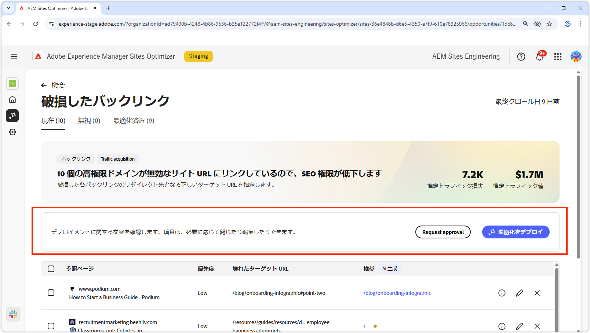
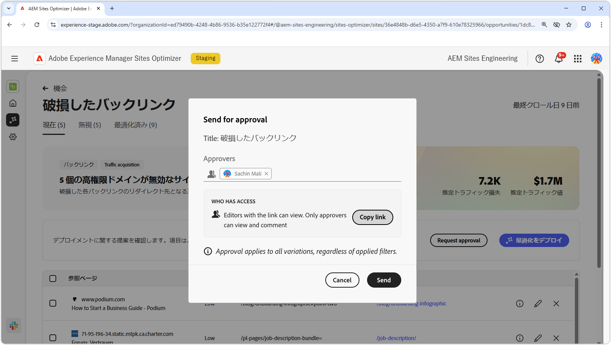

# 破損したバックリンクの機会

{align="center"}

破損したバックリンクの機会は、404 エラーにつながる他の web サイトからサイトへのリンクを特定します。検索エンジンはバックリンクを使用して検索の関連性を判断するので、破損したリンクはサイトの SEO と検出性に悪影響を与える場合があります。これらの問題は、URL の変更やリンクされたページの削除などの要因によって発生する場合があります。

破損したバックリンクの機会では、ページの上部に、問題の概要と、サイトやビジネスに与える影響を含む概要が表示されます。

* **見込みトラフィック損失** - 破損したバックリンクの問題による推定トラフィック損失。
* **見込みトラフィック値** - 損失したトラフィックの推定値。

## 自動特定

{align="center"}

破損したバックリンクの機会では、サイト上の破損したバックリンクがすべて一覧表示されます。これには、次の内容が含まれます。

* **参照ページ** - 破損したリンクが含まれている web サイトドメイン。
* **優先度** - 高、中、低。TODO に基づいて、破損したリンクが SEO に与える影響を示します。
* **破損したターゲット URL** - リンク先のサイト上の存在しない URL。

## 自動提案

{align="center"}

また、破損したバックリンクの機会は、破損した URL を web サイトのリダイレクトする必要があるページに関する AI 生成の提案も提供します。提案は、破損した URL を構成するテキストと、提案されたページの内容に基づいています。

>[!BEGINTABS]

>[!TAB AI の論理的根拠]

{align="center"}

提案された URL の AI の論理的根拠を表示するには、**情報** アイコンを選択します。論理的根拠では、提案された URL が破損したリンクに最適であると AI が判断する理由を説明します。AI の意思決定プロセスを理解し、提案を受け入れるか却下するかについて情報に基づく決定を下すのに役立ちます。

>[!TAB ターゲット URL の編集]

{align="center"}

AI 生成の提案に同意できない場合は、**編集アイコン** を選択して、提案された URL を編集できます。編集により、破損したリンクに最も適している URL を手動で入力できます。また、Sites Optimizer は、破損したリンクに適しているサイト上の他の URL も一覧表示します。

>[!TAB エントリを無視]

{align="center"}

破損したターゲット URL を含むエントリを無視することを選択できます。 を選択すると、機会リストから破損したバックリンクが削除されます。無視された破損したバックリンクは、機会ページの上部にある「**無視**」タブから再度関与できます。

>[!ENDTABS]

## 自動最適化

[!BADGE Ultimate]{type=Positive tooltip="Ultimate"}

{align="center"}

Sites Optimizer Ultimate には、破損したバックリンクの自動最適化をデプロイする機能が追加されています。「**自動最適化**」ボタンを選択すると、AEM サイトのリダイレクトルールが自動的に更新され、**破損したターゲット URL** が&#x200B;**提案された URL** にマッピングされます。この機能により、**参照ページ**&#x200B;の破損したリンクに従って web サイト訪問者と検索ボットがサイト上の正しいページにリダイレクトされ、SEO とユーザーエクスペリエンスが向上します。

>[!BEGINTABS]

>[!TAB 最適化のデプロイ]

{align="center"}

「**最適化をデプロイ**」を選択すると、AEM サイトのリダイレクトルールが更新され、**破損したターゲット URL** が&#x200B;**提案された URL** にマッピングされます。この機能により、**参照ページ**&#x200B;の破損したリンクに従って web サイト訪問者と検索ボットがサイト上の正しいページにリダイレクトされ、SEO とユーザーエクスペリエンスが向上します。

>[!TAB 承認のリクエスト]

{align="center"}

{{auto-optimize-request-approval}}

>[!ENDTABS]
