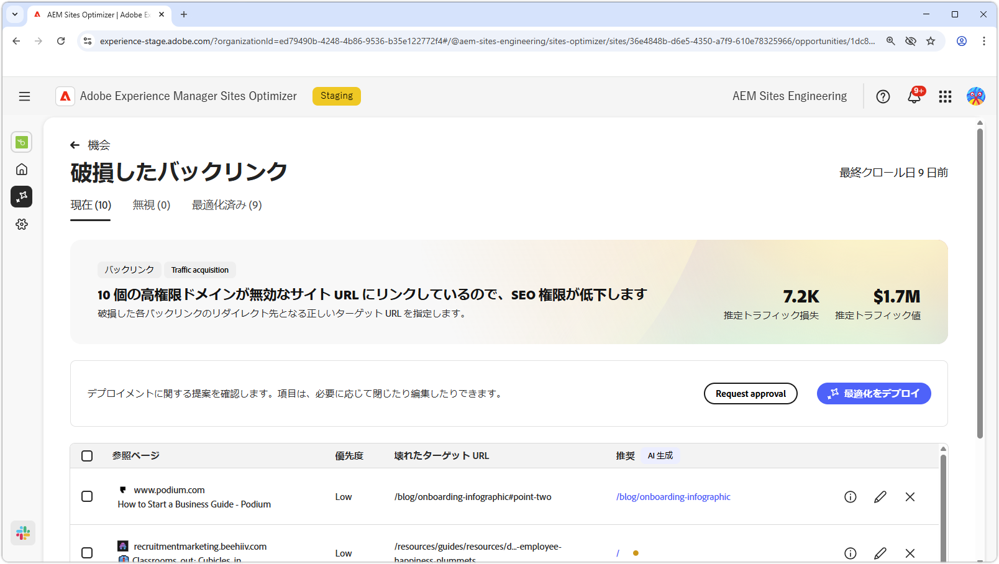
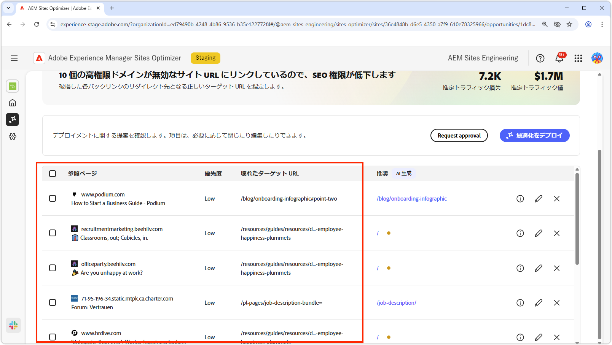
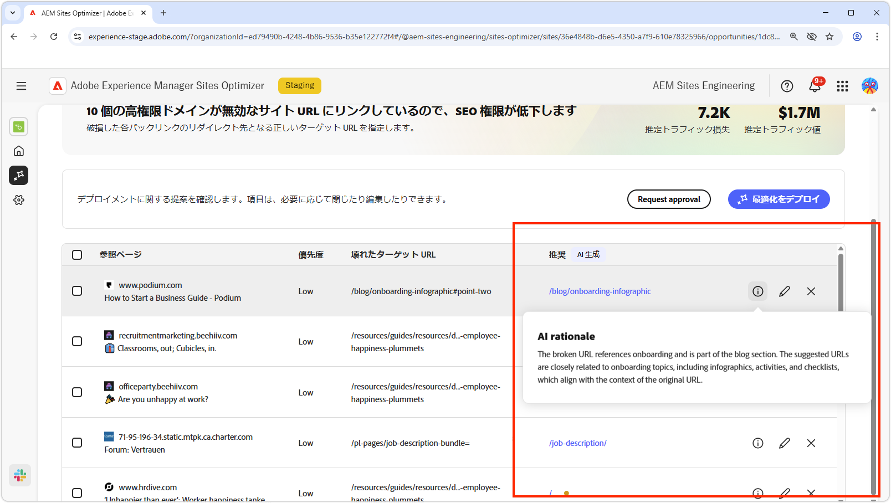
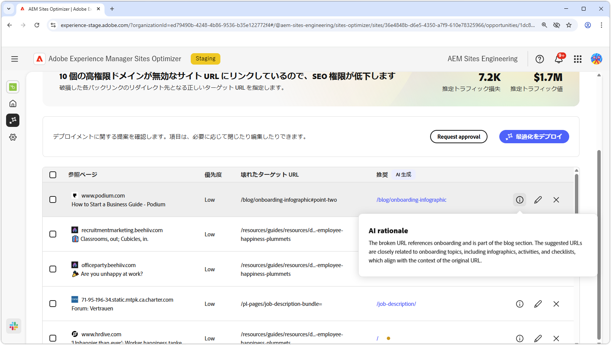
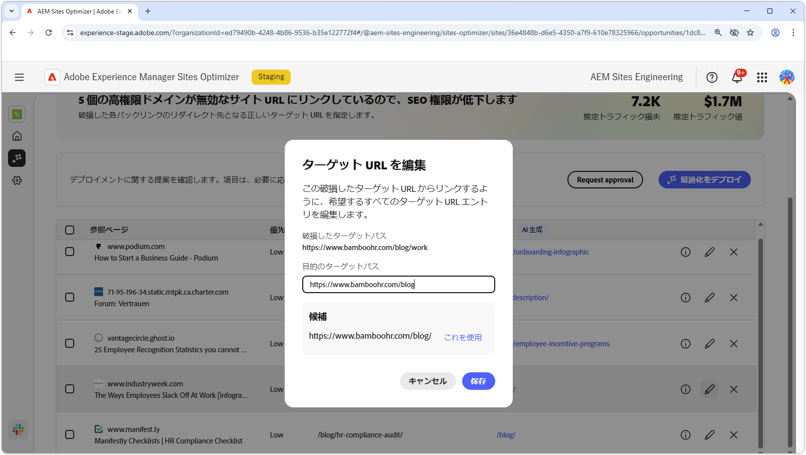
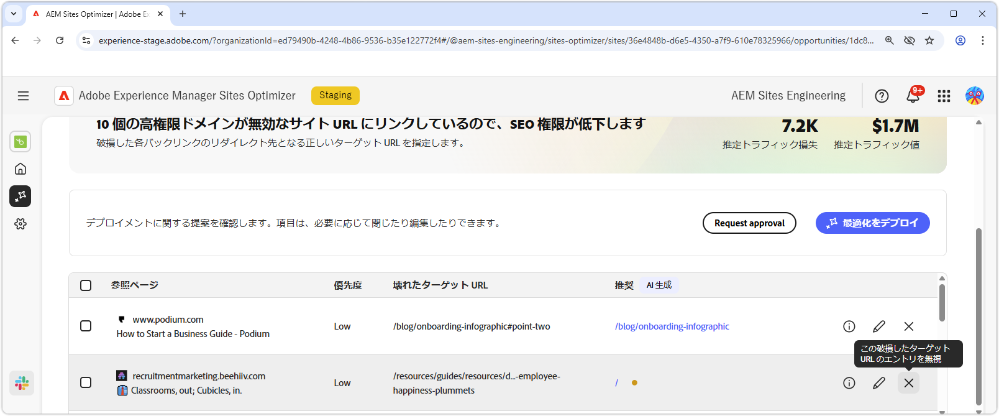

# 破損したバックリンクの機会

<!--{align="center"}-->

>[!VIDEO](https://video.tv.adobe.com/v/3483254/?captions=jpn&learn=on&enablevpops)

壊れたバックリンクの機会は、サイト上の存在しない（404）ページを指す外部リンクを識別します。 これにより、検索エンジンはバックリンクを利用して関連性と信頼性を評価するため、リファラルトラフィックが低下し、SEO価値が低下します。 これらの問題は、URLが変更されたり、コンテンツが削除されたり、適切なリダイレクトがなければページを利用できなくなったりした場合に発生します。 AEM Sites Optimizerなら、破損しているあらゆるバックリンクを特定し、特定のAI レコメンデーションを提供して、ワンクリックでそれらを修正できます。これらはすべて、単一の一元的なビューで確認できます。

## 自動特定

<!--{align="center"}-->

AEM Sites Optimizerは、外部データソースを継続的にスキャンし、サイト上の404 ページ以外のページを指すバックリンクを検出します。 データは、Google Search Console、[Operational Telemetry](https://experienceleague.adobe.com/ja/docs/experience-manager-cloud-service/content/sites/operational-telemetry-for-aem-as-a-cloud-service)、サードパーティのSEO プラットフォームなど、複数のソースから集約されます。 自動識別オポチュニティは、壊れたURLにリンクしている外部ドメインを特定し、ドメイン権限や予想されるトラフィックおよびリンクのエクイティ損失などの影響に基づいて優先順位を付けます。

このオポチュニティには、次の詳細を含む、特定されたすべての問題が一覧表示されます。

* **ドメインとページを参照** – 壊れたリンクを含む外部ページまたはドメイン。
* **優先度** – 破損したリンクがSEO プロセスに与える影響を示す、高、中、低。
* **壊れたターゲット URL** - リンク先のサイトに存在しないURLです。

## 自動提案

<!--{align="center"}-->

特定された破損しているバックリンクごとに、AEM Sites OptimizerはトラフィックとSEOの価値を回復するための最も適切な場所を提案します。 次の項目を分析することで、バックリンクの意図を判断します。

* URL構造とトークン
* アンカーテキスト
* 参照ページのタイトルとコンテキスト

このインテントは、既存のサイトコンテンツと照合され、最も関連性の高い配信先ページを特定します。 壊れた各URLは、正確な置換ページまたは最も近い関連ページのいずれかにマッピングされます。 適切な宛先を決定できない場合、手動レビューのために問題が表示されます。

>[!BEGINTABS]

>[!TAB AI の論理的根拠]

<!--{align="center"}-->

提案された URL の AI の論理的根拠を表示するには、**情報** アイコンを選択します。 論理的根拠では、提案された URL が破損したリンクに最適であると AI が判断する理由を説明します。 AI の意思決定プロセスを理解し、提案を受け入れるか却下するかについて情報に基づく決定を下すのに役立ちます。

>[!TAB ターゲット URL の編集]

<!--{align="center"}-->

AI 生成の提案に同意できない場合は、**編集アイコン** を選択して、提案された URL を編集できます。 編集により、破損したリンクに最も適している URL を手動で入力できます。 また、Sites Optimizer は、破損したリンクに適しているサイト上の他の URL も一覧表示します。

>[!TAB エントリを無視]

<!--{align="center"}-->

ターゲットとなる破損した URL を含むエントリを無視することを選択できます。  を選択すると、機会リストから破損したバックリンクが削除されます。 無視された破損したバックリンクは、機会ページの上部にある「**無視**」タブから再度関与できます。

>[!ENDTABS]

## 自動最適化

<!--[!BADGE Ultimate]{type=Positive tooltip="Ultimate"}-->

提案をレビューして承認したら、**最適化をデプロイ**&#x200B;をクリックできます。 次に、AEM Sites Optimizerは、実装内でのリダイレクトの管理方法に基づいて、オーサリング環境に修正を適用します。 その後、AEM オーサーは、コンテンツ管理システム（CMS）から変更内容を公開できます。

設定に応じて、修正は、既存のデプロイメントワークフロー内のコンテンツまたはコードの変更として適用されます。 最適化プロセスには、次の手順が含まれます。

* **検証** – 変更が期待どおりに機能することを保証し、デプロイメントの前にリグレッションを発生させません。
* **デプロイメント** - AEMでのコンテンツの更新や、CI/CD パイプラインを介したコードのデプロイメントなど、既存のプロセスを通じて変更を適用します。
* **権限チェック** - ユーザーが変更をデプロイするための適切な権限を持っていることを確認します。 そうでない場合は、ダウンロード可能なリダイレクトリストやコードパッチなどの代替出力が提供されます。

このプロセスにより、リダイレクトが正確に実装され、リリース前に検証され、既存の設定やガバナンスプロセスに沿ったものになります。
