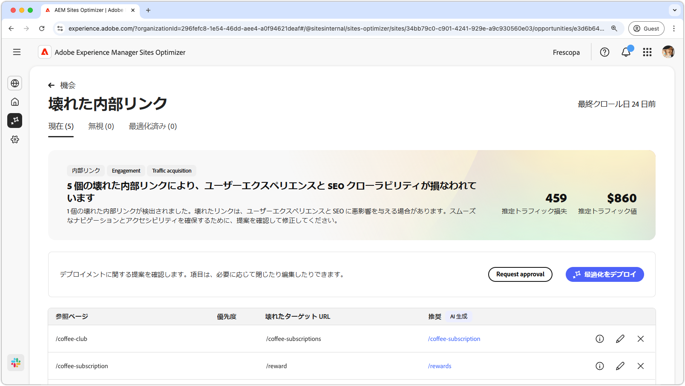
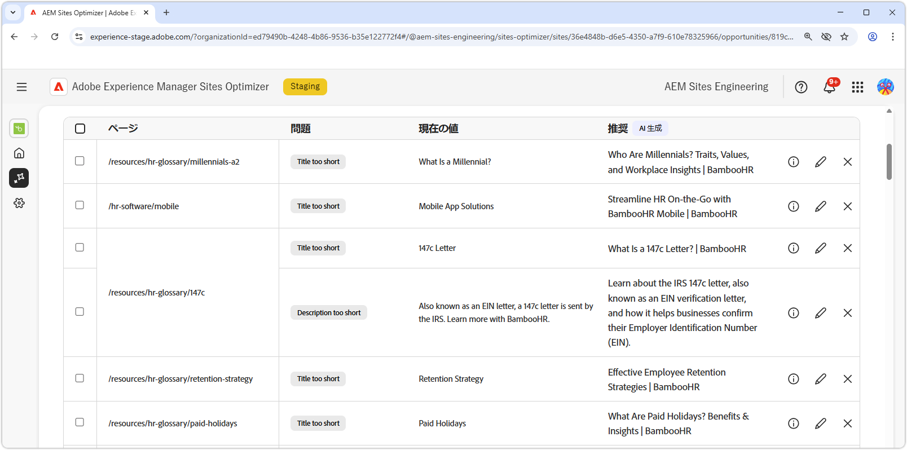

# 破損した内部リンクの機会

{align="center"}

破損した内部リンクは、検索エンジンがサイトをインデックス作成する機能に影響し、ユーザーエクスペリエンスと検索エンジンの最適化の両方に悪影響を及ぼします。この問題を解決するために、破損した内部リンクの機会では破損した URL を指摘し、有効なリンクの更新を提案します。これらの問題に対処することで、ユーザーエンゲージメントが向上し、スムーズなナビゲーションとアクセシビリティが確保されます。

破損した内部リンクの機会では、ページの上部に、問題の概要と、サイトやビジネスに与える影響を含む概要が表示されます。

* **見込みトラフィック損失** - 破損した内部リンクの問題による推定トラフィック損失。
* **見込みトラフィック値** - 損失したトラフィックの推定値。

## 自動特定

<!---{align="center"}-->

破損した内部リンクの機会では、ページ上の破損した内部リンクをすべて自動的に特定して一覧表示します。これには、次の内容が含まれます。

* **参照ページ** - 破損したリンクが含まれているページ。
* **破損したターゲット URL** - 破損した内部リンク。
* **提案** - 破損したリンクを更新する方法に関する AI 生成の提案。詳しくは、自動提案の節を参照してください。

## 自動提案

<!--{align="center"}-->

破損した内部リンクの機会では、破損したリンクを更新する方法に関する AI 生成の提案を提供します。これらの提案は、ターゲットとなる破損した URL に基づいて、適切な代替 URL を提供します。 を選択すると、提案された更新の AI 生成の論理的根拠が提供されます。

>[!BEGINTABS]

>[!TAB AI の論理的根拠]

<!--[AI rationale of broken internal links](./assets/broken-internal-links/auto-suggest-ai-rationale.png) -->

提案された URL の AI の論理的根拠を表示するには、 アイコンを選択します。論理的根拠では、提案された URL が破損したリンクに最適であると AI が判断する理由を説明します。また、AI の意思決定プロセスを理解し、提案を受け入れるか却下するかに関する情報に基づいて決定するのにも役立ちます。

>[!TAB ターゲット URL の編集]

<!--{align="center"}-->

AI 生成の提案に同意できない場合は、**編集アイコン** を選択して、提案されたリンク値を編集できます。この機能を使用すると、目的のリンクを手動で入力できます。編集ウィンドウには、リンクの&#x200B;**破損したターゲットパス**、リンクを手動で編集できる&#x200B;**目的のターゲットパス**、AI 生成の提案を含むフィールドが含まれます。編集が完了したら、「**保存**」をクリックして破損したリンクのエントリを更新します。リンクが編集されたことを示す黄色のドットが、エントリフィールドに表示されます。

>[!TAB エントリを無視]

<!--{align="center"}-->

ターゲットとなる破損した URL を含むエントリを無視することを選択できます。 を選択すると、機会リストからエントリが削除されます。無視されたエントリは、機会ページの上部にある「**無視**」タブから再度関与できます。

>[!ENDTABS]

## 自動最適化

[!BADGE Ultimate]{type=Positive tooltip="Ultimate"}

<!---{align="center"}-->

Sites Optimizer Ultimate には、機会によって検出された破損したリンクに対して自動最適化をデプロイする機能が追加されています。<!--- TBD-need more in-depth and opportunity specific information here. What does the auto-optimization do?-->

>[!BEGINTABS]

>[!TAB 最適化のデプロイ]

{{auto-optimize-deploy-optimization-slack}}

>[!TAB 承認のリクエスト]

{{auto-optimize-request-approval}}

>[!ENDTABS]

