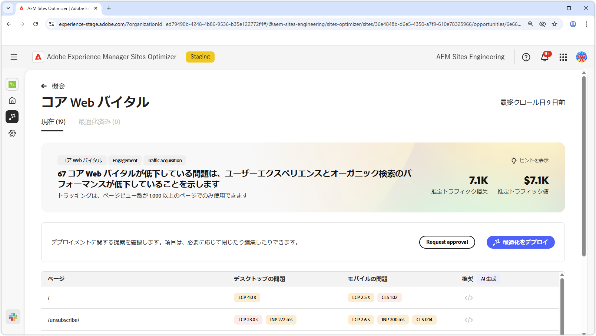
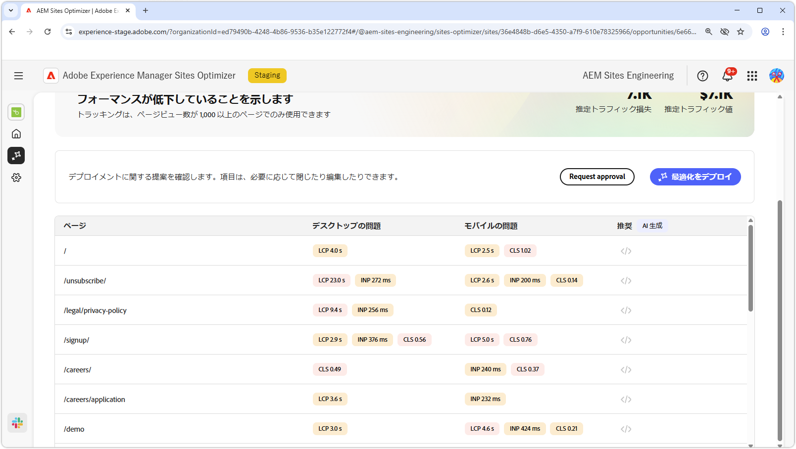

# Core web vitals opportunity

{align="center"}

重要な web バイタルオポチュニティは、web ページのユーザーエクスペリエンスとオーガニック検索パフォーマンスを低下させる可能性のある問題を特定します。 これらの問題は、カスタムフォント、最適化されていない JavaScript の依存関係、サードパーティスクリプトなど、様々な要因によって発生します。 Web の重要なバイタルオポチュニティは、これらの欠陥のある要素を指し、web ページのパフォーマンスを向上させる可能性のある修正を提案します。 分析できるのは、1000 ページビュー以上のページのみです。

まず、Core Web Vitals オポチュニティでは、問題の概要と、その問題がサイトおよびビジネスに与える影響を含む概要をページの上部に表示します。

* **予測されるトラフィック損失** - パフォーマンスしきい値を下回るコア web バイタルによる推定トラフィック損失。
* **予測トラフィック値** – 失われたトラフィックの予測値。

## 自動識別

{align="center"}

ページの下部に、現在のすべてのイシューが、次のようにグループ化されてリストされます。

* **モバイルの問題** - ページのモバイルバージョンに影響を与える問題のリスト。
* **デスクトップの問題** - ページのデスクトップバージョンに影響を与える問題のリスト。

各問題はテーブルに表示され、「**ページ**」列には影響を受けるページエントリが示されます。

さらに、これらの問題は、コアウェブバイタルレポートの標準的なパフォーマンス指標である largest contentful paint **LCP**、interaction to next paint **INP**、累積レイアウトシフト **CLS** によってもグループ化されています。

## 自動候補

{align="center"}

Web の中心となる重要なオポチュニティは、AI が生成した修正提案を提供します。 「候補」ボタンをクリックすると、パフォーマンス指標 **LCP**、**INP** および **CLS** をカテゴリとして含む新しいウィンドウが表示されます。 これらのカテゴリを切り替えて、特定の問題のリストを表示できます。

各カテゴリには複数の問題を含めることができるので、下にスクロールして、問題と推奨事項の完全なリストを確認してください。  さらに、各指標に対して、モバイルとデスクトップの両方のパフォーマンスゲージが 2 つあります。

## [!BADGE Ultimate] を自動最適化{type=Positive tooltip="Ultimate"}

{align="center"}

Sites Optimizer Ultimateには、web の中心業務のオポチュニティで見つかった問題に対して自動最適化をデプロイする機能が追加されています。<!--- TBD-need more in-depth and opportunity specific information here. What does the auto-optimization do?-->

>[!BEGINTABS]

>[!TAB  最適化のデプロイ ]

{{auto-optimize-deploy-optimization-slack}}

>[!TAB 承認のリクエスト]

{{auto-optimize-request-approval}}

>[!ENDTABS]

