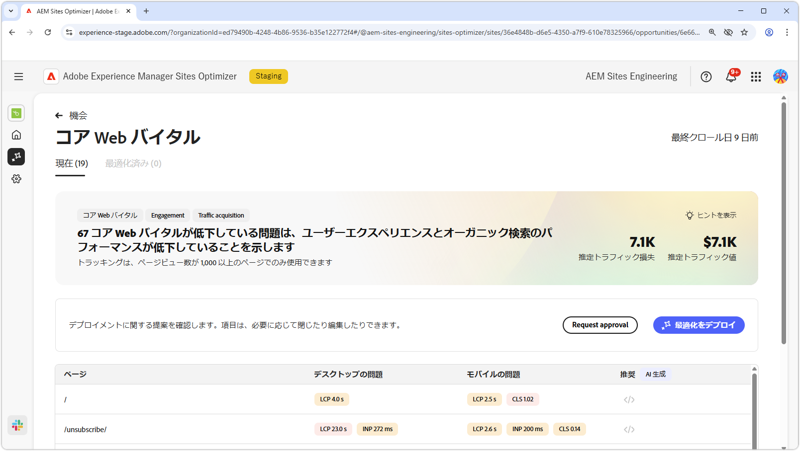
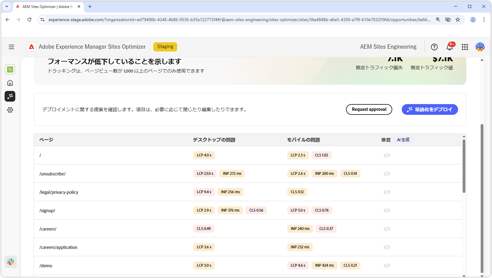

# コア web バイタルの機会

<!--{align="center"}-->

>[!VIDEO](https://video.tv.adobe.com/v/3483371/?learn=on&enablevpops)

Core Web Vitalsのオポチュニティは、web サイト上で、ユーザーエクスペリエンスやオーガニック検索のパフォーマンスに対して、パフォーマンスが低いページを特定します。 これらの問題は、カスタムフォント、最適化されていないJavaScriptの依存関係、サードパーティのスクリプトなどの要因から発生する可能性があります。 Core Web Vitalsは、コンテンツの読み込み速度、ページレイアウトの安定性、オーディエンスのインタラクションに対するページのレスポンスを測定します。

AEM Sites Optimizerは、これらの問題の影響を受けるページを検出し、コードレベルで特定のAI レコメンデーションを提供し、既存の開発ワークフローを通じて修正を適用します。 分析できるのは、1000 ページビュー以上のページのみです。

## 自動特定

<!--{align="center"}-->

AEM Sites Optimizerは、[運用テレメトリ ](https://experienceleague.adobe.com/en/docs/experience-manager-cloud-service/content/sites/operational-telemetry-for-aem-as-a-cloud-service)を使用して、LCP （Largest Contentful Paint）、CLS （Cumulative Layout Shift）、INP （Interaction to Next Paint）などのCore Web Vitals指標のリグレッションを検出し、サイトパフォーマンスを継続的に監視します。 実際の利用者データを利用して、パフォーマンスの回帰を特定し、ユーザーエクスペリエンスへの影響にもとづいて問題の優先順位を付けます。

AEM Sites Optimizerには、現在のすべての問題のリストが、モバイルとデスクトップで詳細に表示されます。 **ページ**&#x200B;列は、影響を受けるページのエントリを示し、問題はLCP、INP、CLSによって分類されます。

## 自動提案

<!--{align="center"}-->

特定された各問題について、AEM Sites Optimizerは、Core Web Vitalsのパフォーマンスを向上させるための規範的なコードレベルの推奨事項を生成します。 コードリポジトリにアクセスすることで、基盤となる実装を評価します。 これにより、コンポーネント、スクリプト、スタイルの実装方法を分析し、パフォーマンス上の問題の根本原因を特定できます。 この分析にもとづいて、システムはターゲットを絞ったレコメンデーションを提供し、パフォーマンスを向上させるために必要な変更を指定するコードパッチを生成します。 各レコメンデーションは適用前にレビューすることができます。

提案ボタンをクリックすると、パフォーマンス指標LCP、INP、CLSをカテゴリとして含む新しいウィンドウが表示されます。 これらのカテゴリを切り替えて、特定の問題のリストを表示できます。 各カテゴリにはいくつかの問題が含まれる場合があるので、必ず下にスクロールして、問題と推奨事項の完全なリストを確認してください。 さらに、各指標には、モバイルとデスクトップの両方に対応する2つのパフォーマンスゲージがあります。

## 自動最適化

<!--[!BADGE Ultimate]{type=Positive tooltip="Ultimate"}-->

レコメンデーションがレビューおよび承認されたら、**最適化をデプロイ**&#x200B;をクリックできます。 AEM Sites Optimizerは、特定された問題に基づいてコードパッチを生成し、バージョン管理プロセスを通じて利用できるようにします。 最適化プロセスには、次の手順が含まれます。

* **問題作成** – 各修正に対して、明確な説明と影響を受けるURLを含む、ラベル付きのGitHub問題を作成します。
* **プルリクエスト配信** - リンクされたプルリクエストを自動的に開き、正確なコード修正が行われ、レビュー、テスト、結合の準備が整います。
* **ステータスの追跡** – 完了、部分的または失敗した試行のフォローアップのフラグ付けによる各修正を追跡します。

これらのアップデートを利用可能にする前に、AEM Sites Optimizerは検証を実行して、修正が根本的な問題に対処し、リグレッションが発生しないことを確認します。 あらゆる更新は、標準的な開発方法に従っており、本番環境にマージする前にレビューと承認が必要です。

これにより、パフォーマンスの最適化を正確におこない、検証し、既存の開発プロセスやガバナンスプロセスに統合できます。
