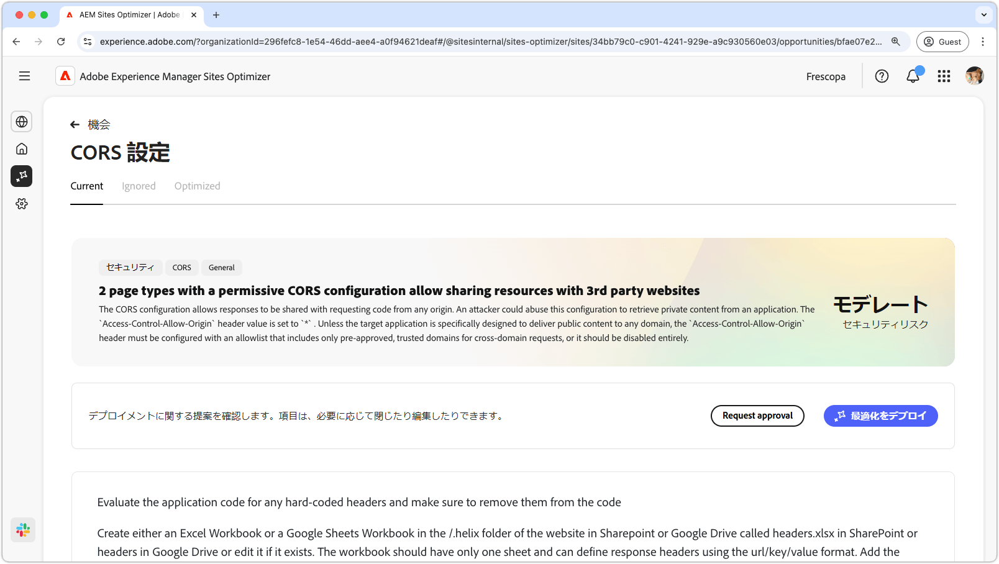
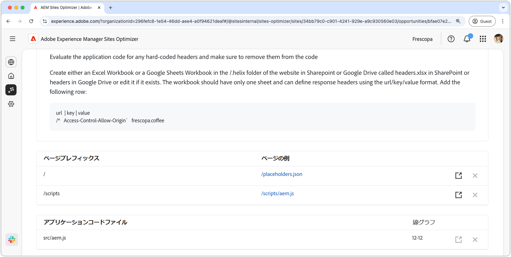

# CORS 設定の機会

{align="center"}

不正なデータアクセスから web アプリケーションを保護するには、クロスオリジンリソース共有（CORS）を適切に設定することが不可欠です。`Access-Control-Allow-Origin` ヘッダーを `*` に設定すると、任意のドメインが応答をリクエストして受信できるので、機密情報が攻撃者に公開される可能性があります。これにより、信頼できるドメインの制御された許可リストを実装したり、不要な場合は CORS を無効にしたりすることで、セキュリティを強化する機会が提供されます。安全な CORS 設定を確保すると、承認済みユーザーによるシームレスなアクセスを維持しながら、プライベートコンテンツを保護できます。

## 自動特定

{align="center"}

自動特定では、web サイトの CORS の誤った設定をスキャンし、不正アクセスの影響を受けやすい URL を検出します。これらの URL は、次の詳細と共に一番上のテーブルに一覧表示されます。

* **ページプレフィックス** - CORS の誤った設定に対して脆弱な URL パスプレフィックス。
* **ページ例** - 不正アクセスの影響を受けやすい URL の例。

## 自動提案

{align="center"}

自動提案では、CORS ポリシーの設定が緩い場合がある&#x200B;**アプリケーションコードファイル**&#x200B;とその&#x200B;**行**&#x200B;がレビュー対象として提供されます。

## 自動最適化

[!BADGE Ultimate]{type=Positive tooltip="Ultimate"}

>[!BEGINTABS]

>[!TAB 最適化のデプロイ]

{{auto-optimize-deploy-optimization-slack}}

>[!TAB 承認のリクエスト]

{{auto-optimize-request-approval}}

>[!ENDTABS]
