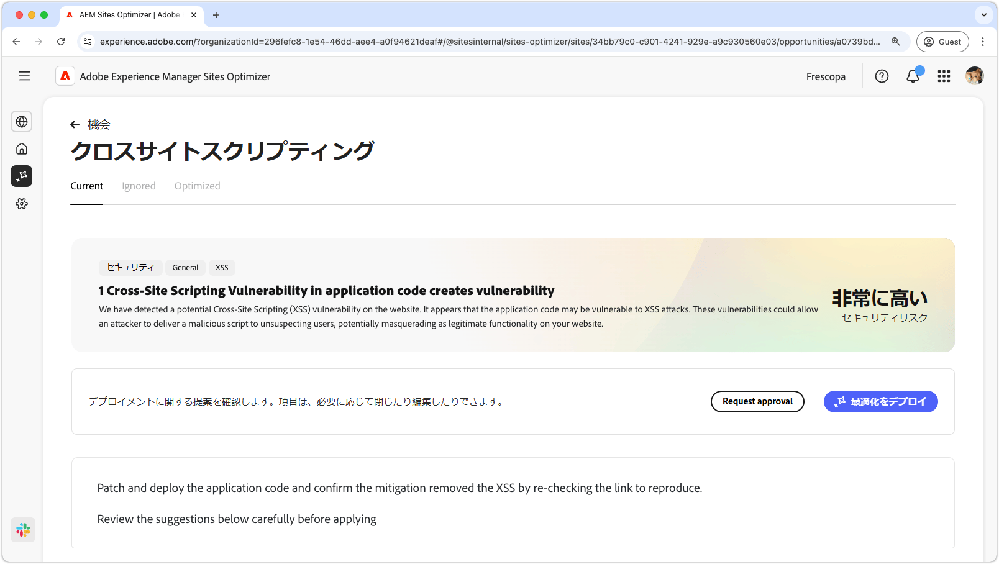
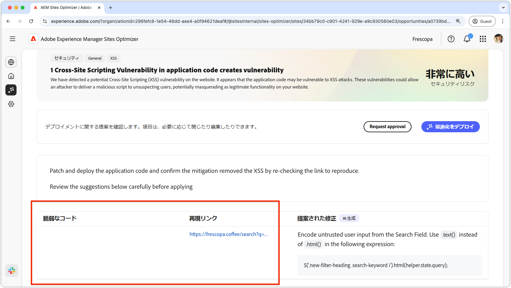
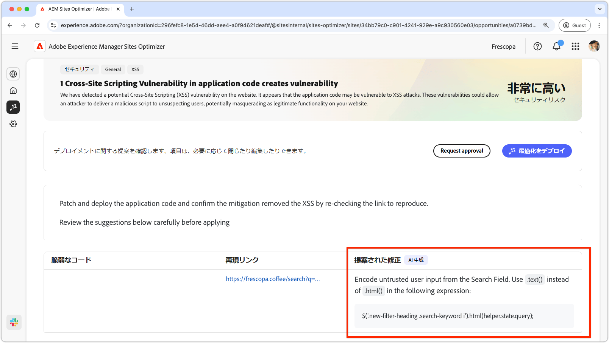

# クロスサイトスクリプティングの機会

{align="center"}

クロスサイトスクリプティングの機会により、攻撃者に悪用される可能性があるサイトコードの脆弱性を特定して修正し、他のユーザーが閲覧する web ページに悪意のあるスクリプトを挿入することができます。 これらのスクリプトは、セッション Cookie などの機密情報を盗んだり、ユーザーのパスワードの変更など、ユーザーに代わってアクションを実行したりする可能性があります。

## 自動識別

{align="center"}

* **脆弱なコード** - クロスサイトスクリプティング攻撃に対して脆弱なすべてのコード。
* **再現へのリンク** – 脆弱性が見つかったページへのリンク。

## 自動候補

{align="center"}

* **修正候補** – 脆弱性の修正方法に関して AI が生成した提案。

## 自動最適化

[!BADGE Ultimate]{type=Positive tooltip="Ultimate"}

>[!BEGINTABS]

>[!TAB  最適化のデプロイ ]

{{auto-optimize-deploy-optimization-slack}}

>[!TAB 承認のリクエスト]

{{auto-optimize-request-approval}}

>[!ENDTABS]
