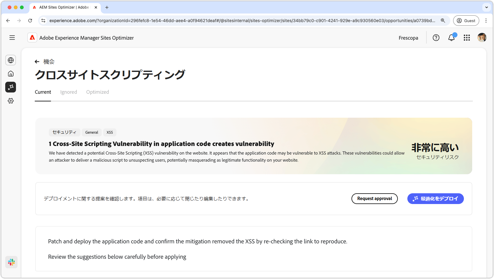
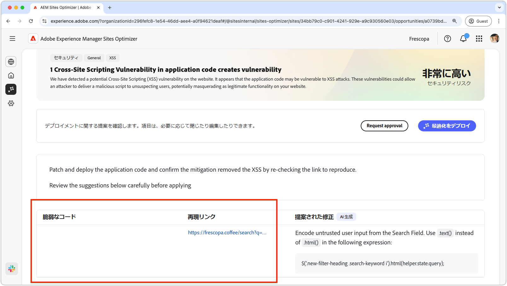
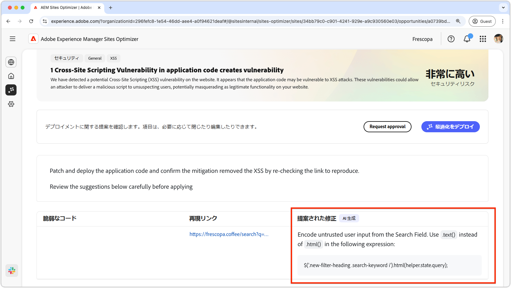

# クロスサイトスクリプティングの機会

{align="center"}

クロスサイトスクリプティングの機会は、サイトのコードの脆弱性を特定します。 次に、攻撃者が悪用して、他のユーザーが閲覧する web ページに悪意のあるスクリプトを挿入する可能性がある問題を修正します。 これらのスクリプトは、セッション Cookie などの機密情報を盗んだり、ユーザーのパスワードの変更などのアクションをユーザーに代わって実行したりする場合があります。

## 自動特定

{align="center"}

* **脆弱なコード** - クロスサイトスクリプティング攻撃に対して脆弱なコード。
* **再現するためのリンク** - 脆弱性が発見されたページへのリンク。

## 自動提案

{align="center"}

* **提案された修正** - 脆弱性を修正する方法に関する AI 生成の提案。

## 自動最適化

[!BADGE Ultimate]{type=Positive tooltip="Ultimate"}

>[!BEGINTABS]

>[!TAB 最適化のデプロイ]

{{auto-optimize-deploy-optimization-slack}}

>[!TAB 承認のリクエスト]

{{auto-optimize-request-approval}}

>[!ENDTABS]
