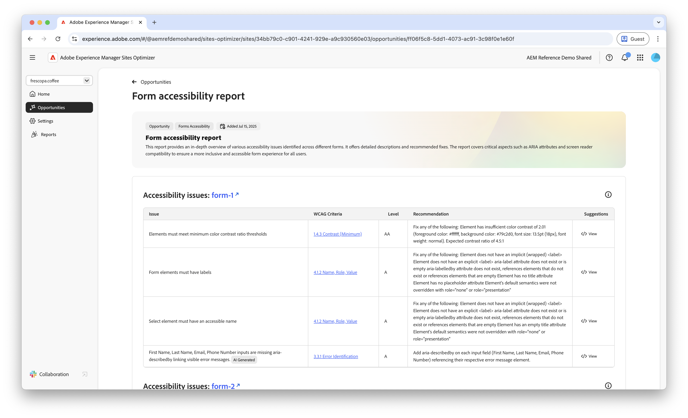
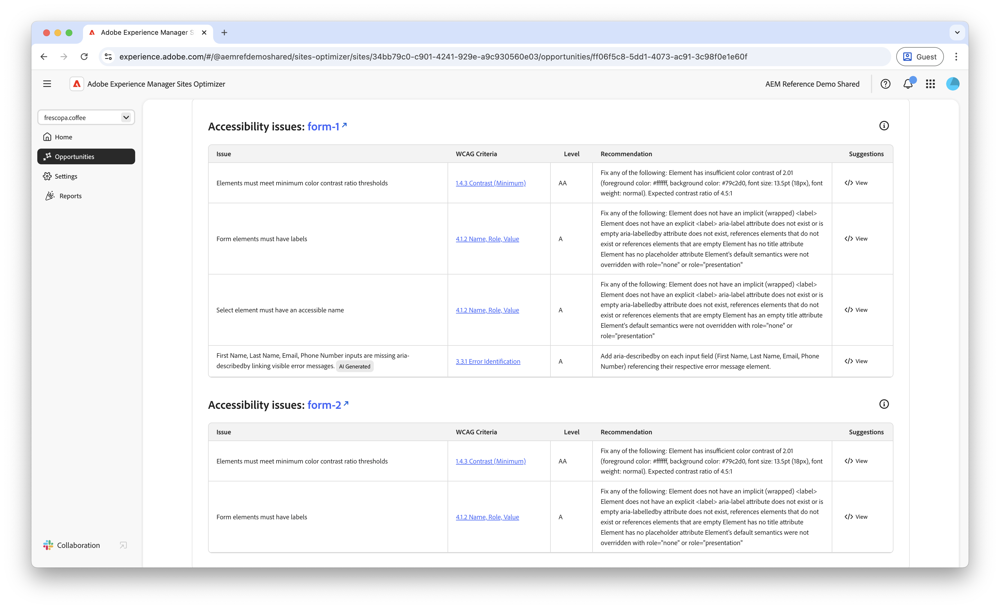
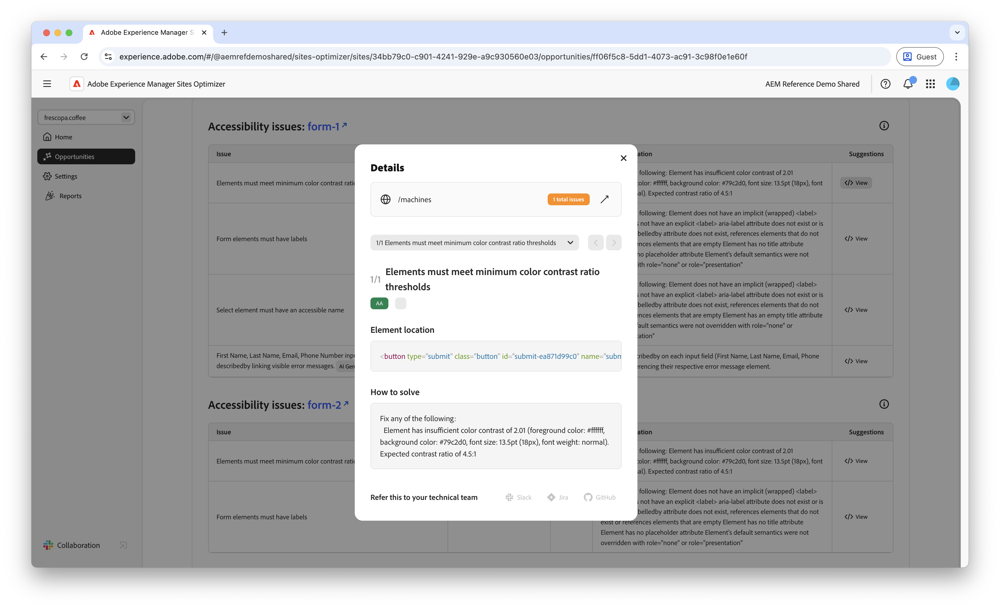

# フォームのアクセシビリティの問題の機会

フォームの最適化機能は、早期アクセスプログラムで利用できます。 早期アクセスプログラムに参加し、機能へのアクセスをリクエストするには、公式メール ID から aem-forms-ea@adobe.com にメールを送信してください。

{align="center"}

フォームのアクセシビリティの問題の機会では、フォームが障害のある人物のニーズにどの程度適合しているか、また [Web コンテンツアクセシビリティガイドライン（WCAG）](https://www.w3.org/TR/WCAG21/)に準拠しているかどうかを識別します。 フォームが WCAG にどの程度準拠しているかを評価することで、包括的なフォームエクスペリエンスを作成するのに役立ちます。 これにより、視覚、聴覚、認知、運動に障がいのあるユーザーがフォームを移動、操作し、正常に完了できます。 倫理的な理由から不可欠であるだけでなく、法的要件への準拠を促進します。 また、フォームの完了率を改善し、オーディエンスのリーチを拡大して、ユーザーエクスペリエンスと業績の両方を向上できます。

## 自動特定

{align="center"}

**フォームのアクセシビリティの問題の機会**&#x200B;では、フォーム内のアクセシビリティの問題が具体的に特定されます。次の内容が含まれます。

* **問題** - フォームで見つかった特定のアクセシビリティの問題。
* **WCAG ガイドライン** - フォームの問題が違反している [WCAG ガイドライン ID](https://www.w3.org/TR/WCAG21/)。
* **レベル** - 問題の[適合レベル](https://www.w3.org/WAI/WCAG21/Understanding/conformance#levels)。
* **レコメンデーション** - コード例やベストプラクティスなど、フォームのアクセシビリティの問題を修正する方法に関する特定のガイダンス。
* **ソース HTML** - 問題の影響を受けるページ上のフォーム要素の HTML スニペット。

## 自動提案

{align="center"}

自動提案では、「**提案**」フィールドに AI 生成レコメンデーションが提供され、フォームのアクセシビリティの問題を解決するための実行内容に関する規範的なガイダンスが提供されます。

<!-- 

## Auto-optimize

[!BADGE Ultimate]{type=Positive tooltip="Ultimate"}

{align="center"}

Sites Optimizer Ultimate adds the ability to deploy auto-optimization for the form accessibility issues found.

>[!BEGINTABS]

>[!TAB Deploy optimization]

{{auto-optimize-deploy-optimization-slack}}

>[!TAB Request approval]

{{auto-optimize-request-approval}}

>[!ENDTABS]
-->

