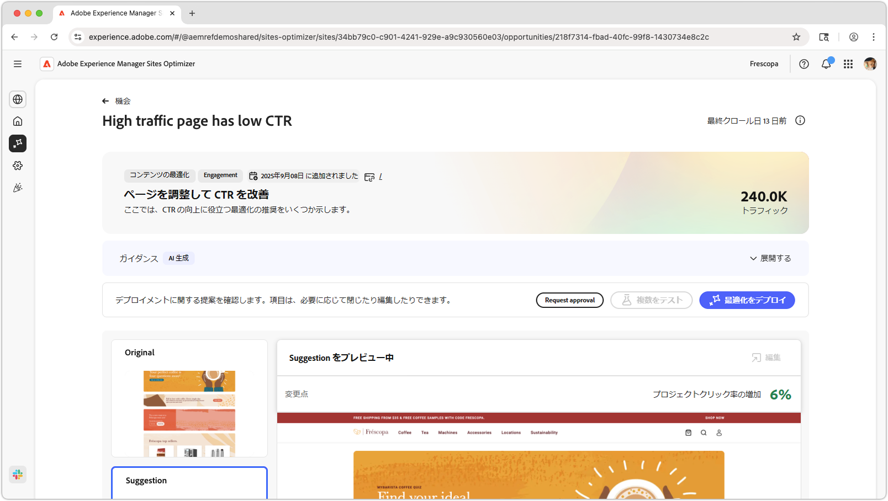
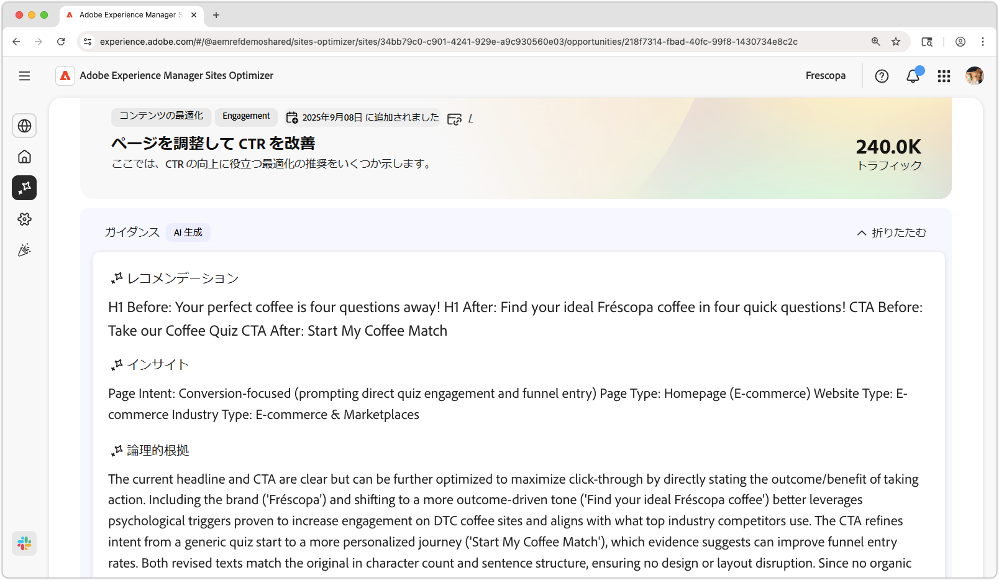
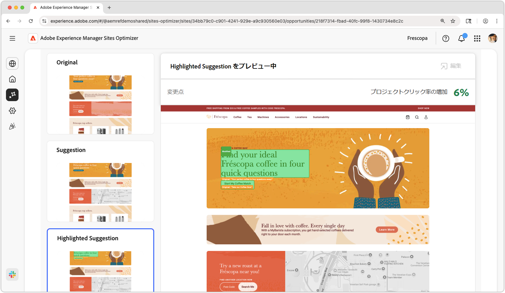
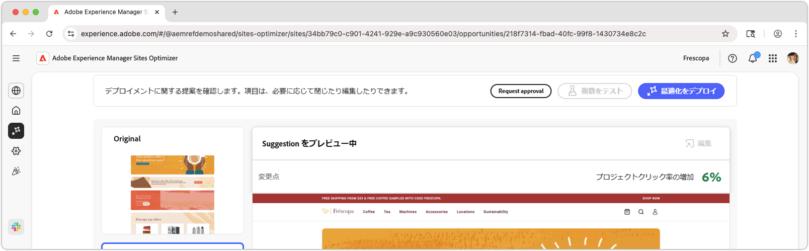

# 高トラフィックページは CTR の機会が少ない

{align="center"}

トラフィックが多いページで CTR が低い機会では、web サイト上で大量のトラフィックを受信したがクリックスルー率（CTR）が低いページを特定します。これらのページを分析すると、ユーザーエンゲージメントを妨げている可能性のある潜在的な問題を明らかにし、パフォーマンスを向上させる手順を実行できます。この機会は、web サイトのコンテンツとレイアウトを最適化するために不可欠で、最終的にコンバージョン率の向上とユーザーエクスペリエンスの向上につながります。

## 自動特定

{align="center"}

**高トラフィックのページには低 CTR の機会があります** は、web サイト上で低 CTR の高トラフィックのページを識別します。次が含まれます。

* **レコメンデーション** - ページの CTR を向上させるための推奨アクション。
* **インサイト** - ページの CTR が低い理由の説明。
* **理論的根拠** - レコメンデーションの背後にある理由。

## 自動提案

{align="center"}

自動提案では、最適化された web エクスペリエンスの表示内容に関する AI 生成の提案が提供されます。提案には、**ハイライト表示**&#x200B;されたビューが含まれ、提案されている変更内容を簡単に確認できます。

提案を選択すると、フルビューで表示し、見込まれる CTR の影響や、ページに適用する前に編集する機能を確認できます。

## 自動最適化

[!BADGE Ultimate]{type=Positive tooltip="Ultimate"}

{align="center"}

Sites Optimizer Ultimate には、提案された最適化に対して自動最適化をデプロイする機能が追加されています。

>[!BEGINTABS]

>[!TAB 最適化のデプロイ]

{{auto-optimize-deploy-optimization-slack}}

>[!TAB 承認のリクエスト]

{{auto-optimize-request-approval}}

>[!ENDTABS]
