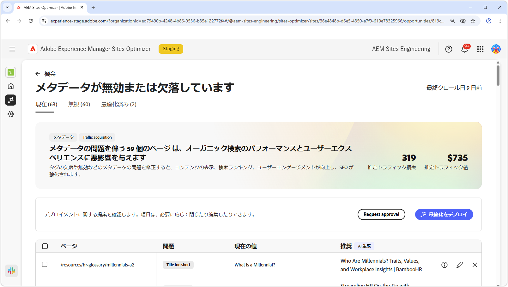
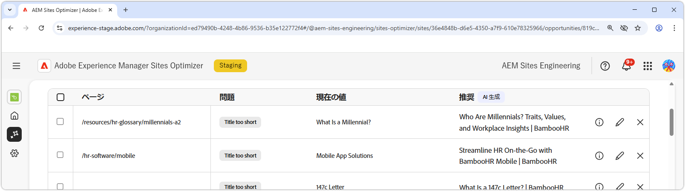
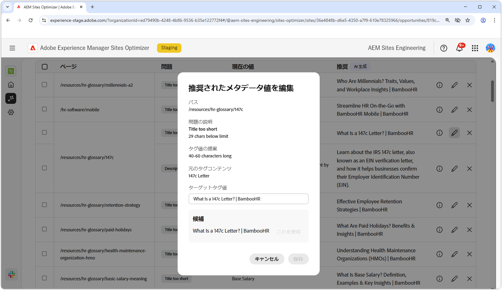
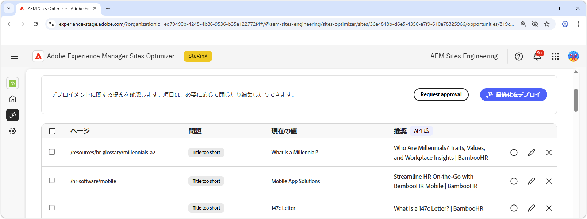

# メタデータ商談が無効または見つかりません

{align="center"}

無効な、または見つからないメタデータのオポチュニティは、web ページ上のメタデータの欠如または欠陥を識別します。 メタデータの問題を修正すると、コンテンツの表示、検索ランキング、ユーザーエンゲージメントが向上し、SEO が向上します。 これらの問題は、タグが見つからないか無効である、説明が長すぎる、短すぎるなどの要因によって発生する可能性があります。

メタデータ商談が無効または見つからない場合、ページの上部に、問題の概要と、その問題がサイトやビジネスに与える影響が表示されます。

* **予測されるトラフィック損失** - メタデータの不具合によるトラフィック損失の推定値。
* **予測トラフィック値** – 失われたトラフィックの予測値。

## 自動識別

{align="center"}

無効な、または見つからないメタデータのオポチュニティに、ページ上の問題のあるすべてのメタデータが一覧表示されます。これには、次のものが含まれます。

* **ページ** – 無効なメタデータまたは見つからないメタデータを含むページ。
* **問題** - メタデータタグに影響を与える問題のタイプを示します。 このような問題は、タイトルの欠落から H1 の重複に至るまで様々です。
* **Value** – 変更が必要な現在のメタデータタグの値。
* **提案** – 適切なタグの更新に向けて AI が生成した提案。 詳しくは、以下の節を参照してください。

## 自動候補

{align="center"}

メタデータのオポチュニティが無効または見つからない場合も、メタデータタグの変更方法や更新方法に関して、AI が生成した提案を提供します。 これらの提案は、問題のあるメタデータを構成した初期タグと、提案された更新の内容に基づいています。

>[!BEGINTABS]

>[!TAB AI の根拠 ]

**情報アイコン** を選択すると、提案された更新の AI の根拠が提供されます。

>提案 [!TAB  れたメタデータ値を編集するには ]

{align="center"}

AI によって生成された提案に同意しない場合は、**編集アイコン** を選択して、提案されたメタデータ値を編集できます。 これにより、メタデータに最適と思われる値を手動で入力できます。 編集ウィンドウには以下の項目があります。

* **パス** - メタデータを含む（または含まない）ページへのパス。
* **問題の説明** - メタデータタグと短い説明に影響を与える問題のタイプを示します。
* **タグ値の提案** - メタデータタグの変更方法や更新方法に関して AI が生成した提案。 例えば、タグの更新に含める文字数などがあります。
* **元のタグコンテンツ** – 元のタグ値。
* **ターゲットタグ値** – このフィールドを編集し、目的のタグ値を手動で追加します。 「**保存**」を選択すると、提案された更新に適用される値となります。
* **提案** – 値の変更方法に関して AI が生成した提案。
* **保存** - 「**ターゲットタグ値**」フィールドの値を保存して適用します。

>[!TAB  エントリを無視 ]

破損したメタデータまたは無効なメタデータをターゲットとするエントリを無視するように選択できます。 **無視アイコン** を選択すると、商談リストからエントリが削除されます。 無視されたエントリは、商談ページ上部の **無視** タブから再エンゲージできます。

>[!ENDTABS]

## [!BADGE Ultimate] を自動最適化{type=Positive tooltip="Ultimate"}

{align="center"}

Sites Optimizer Ultimateには、無効なメタデータ商談または見つからないメタデータ商談で見つかった問題に対して自動最適化をデプロイする機能が追加されています。<!--- TBD-need more in-depth and opportunity specific information here. What does the auto-optimization do?-->

>[!BEGINTABS]

>[!TAB  最適化のデプロイ ]

{{auto-optimize-deploy-optimization-slack}}

>[!TAB 承認のリクエスト]

{{auto-optimize-request-approval}}

>[!ENDTABS]
