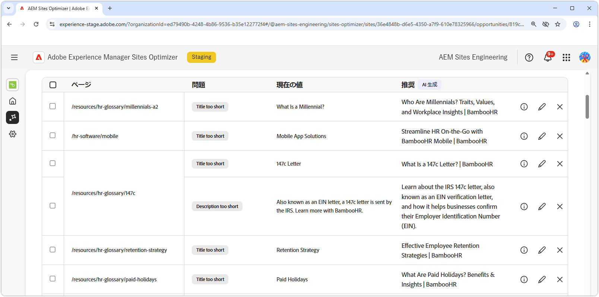

# 無効または欠落しているメタデータの機会

{align="center"}

無効または欠落しているメタデータの機会では、web ページに欠落しているメタデータや、障害のあるメタデータを特定します。メタデータの問題を修正すると、コンテンツの表示、検索ランキング、ユーザーエンゲージメントが向上し、SEO が強化されます。これらの問題は、タグが欠落しているか無効である、説明が長すぎるか短すぎるなどの要因によって発生する場合があります。

無効または欠落しているメタデータの機会では、問題の概要とサイトやビジネスへの影響を含む概要がページの上部に表示されます。

* **見込みトラフィック損失** - 障害のあるメタデータによる推定トラフィック損失。
* **見込みトラフィック値** - 損失したトラフィックの推定値。

## 自動特定

{align="center"}

無効または欠落しているメタデータの機会には、ページ上のすべての問題のあるメタデータが一覧表示されます。これには、次の内容が含まれます。

* **ページ** - 無効または欠落しているメタデータを含むページ。
* **問題**- メタデータタグに影響を与える問題のタイプを示します。これらには、タイトルの欠落から H1 の重複まで様々なものがあります。
* **値**- 変更する必要がある現在のメタデータタグの値。
* **提案** - 適切なタグの更新に関する AI 生成の提案。詳しくは、以下の節を参照してください。

## 自動提案

{align="center"}

無効または欠落しているメタデータの機会では、メタデータタグを変更または更新する方法に関する AI 生成の提案を提供します。これらの提案は、障害のあるメタデータを構成する最初のタグと、提案された更新の内容に基づいています。

>[!BEGINTABS]

>[!TAB AI の論理的根拠]

**情報アイコン** を選択すると、提案された更新の AI の論理的根拠が提供されます。

>[!TAB 提案されたメタデータ値の編集]

{align="center"}

AI 生成の提案に同意できない場合は、**編集アイコン** を選択して、提案されたメタデータ値を編集できます。これにより、メタデータに最も適している値を手動で入力できます。編集ウィンドウには以下が含まれます。

* **パス** - メタデータが含まれる（またはメタデータが欠落している）ページへのパス。
* **問題の説明** - メタデータタグに影響を与える問題のタイプと簡単な説明を示します。
* **タグ値の提案** - メタデータタグを変更または更新する方法に関する AI 生成の提案。例えば、タグの更新に含める文字数などです。
* **元のタグコンテンツ** - 元のタグ値。
* **ターゲットタグ値** - このフィールドを編集し、目的のタグ値を手動で追加します。「**保存**」を選択すると、提案された更新に適用される値になります。
* **提案** - 値を変更する方法に関する AI 生成の提案。
* **保存** - 「**ターゲットタグ値**」フィールドの値を保存して適用します。

>[!TAB エントリを無視]

破損したメタデータまたは無効なメタデータをターゲットとするエントリを無視することを選択できます。**無視アイコン** を選択すると、機会リストからエントリが削除されます。無視されたエントリは、機会ページの上部にある「**無視**」タブから再度関与できます。

>[!ENDTABS]

## 自動最適化

[!BADGE Ultimate]{type=Positive tooltip="Ultimate"}

{align="center"}

Sites Optimizer Ultimate には、無効または欠落しているメタデータの機会によって検出された問題に対して自動最適化をデプロイする機能が追加されています。<!--- TBD-need more in-depth and opportunity specific information here. What does the auto-optimization do?-->

>[!BEGINTABS]

>[!TAB 最適化のデプロイ]

{{auto-optimize-deploy-optimization-slack}}

>[!TAB 承認のリクエスト]

{{auto-optimize-request-approval}}

>[!ENDTABS]
