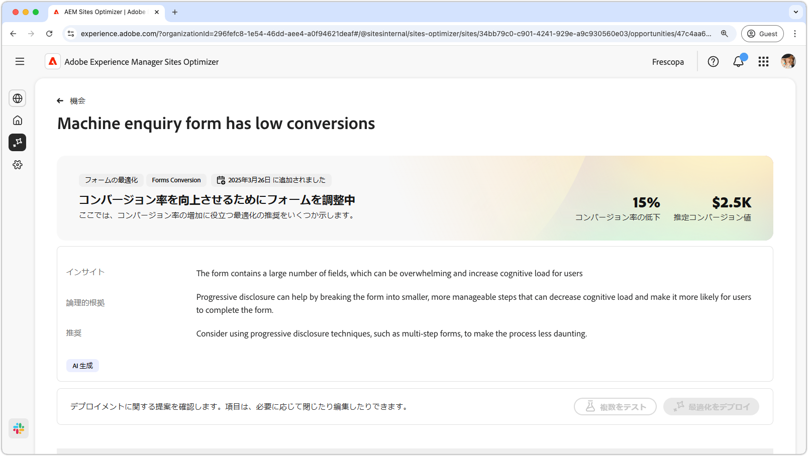
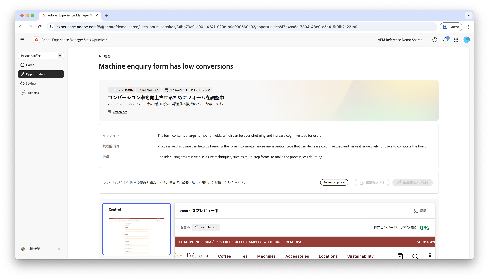
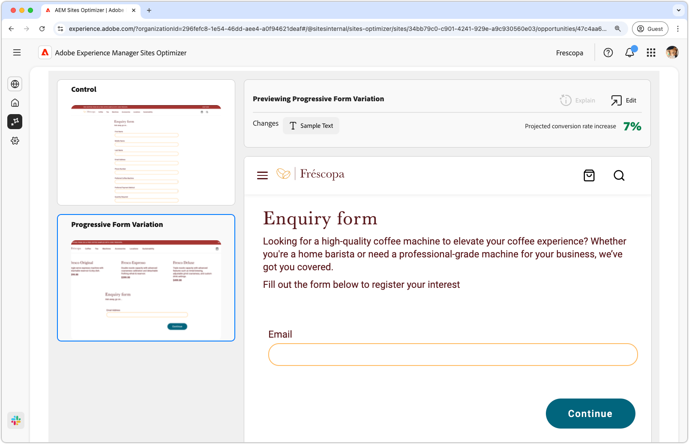

# Formsの低コンバージョンの機会

 Formsの最適化機能は、早期アクセスプログラムで利用できます。 公式メール ID からaem-forms-ea@adobe.comに書き込んで、早期アクセスプログラムに参加し、機能へのアクセスをリクエストできます。

{align="center"}

コンバージョン率の低いオポチュニティは、コンバージョン率の低い web サイト上のフォームを特定します。 この機会タイプは、パフォーマンスの低いフォームを理解するのに役立ち、エンゲージメント率を向上させる方法に関する提案を提供します。

## 自動特定

{align="center"}

コンバージョンの低いフォームを含む各 web ページは、独自の **コンバージョンの低い** オポチュニティとしてリストされます。 オポチュニティと理由の簡単な概要が、オポチュニティ・ページの上部に表示されます。

## 自動提案

{align="center"}

自動提案は、フォームのコンバージョンを増やすために設計された、AI によって生成されたフォームバリエーションを提供します。 各バリエーションには、フォームのエンゲージメントを向上させる可能性に基づいて **予測コンバージョン率の増加** が表示され、最も効果的な提案に優先順位を付けることができます。

>[!BEGINTABS]

>[!TAB コントロールバリエーション]

{align="center"}

コントロールバリエーションは、現在 Web サイト上に存在する元のフォームです。 このバリエーションは、提案されたバリエーションのパフォーマンスを比較するベースラインとして使用されます。

>[!TAB 提案されたバリエーション]

{align="center"}

推奨されるバリエーションは、フォームのコンバージョンを高めるように設計された AI 生成のフォームバリエーションです。 各バリエーションには、フォームのエンゲージメントを向上させる可能性に基づいて **予測コンバージョン率の増加** が表示され、最も効果的な提案に優先順位を付けることができます。

各バリエーションをクリックすると、画面の右側でプレビューが表示されます。プレビューの上部には、次のアクションと情報が表示されます。

* **変更点** - **コントロール**&#x200B;バリエーションからこのバリエーションに変更された点の簡単な概要。
* **予測コンバージョン率増加** – このバリエーションが実装されている場合の、フォームエンゲージメントの推定増加。
* **編集** - クリックして、AEM オーサリングのバリエーションを編集します。

>[!ENDTABS]

<!-- 

## Auto-optimize

[!BADGE Ultimate]{type=Positive tooltip="Ultimate"}

{align="center"}

Sites Optimizer Ultimate adds the ability to deploy auto-optimization for the issues found by the low conversions opportunity.

>[!BEGINTABS]

>[!TAB Test multiple]

>[!TAB Publish selected]

{{auto-optimize-deploy-optimization-slack}}

>[!TAB Request approval]

{{auto-optimize-request-approval}}

>[!ENDTABS]

-->