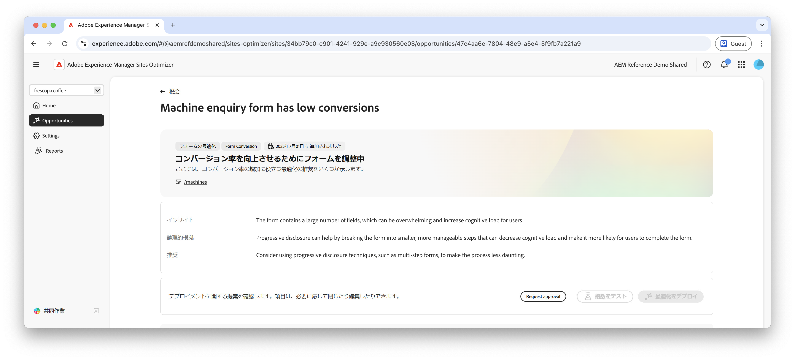

# 低コンバージョンの機会

{align="center"}

低コンバージョンの機会は、低コンバージョン率の web サイト上のフォームを特定します。この機会により、パフォーマンスが低いフォームを把握し、エンゲージメント率を向上させる方法に関する提案を得ることができます。フォームのコンバージョン率を最適化することで、フォームの送信数を増やし、web サイト全体のパフォーマンスを向上させることができます。

## 自動特定

{align="center"}

低コンバージョンのフォームを含む各 web ページは、独自の&#x200B;**低コンバージョン**&#x200B;の機会として一覧表示されます。機会の簡単な概要と AI の論理的根拠が、機会ページの上部に表示されます。

## 自動提案

{align="center"}

自動提案は、フォームのコンバージョン率を増やすように設計された、AI 生成の web ページのバリエーションを提供します。各バリエーションでは、フォームのエンゲージメントを向上させる可能性に基づいて&#x200B;**プロジェクトのコンバージョン率の増加**&#x200B;が表示されるので、最も効果的な提案を優先するのに役立ちます。

>[!BEGINTABS]

>[!TAB コントロールバリエーション]

{align="center"}

コントロールバリエーションは、現在 web サイトで公開されている元のフォームです。このバリエーションは、提案されたバリエーションのパフォーマンスを比較するベースラインとして使用されます。

>[!TAB 提案されたバリエーション]

{align="center"}

提案されたバリエーションは、フォームのコンバージョン率を増やすように設計された、AI 生成の web ページのバリエーションです。各バリエーションでは、フォームのエンゲージメントを向上させる可能性に基づいて&#x200B;**見込みコンバージョン率の増加**&#x200B;が表示されるので、最も効果的な提案を優先するのに役立ちます。

各バリエーションをクリックすると、画面の右側でプレビューが表示されます。プレビューの上部には、次のアクションと情報が表示されます。

* **変更点** - **コントロール**&#x200B;バリエーションからこのバリエーションに変更された点の簡単な概要。
* **見込みコンバージョン率増加** - このバリエーションを実装した場合のフォームエンゲージメントの推定増加数。
* **編集** - クリックして、AEM オーサリングのバリエーションを編集します。

>[!ENDTABS]

## 自動最適化

[!BADGE Ultimate]{type=Positive tooltip="Ultimate"}

{align="center"}

Sites Optimizer Ultimate には、低コンバージョンの機会によって検出された問題に対して自動最適化をデプロイする機能が追加されています。

>[!BEGINTABS]

>[!TAB 複数のテスト]

>[!TAB 選択された公開]

{{auto-optimize-deploy-optimization-slack}}

>[!TAB 承認のリクエスト]

{{auto-optimize-request-approval}}

>[!ENDTABS]
