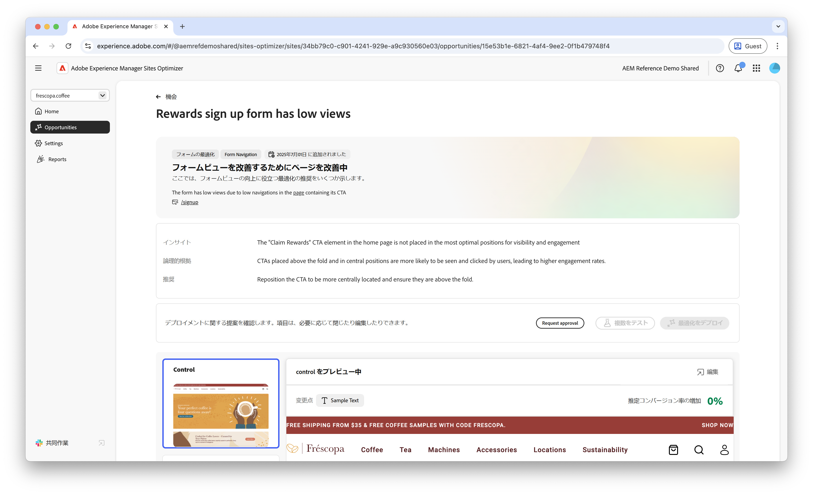
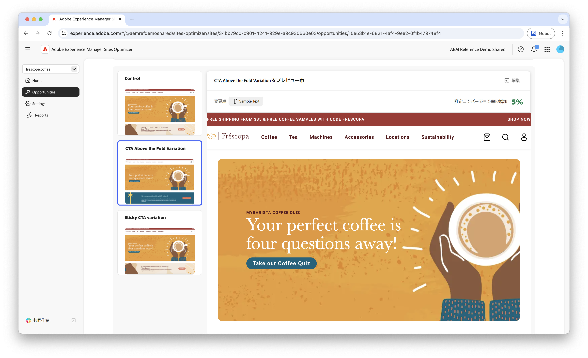
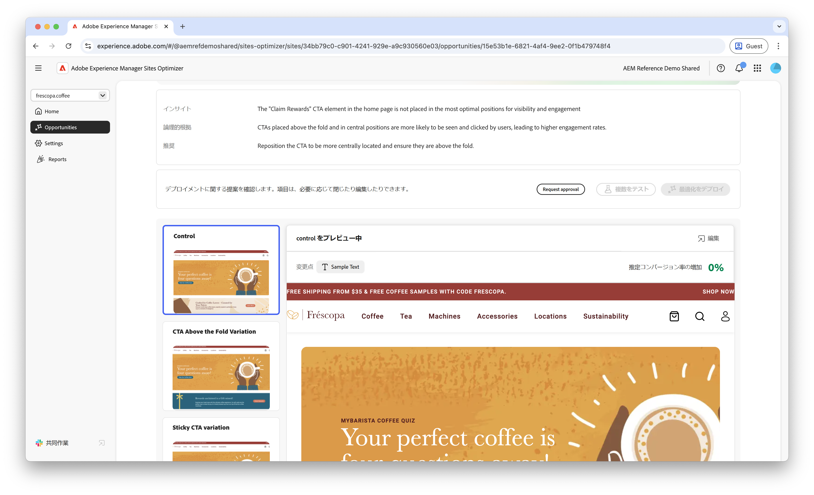
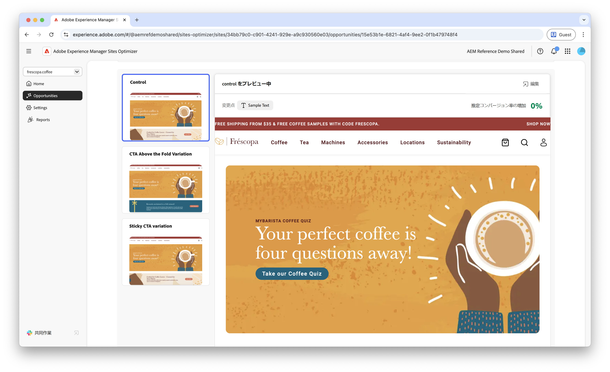

# フォームの低ナビゲーションの機会

フォームの最適化機能は、早期アクセスプログラムで利用できます。早期アクセスプログラムに参加し、機能へのアクセスをリクエストするには、公式メール ID から aem-forms-ea@adobe.com にメールを送信してください。

{align="center"}

低ナビゲーションの機会は、低ナビゲーション率の web サイト上のフォームを特定します。この機会タイプにより、ユーザーによって発見またはアクセスされていないフォームを把握し、検出性を向上させる方法に関する提案を得ることができます。

## 自動特定

{align="center"}

低ナビゲーションのフォームを含む各 web ページは、独自の&#x200B;**低ナビゲーション**&#x200B;の機会として一覧表示されます。機会の簡単な概要と論理的根拠が、機会ページの上部に表示されます。

## 自動提案

自動提案は、フォームへのナビゲーションを増やすように設計された、AI 生成フォームのバリエーションを提供します。各バリエーションでは、フォームの検出性とアクセシビリティを向上させる可能性に基づいて&#x200B;**見込みコンバージョン率の増加**&#x200B;が表示されるので、最も効果的な提案を優先するのに役立ちます。

>[!BEGINTABS]

>[!TAB コントロールバリエーション]

{align="center"}

コントロールバリエーションは、現在 web サイトで公開されている元のフォームです。このバリエーションは、提案されたバリエーションのパフォーマンスを比較するベースラインとして使用されます。

>[!TAB 提案されたバリエーション]

{align="center"}

提案されたバリエーションは、フォームへのナビゲーションを増やすように設計された、AI 生成フォームのバリエーションです。各バリエーションでは、フォームの検出性とアクセシビリティを向上させる可能性に基づいて&#x200B;**見込みコンバージョン率の増加**&#x200B;が表示されるので、最も効果的な提案を優先するのに役立ちます。

各バリエーションをクリックすると、画面の右側でプレビューが表示されます。プレビューの上部には、次のアクションと情報が表示されます。

* **変更点** - **コントロール**&#x200B;バリエーションからこのバリエーションに変更された点の簡単な概要。
* **見込みコンバージョン率増加** - このバリエーションを実装した場合のフォームエンゲージメントの推定増加数。
* **編集** - クリックして、AEM オーサリングのバリエーションを編集します。

>[!ENDTABS]

<!-- 

## Auto-optimize

[!BADGE Ultimate]{type=Positive tooltip="Ultimate"}

{align="center"}

Sites Optimizer Ultimate adds the ability to deploy auto-optimization for the issues found by the low navigation opportunity.

>[!BEGINTABS]

>[!TAB Test multiple]

>[!TAB Publish selected]

{{auto-optimize-deploy-optimization-slack}}

>[!TAB Request approval]

{{auto-optimize-request-approval}}

>[!ENDTABS]

-->
