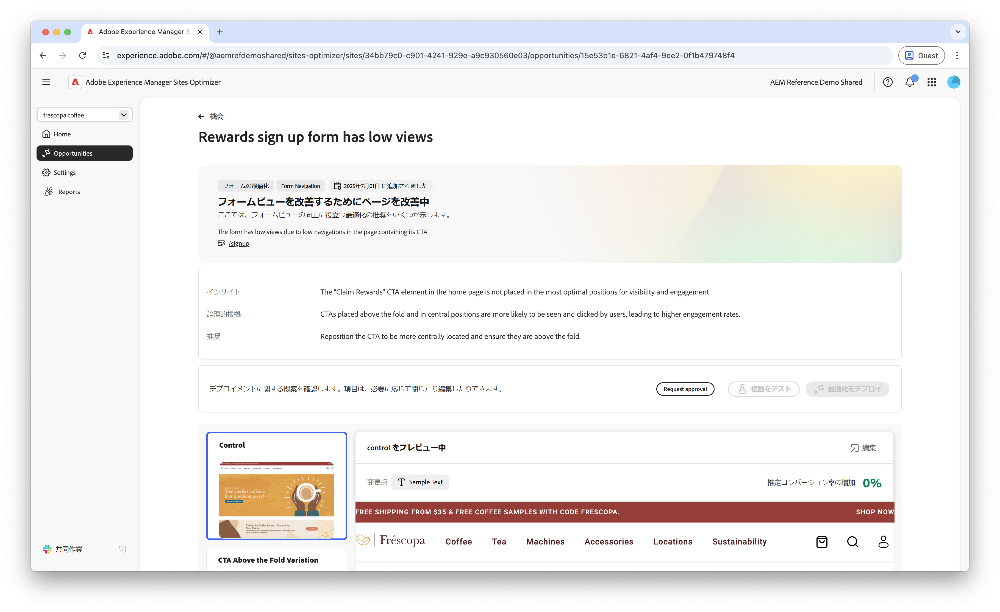
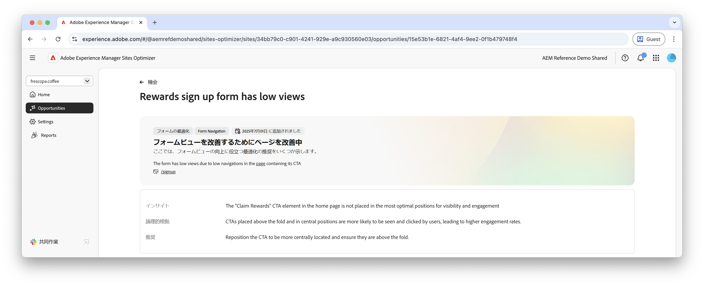

# Formsの低視聴率のオポチュニティ

{align="center"}

少ない閲覧数の機会では、閲覧数が少ない web サイト上のフォームを特定します。この機会タイプは、パフォーマンスの低いフォームを理解するのに役立ち、エンゲージメント率を向上させる方法に関する提案を提供します。

## 自動特定

{align="center"}

ビューの少ないフォームを含む各 web ページは、独自の **低ビュー** オポチュニティとしてリストされます。 オポチュニティと理由の簡単な概要が、オポチュニティ・ページの上部に表示されます。

## 自動提案

{align="center"}

自動候補表示は、フォームのビューを増やすために設計された、AI によって生成されたフォームのバリエーションを提供します。 各バリエーションには、フォームのエンゲージメントを向上させる可能性に基づいて **予測コンバージョン率の増加** が表示され、最も効果的な提案に優先順位を付けることができます。

>[!BEGINTABS]

>[!TAB コントロールバリエーション]

{align="center"}

コントロールバリエーションは、現在 Web サイト上に存在する元のフォームです。 このバリエーションは、提案されたバリエーションのパフォーマンスを比較するベースラインとして使用されます。

>[!TAB 提案されたバリエーション]

{align="center"}

推奨されるバリエーションは、フォームのビューを増やすために設計された、AI が生成したフォームバリエーションです。 各バリエーションには、フォームのエンゲージメントを向上させる可能性に基づいて **予測コンバージョン率の増加** が表示され、最も効果的な提案に優先順位を付けることができます。

各バリエーションをクリックすると、画面の右側でプレビューが表示されます。プレビューの上部には、次のアクションと情報が表示されます。

* **変更点** - **コントロール**&#x200B;バリエーションからこのバリエーションに変更された点の簡単な概要。
* **予測コンバージョン率増加** – このバリエーションが実装されている場合の、フォームエンゲージメントの推定増加。
* **編集** - クリックして、AEM オーサリングのバリエーションを編集します。

>[!ENDTABS]

<!-- 

## Auto-optimize

[!BADGE Ultimate]{type=Positive tooltip="Ultimate"}

{align="center"}

Sites Optimizer Ultimate adds the ability to deploy auto-optimization for the issues found by the low views opportunity.

>[!BEGINTABS]

>[!TAB Test multiple]

>[!TAB Publish selected]

{{auto-optimize-deploy-optimization-slack}}

>[!TAB Request approval]

{{auto-optimize-request-approval}}

>[!ENDTABS]

-->

