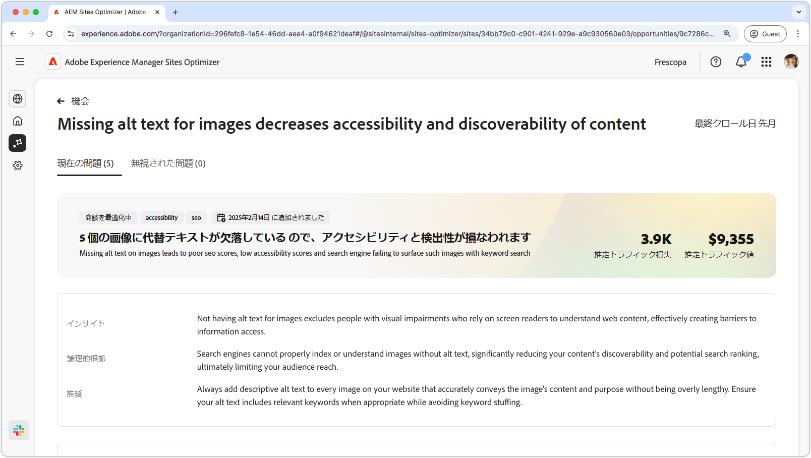
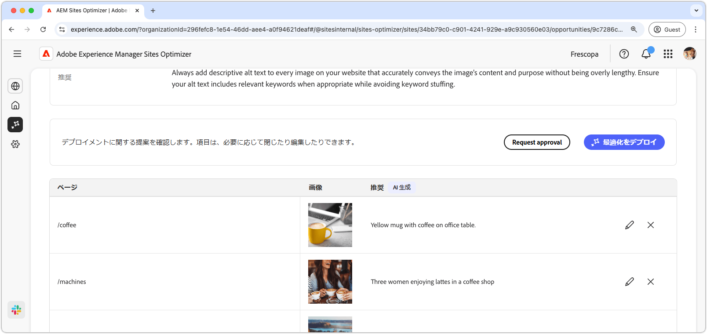
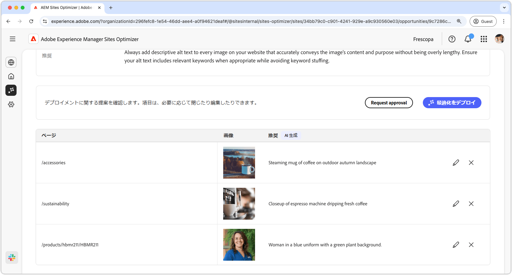
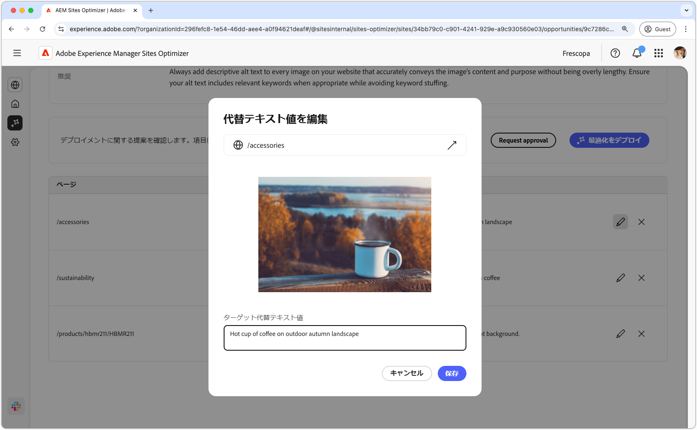
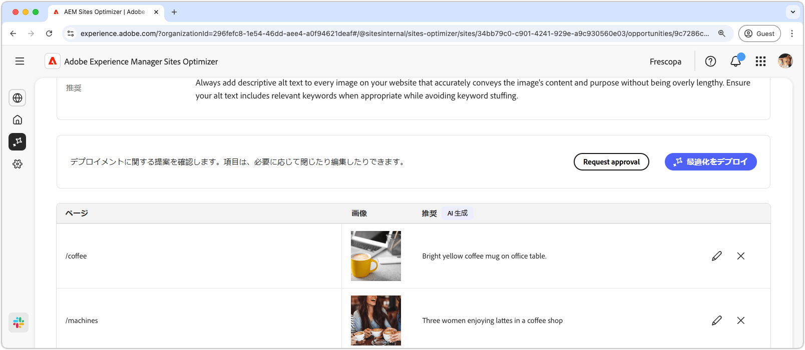

# 欠落している代替テキストの機会

{align="center"}

欠落している代替テキストの機会では、web サイトに説明用代替テキストがない画像を特定します。検索エンジンでは、代替テキストのない画像を適切にインデックス作成したり理解したりすることができず、コンテンツの検出性と潜在的な検索ランキングが大幅に低下し、最終的にはオーディエンスのリーチが制限されます。さらに、画像に代替テキストがないと、スクリーンリーダーを使用して web コンテンツを理解する視覚障害のある人物が除外され、情報へのアクセスが事実上妨げられることになります。

欠落している代替テキストの機会では、問題の概要とサイトやビジネスへの影響を含む概要が、ページの上部に表示されます。

* **見込みトラフィック損失** - 欠落している代替テキストの問題による推定トラフィック損失。
* **見込みトラフィック値** - 損失したトラフィックの推定値。

また、機会に関連する論理的根拠、インサイト、提案を表示する追加のフィールドもあります。

## 自動特定

{align="center"}

欠落している代替テキストの機会には、代替テキストが欠落している web サイトにすべての画像が一覧表示されます。このセクションには、次のカテゴリが含まれます。

* **ページ** - 欠落している代替テキストを含むページへのパス。
* **画像** - 説明用代替テキストが欠落している画像。
* **提案** - 代替テキストに関する AI 生成の提案。

## 自動提案

{align="center"}

自動提案は、画像の代替テキストに関する AI 生成の提案を提供します。AI 生成の提案は、各画像を手動で分析することなく、画像に代替テキストをすばやく追加できるように設計されています。

>[!BEGINTABS]

>[!TAB 欠落している代替テキストの編集]

{align="center"}

AI 生成の提案に同意できない場合は、**編集アイコン** を選択して、提案された代替テキストを編集できます。これにより、画像に最も適しているテキストを手動で調整できます。編集ウィンドウには以下が含まれます。

* **ページパス** - 欠落している代替テキストの問題が発生するページへのパスを表示する読み取り専用フィールド。パスの横にある矢印をクリックして、対応するページを開きます。
* **画像** - 代替テキストを必要とする画像の読み取り専用プレビュー。
* **ターゲット代替テキスト** - 画像の説明用代替テキストを手動で入力できる編集可能なフィールド。代替テキストで画像の内容と目的が明確に伝わっていることを確認します。該当する場合は、キーワードを過剰でない程度に自然に含めます。

>[!TAB エントリを無視]

機会リストのエントリを無視することを選択できます。**無視アイコン** を選択すると、リストからエントリが削除されます。無視されたエントリは、機会ページの上部にある「**無視**」タブから再度関与できます。

>[!ENDTABS]

## 自動最適化

[!BADGE Ultimate]{type=Positive tooltip="Ultimate"}

{align="center"}

Sites Optimizer Ultimate には、欠落している代替テキストの機会によって検出された問題に対して自動最適化をデプロイする機能が追加されています。<!--- TBD-need more in-depth and opportunity specific information here. What does the auto-optimization do?-->

>[!BEGINTABS]

>[!TAB 最適化のデプロイ]

{{auto-optimize-deploy-optimization-slack}}

>[!TAB 承認のリクエスト]

{{auto-optimize-request-approval}}

>[!ENDTABS]
