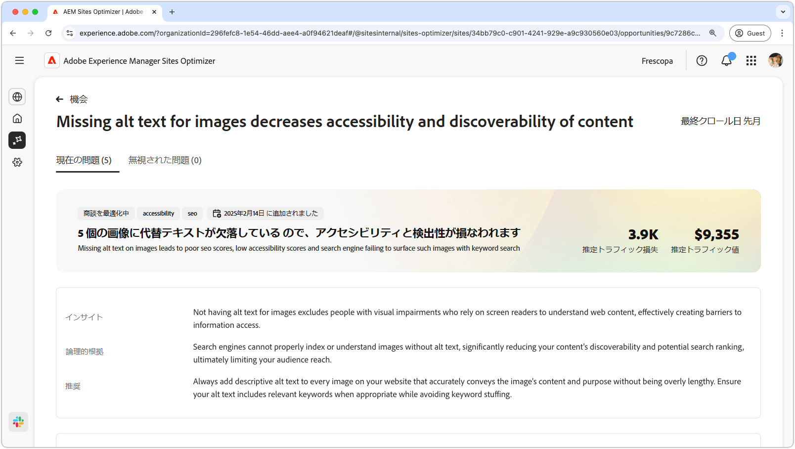
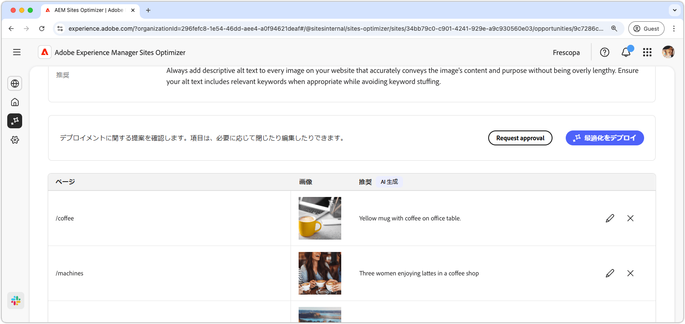
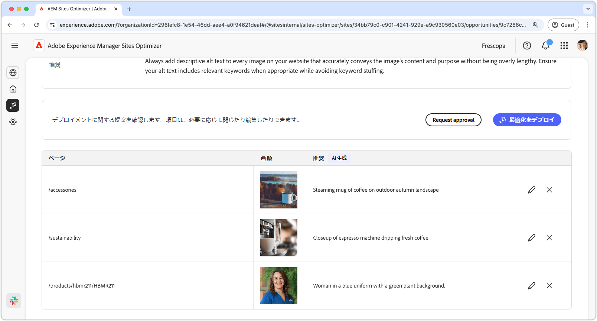
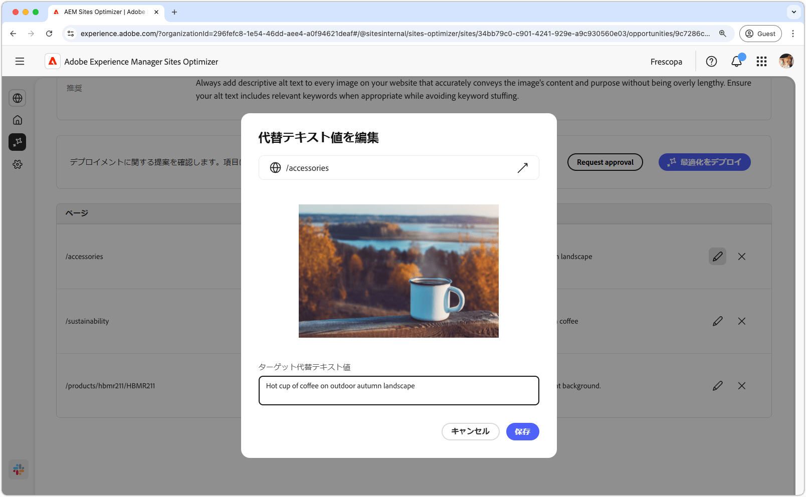

# 欠落している代替テキストの機会

<!--{align="center"}-->

>[!VIDEO](https://video.tv.adobe.com/v/3483251/?learn=on&enablevpops)

欠落している代替テキストの機会は、web サイト上の説明的な代替テキストを持たない画像を特定します。 代替テキストがない場合、スクリーンリーダーに依存するユーザーはビジュアルコンテンツを解釈できず、アクセシビリティ上の障壁が生じます。 また、検索エンジンが画像を理解してインデックス作成する方法を制限するので、コンテンツの検出性と検索パフォーマンスが低下します。 AEM Sites Optimizer は、欠落している代替テキストの問題を特定し、特定のAI レコメンデーションを提供し、ワンクリックで修正できるデプロイメントを単一の一元的なビューで実現します。

## 自動特定

<!--{align="center"}-->

AEM Sites Optimizer は、サイトクロール、実際のユーザートラフィックデータ、AI 分析を組み合わせた複数ステップ監査を使用して、web サイトをスキャンし、代替テキストを必要とするものの、定義されていない画像を特定します。 また、web コンテンツアクセシビリティガイドライン（WCAG）に従って、装飾的な画像や有益でない画像を除外して、ページ上の画像を評価し、代替テキストが必要かどうかを判断します。 画像は、アクセシビリティと SEO に最も大きな影響を与える修正を優先して、ページ内での役割と関連性に基づいて分析されます。

この機会では、次のような特定された問題のリストが提供されます。

* **ページ** - 欠落している代替テキストを含むページへのパス。
* **画像** - 説明用代替テキストが欠落している画像。

## 自動提案

<!--{align="center"}-->

AEM Sites Optimizer は、特定された各問題に対して、画像の説明的な代替テキストを提案します。 AI ビジョンモデルを使用して画像を分析し、ページ内での画像のコンテンツと役割を反映した説明を生成します。 レコメンデーションは簡潔で関連性が高く、アクセシビリティのベストプラクティスに沿っています。 各提案は、適用前にレビューおよび編集できます。

>[!BEGINTABS]

>[!TAB 欠落している代替テキストの編集]

<!--{align="center"}-->

AI 生成の提案に同意できない場合は、**編集アイコン** を選択して、提案された代替テキストを編集できます。 この機能により、画像に最も適しているテキストを手動で調整できます。 編集ウィンドウには以下が含まれます。

* **ページパス** - 欠落している代替テキストの問題が発生するページへのパスを表示する読み取り専用フィールド。 パスの横にある矢印をクリックして、対応するページを開きます。
* **画像** - 代替テキストを必要とする画像の読み取り専用プレビュー。
* **ターゲット代替テキスト** - 画像の説明用代替テキストを手動で入力できる編集可能なフィールド。 代替テキストで画像の内容と目的が明確に伝わっていることを確認します。 該当する場合は、キーワードを過剰でない程度に自然に含めます。

>[!TAB エントリを無視]

機会リストのエントリを無視することを選択できます。  を選択すると、リストからエントリが削除されます。 無視されたエントリは、機会ページの上部にある「**無視**」タブから再度関与できます。

>[!ENDTABS]

## 自動最適化

<!--[!BADGE Ultimate]{type=Positive tooltip="Ultimate"}-->

提案をレビューして承認したら、「**最適化をデプロイ**」をクリックできます。 その後、AEM Sites Optimizer は、実装内での代替テキストの管理方法に基づいて、修正をオーサリング環境に適用します。 その後、AEM オーサーは、コンテンツ管理システム（CMS）から変更を公開できます。

設定に応じて、更新はページコンテンツ、アセットメタデータまたはサポートするコンテンツモデルに直接適用される場合があります。 最適化プロセスには、次の手順が含まれます。

* **検証** - 既存の機能に影響を与えることなく、更新が安全に適用されるようにします。
* **デプロイメント** - AEM でのコンテンツの更新やコンテンツ API との統合など、既存のプロセスを通じて更新を適用します。
* **権限チェック** - ユーザーが変更を適用するための適切な権限を持っていることを検証します。 権限がない場合は、ダウンロード可能な更新などの代替出力をハンドオフに使用できます。

更新は、サポートされている場合はバージョン管理され、可視性とロールバック処理能力が提供されます。 これにより、代替テキストの更新が正確に適用され、既存の実装と一致し、ガバナンスおよびアクセシビリティ標準に準拠することが確保されます。

AEM Sites Optimizer では、次のように、設定に基づいて代替テキストの更新が自動的に適用されます。

>[!BEGINTABS]

>[!TAB Edge Delivery Services]

ソースドキュメント（例：Google Docs または SharePoint）を更新します。

>[!TAB AEM as a Cloud Service]

バージョン管理とフォールバックサポートにより、Content API 経由で更新を直接書き込みます。

>[!TAB デジタルアセット管理（オプション）]

該当する場合、アセットレベルの代替テキストを更新します。

>[!ENDTABS]
