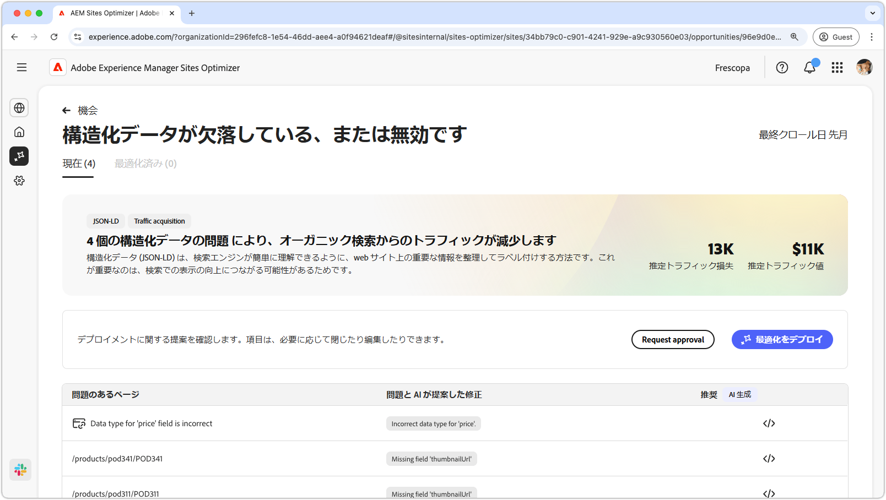
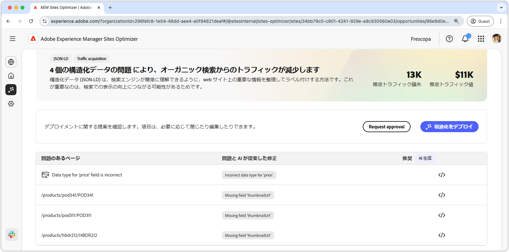
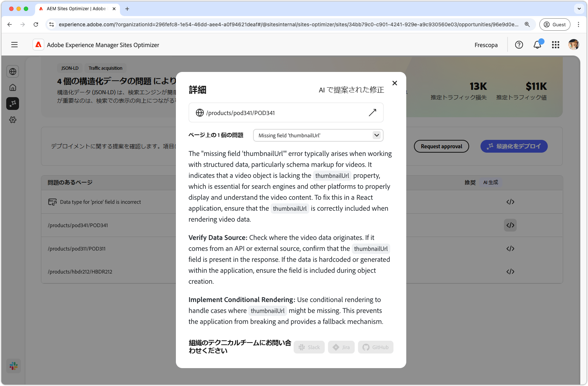
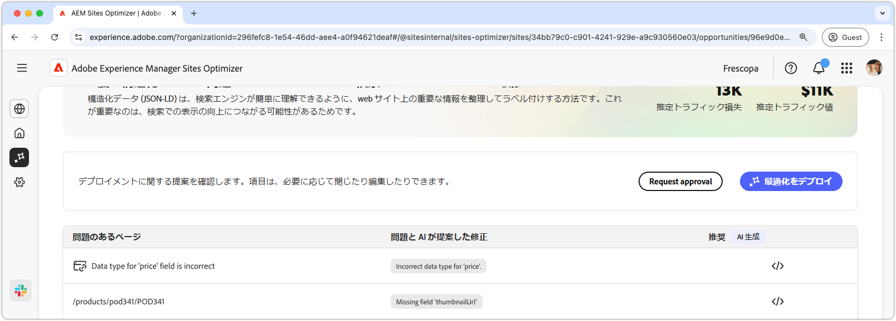

# 構造化データ商談が見つからないか無効です

{align="center"}

構造化データの機会が見つからない、または無効な場合は、構造化データの欠如または欠陥が、Json-LD で標準化された形式で識別されます。 構造化データを使用すると、web サイト上の重要な情報を整理、説明およびラベル付けすることができます。 これにより、検索エンジンがページのコンテンツを解釈し、検索結果の可視性が向上します。 より良い検索結果は、より多くのユーザーが web サイトを操作できるようにする可能性があります。

欠落している構造化データ商談または無効な構造化データ商談では、問題の概要とサイトおよびビジネスへの影響がページ上部に表示されます。

* **予測されるトラフィック損失** – 構造化データの不具合によるトラフィック損失の推定値。
* **予測トラフィック値** – 失われたトラフィックの予測値。

## 自動識別

{align="center"}

見つからない構造化データ商談または無効な構造化データ商談には、ページで検出されたすべての問題が一覧表示され、次のカテゴリが含まれています。

* **問題が発生したページ** – 無効な構造データまたは欠落した構造データを含むページ。
* **問題と AI が提案した修正** - ページに影響を与える構造化データの問題のタイプを示します。
* **提案** – 適切な構造化データの更新に対応するために AI が生成した提案。 詳しくは、以下の節を参照してください。

## 自動候補

{align="center"}

構造化データのオポチュニティが無効または見つからない場合も、構造化データの変更または更新方法に関して、AI が生成した提案を提供します。 「候補」ボタンをクリックすると、次の内容を含む新しいウィンドウが表示されます。

* **ページパス** – 無効な構造化データが含まれている、または構造化データが欠落しているページへのパスを含むフィールド。
* **イシュー** – 問題の数と、すべての問題を一覧表示するドロップダウンメニューを含むフィールド。
* **提案フィールド** - AI が生成した、適切な構造化データの更新に適した説明と提案。 下にスクロールして、その他の提案や問題を参照できます。

## [!BADGE Ultimate] を自動最適化{type=Positive tooltip="Ultimate"}

{align="center"}

Sites Optimizer Ultimateには、構造化データのオポチュニティが無効または見つからない問題に対して自動最適化をデプロイする機能が追加されています。<!--- TBD-need more in-depth and opportunity specific information here. What does the auto-optimization do?-->

>[!BEGINTABS]

>[!TAB  最適化のデプロイ ]

{{auto-optimize-deploy-optimization-slack}}

>[!TAB 承認のリクエスト]

{{auto-optimize-request-approval}}

>[!ENDTABS]
