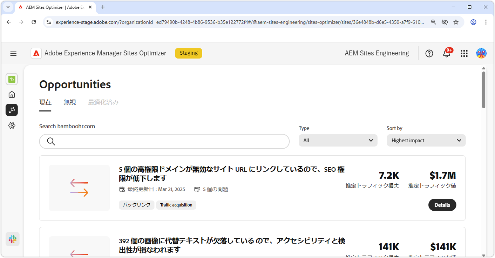
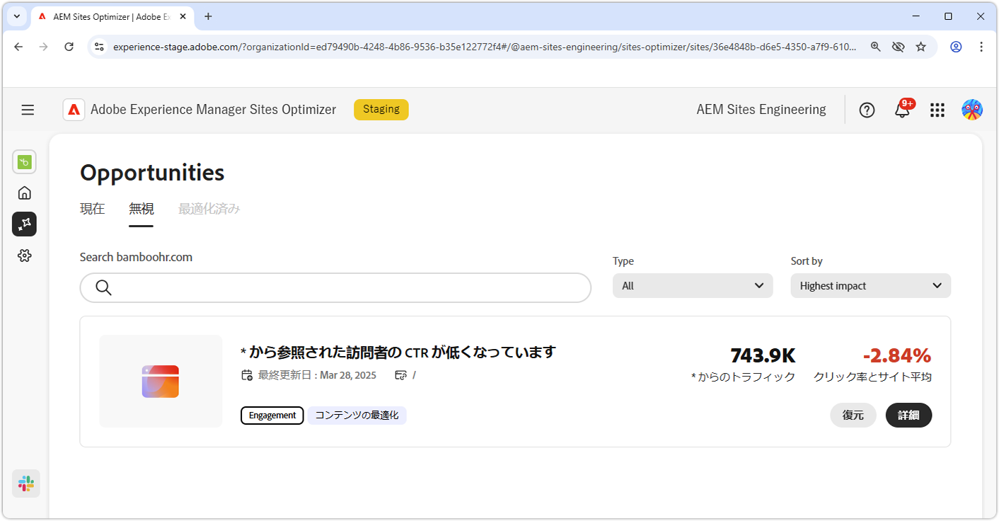

# 機会ドキュメント

{align="center"}

Sites Optimizer は、Adobe AI を活用した増え続ける一連の機会で構成されており、web サイトの改善点を特定して提案するように設計されています。それぞれの機会では、潜在的なビジネス価値に関するインサイトが得られ、注意が必要な領域がハイライト表示され、最適化のための実用的な推奨事項を提供されます。各機会をクリックすると、特定された問題、提案された改善点、およびこれらの変更を実装して web サイトのパフォーマンスとユーザーエクスペリエンスを向上させる方法に関するステップバイステップのガイダンスを確認できます。

機会は、[Site Optimizer の永続的なナビゲーション](/help/documentation/basics.md#navigation)の&#x200B;**機会**&#x200B;メニューオプションから使用できます。

## 機会ステータス

上部のタブを使用して、機会をステータス別に整理およびフィルタリングできます。

>[!BEGINTABS]

>[!TAB 現在]

{align="center"}

現在保留中の機会。

>[!TAB 無視]

{align="center"}

無視された機会。無視された機会は、このビューから復元できます。

>[!TAB 最適化済み]

最適化された機会の過去のリスト。

>[!ENDTABS]

## 機会

[機会ステータス](#opportunity-status)を選択すると、機会のリストを表示できます。 機会のリストは、次の方法でさらにフィルタリングできます。

* **検索** - **キーワード、タグ、URL** で機会を検索します。
* **機会タイプ** - **タイプ**&#x200B;ドロップダウンを使用して、[機会タイプ](/help/opportunity-types/overview.md)別に機会をフィルタリングできます。

### 機会の詳細

{align="center"}

各機会には、問題の簡単な説明、サイトへの潜在的な影響、詳細へのリンクが提供されます。また、最適化されたか、まだ保留中かを示すステータスも確認できます。

* **機会タイトル** - 問題の概要と、サイトのパフォーマンスに対する潜在的な影響。
* **最終更新日** - Sites Optimizer によって新しいデータで機会が最後に更新された日付。
* **問題数** - サイト上で特定された問題のインスタンスの数。
* **機会タイプ** - トラフィック獲得、エンゲージメント、サイトの健全性など、この機会が含まれる[機会のタイプ](/help/opportunity-types/overview.md)。

各機会の概要情報はタイプによって異なり、収益への影響、トラフィック、ユーザーエンゲージメント、セキュリティの脅威に関する詳細が含まれる場合があります。

機会の詳細を表示するには、「**詳細**」ボタンをクリックします。

Sites Optimizer ダッシュボードから機会を除外するには、「**無視**」ボタンをクリックします。このアクションにより、機会は「[**無視**」タブ](#opportunity-status)に移動します。

## すべての機会

Sites Optimizer で使用可能なすべての機会を探索します。

<!-- CARDS

* ./accessibility-issues.md
  {title=Accessibility issues}
  {image=../../assets/common/card-arrows.png} 
* ./broken-backlinks.md
  {title=Broken backlinks}
  {image=../../assets/common/card-arrows.png}
* ./broken-internal-links.md
  {title=Broken internal links}
  {image=../../assets/common/card-link.png}
* ./cors-configuration.md
  {title=CORS configuration}
  {image=../../assets/common/card-code.png}
* ./core-web-vitals.md
  {title=Core web vitals}
  {image=../../assets/common/card-performance.png}
* ./cross-site-scripting.md
  {title=Cross-site scripting}
  {image=../../assets/common/card-code.png}
* ./high-bounce-rate.md
  {title=High bounce rate}
  {image=../../assets/common/card-arrows.png}    
* ./invalid-or-missing-metadata.md
  {title=Invalid or missing metadata}
  {image=../../assets/common/card-code.png}
* ./missing-alt-text.md
  {title=Missing alt text}
  {image=../../assets/common/card-arrows.png}
* ./missing-invalid-structured-data.md
  {title=Missing or invalid structured data}
  {image=../../assets/common/card-bag.png}
* ./sitemap-issues.md
  {title=Sitemap issues}
  {image=../../assets/common/card-relationship.png}
* ./website-permissions.md
  {title=Website permissions}
  {image=../../assets/common/card-people.png}
* ./website-vulnerabilities.md
  {title=Website vulnerabilities}
  {image=../../assets/common/card-puzzle.png}
  
--->
<!-- START CARDS HTML - DO NOT MODIFY BY HAND -->

    

        

            

                <figure class="image x-is-16by9">
                    
                </figure>
            

            

                

                    

                        <a href="./accessibility-issues.md" target="_blank" rel="referrer" title="アクセシビリティの問題">アクセシビリティの問題</a>
                    

                    
アクセシビリティの問題の機会と、これを使用して web サイトのセキュリティを強化する方法について説明します。

                

                <a href="./accessibility-issues.md" target="_blank" rel="referrer" class="spectrum-Button spectrum-Button--outline spectrum-Button--primary spectrum-Button--sizeM" style="align-self: flex-start; margin-top: 1rem;">
                    詳細情報
                </a>
            

        

    

    

        

            

                <figure class="image x-is-16by9">
                    
                </figure>
            

            

                

                    

                        <a href="./broken-backlinks.md" target="_blank" rel="referrer" title="破損したバックリンク">破損したバックリンク</a>
                    

                    
破損したバックリンクの機会と、これを使用してトラフィックの獲得を向上させる方法について説明します。

                

                <a href="./broken-backlinks.md" target="_blank" rel="referrer" class="spectrum-Button spectrum-Button--outline spectrum-Button--primary spectrum-Button--sizeM" style="align-self: flex-start; margin-top: 1rem;">
                    詳細情報
                </a>
            

        

    

    

        

            

                <figure class="image x-is-16by9">
                    
                </figure>
            

            

                

                    

                        <a href="./broken-internal-links.md" target="_blank" rel="referrer" title="破損した内部リンク">破損した内部リンク</a>
                    

                    
破損したリンクの機会と、これを使用して web サイトのエンゲージメントを向上させる方法について説明します。

                

                <a href="./broken-internal-links.md" target="_blank" rel="referrer" class="spectrum-Button spectrum-Button--outline spectrum-Button--primary spectrum-Button--sizeM" style="align-self: flex-start; margin-top: 1rem;">
                    詳細情報
                </a>
            

        

    

    

        

            

                <figure class="image x-is-16by9">
                    
                </figure>
            

            

                

                    

                        <a href="./cors-configuration.md" target="_blank" rel="referrer" title="CORS 設定">CORS 設定</a>
                    

                    
CORS 設定の機会と、サイトのセキュリティの脆弱性を特定して修正する方法について説明します。

                

                <a href="./cors-configuration.md" target="_blank" rel="referrer" class="spectrum-Button spectrum-Button--outline spectrum-Button--primary spectrum-Button--sizeM" style="align-self: flex-start; margin-top: 1rem;">
                    詳細情報
                </a>
            

        

    

    

        

            

                <figure class="image x-is-16by9">
                    
                </figure>
            

            

                

                    

                        <a href="./core-web-vitals.md" target="_blank" rel="referrer" title="コア web バイタル">コア web バイタル</a>
                    

                    
コア web バイタルの機会と、これを使用してトラフィックの獲得を向上させる方法について説明します。

                

                <a href="./core-web-vitals.md" target="_blank" rel="referrer" class="spectrum-Button spectrum-Button--outline spectrum-Button--primary spectrum-Button--sizeM" style="align-self: flex-start; margin-top: 1rem;">
                    詳細情報
                </a>
            

        

    

    

        

            

                <figure class="image x-is-16by9">
                    
                </figure>
            

            

                

                    

                        <a href="./cross-site-scripting.md" target="_blank" rel="referrer" title="クロスサイトスクリプティング">クロスサイトスクリプティング</a>
                    

                    
クロスサイトスクリプティングの機会と、サイトのセキュリティの脆弱性を特定して修正する方法について説明します。

                

                <a href="./cross-site-scripting.md" target="_blank" rel="referrer" class="spectrum-Button spectrum-Button--outline spectrum-Button--primary spectrum-Button--sizeM" style="align-self: flex-start; margin-top: 1rem;">
                    詳細情報
                </a>
            

        

    

    

        

            

                <figure class="image x-is-16by9">
                    
                </figure>
            

            

                

                    

                        <a href="./high-bounce-rate.md" target="_blank" rel="referrer" title="高バウンス率">高バウンス率</a>
                    

                    
少ない閲覧数の機会と、これを使用してフォームのエンゲージメントを向上させる方法について説明します。

                

                <a href="./high-bounce-rate.md" target="_blank" rel="referrer" class="spectrum-Button spectrum-Button--outline spectrum-Button--primary spectrum-Button--sizeM" style="align-self: flex-start; margin-top: 1rem;">
                    詳細情報
                </a>
            

        

    

    

        

            

                <figure class="image x-is-16by9">
                    
                </figure>
            

            

                

                    

                        <a href="./invalid-or-missing-metadata.md" target="_blank" rel="referrer" title="無効または欠落しているメタデータ">無効または欠落しているメタデータ</a>
                    

                    
無効または欠落しているメタデータの機会と、これを使用してトラフィックの獲得を向上させる方法について説明します。

                

                <a href="./invalid-or-missing-metadata.md" target="_blank" rel="referrer" class="spectrum-Button spectrum-Button--outline spectrum-Button--primary spectrum-Button--sizeM" style="align-self: flex-start; margin-top: 1rem;">
                    詳細情報
                </a>
            

        

    

    

        

            

                <figure class="image x-is-16by9">
                    
                </figure>
            

            

                

                    

                        <a href="./missing-alt-text.md" target="_blank" rel="referrer" title="欠落している代替テキスト">欠落している代替テキスト</a>
                    

                    
欠落している代替テキストの機会と、これを使用して web サイトのエンゲージメントを向上させる方法について説明します。

                

                <a href="./missing-alt-text.md" target="_blank" rel="referrer" class="spectrum-Button spectrum-Button--outline spectrum-Button--primary spectrum-Button--sizeM" style="align-self: flex-start; margin-top: 1rem;">
                    詳細情報
                </a>
            

        

    

    

        

            

                <figure class="image x-is-16by9">
                    
                </figure>
            

            

                

                    

                        <a href="./missing-invalid-structured-data.md" target="_blank" rel="referrer" title="欠落しているまたは無効な構造化データ">欠落しているまたは無効な構造化データ</a>
                    

                    
欠落しているまたは無効な構造化データの機会と、それを使用してトラフィックの獲得を向上させる方法について説明します。

                

                <a href="./missing-invalid-structured-data.md" target="_blank" rel="referrer" class="spectrum-Button spectrum-Button--outline spectrum-Button--primary spectrum-Button--sizeM" style="align-self: flex-start; margin-top: 1rem;">
                    詳細情報
                </a>
            

        

    

    

        

            

                <figure class="image x-is-16by9">
                    
                </figure>
            

            

                

                    

                        <a href="./sitemap-issues.md" target="_blank" rel="referrer" title="サイトマップの問題">サイトマップの問題</a>
                    

                    
サイトマップの問題の機会と、これを使用してトラフィックの獲得を向上させる方法について説明します。

                

                <a href="./sitemap-issues.md" target="_blank" rel="referrer" class="spectrum-Button spectrum-Button--outline spectrum-Button--primary spectrum-Button--sizeM" style="align-self: flex-start; margin-top: 1rem;">
                    詳細情報
                </a>
            

        

    

    

        

            

                <figure class="image x-is-16by9">
                    
                </figure>
            

            

                

                    

                        <a href="./website-permissions.md" target="_blank" rel="referrer" title="Web サイト権限">Web サイト権限</a>
                    

                    
Web サイト権限の機会と、これを使用して web サイトのセキュリティを強化する方法について説明します。

                

                <a href="./website-permissions.md" target="_blank" rel="referrer" class="spectrum-Button spectrum-Button--outline spectrum-Button--primary spectrum-Button--sizeM" style="align-self: flex-start; margin-top: 1rem;">
                    詳細情報
                </a>
            

        

    

    

        

            

                <figure class="image x-is-16by9">
                    
                </figure>
            

            

                

                    

                        <a href="./website-vulnerabilities.md" target="_blank" rel="referrer" title="Web サイトの脆弱性">Web サイトの脆弱性</a>
                    

                    
Web サイトの脆弱性の機会と、これを使用して web サイトのセキュリティを強化する方法について説明します。

                

                <a href="./website-vulnerabilities.md" target="_blank" rel="referrer" class="spectrum-Button spectrum-Button--outline spectrum-Button--primary spectrum-Button--sizeM" style="align-self: flex-start; margin-top: 1rem;">
                    詳細情報
                </a>
            

        

    

<!-- END CARDS HTML - DO NOT MODIFY BY HAND -->

