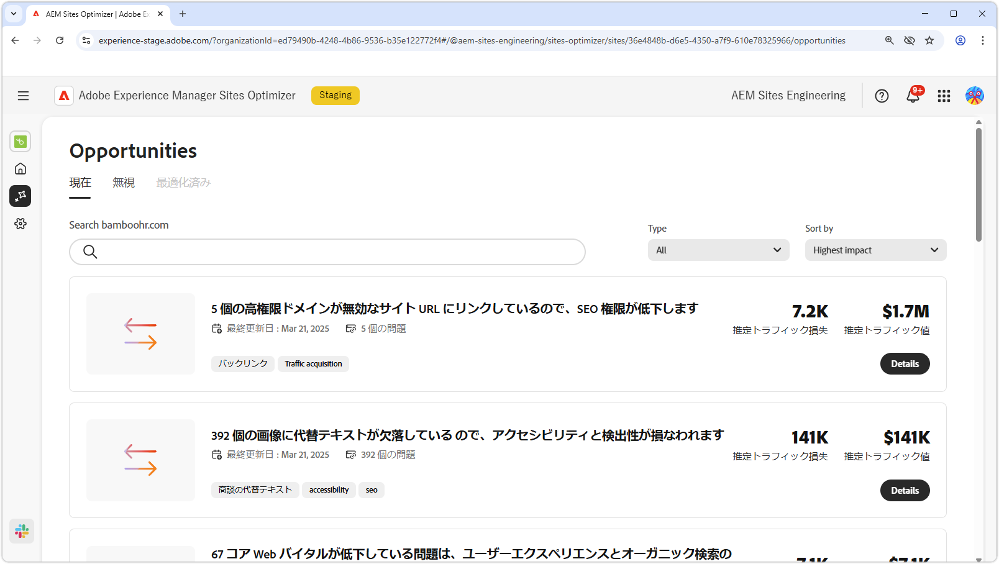

# 商談ドキュメント

{align="center"}

Sites Optimizerは、Adobe AI を活用した、Web サイトの改善点を特定および提案するように設計された、増え続けるオポチュニティのセットとして構成されます。 オポチュニティごとに、潜在的なビジネス価値に関するインサイトが得られ、注意が必要な領域がハイライト表示され、最適化のための実用的な推奨事項が提示されます。 各オポチュニティをクリックして、特定された問題、提案された改善点、および web サイトのパフォーマンスとユーザーエクスペリエンスを向上させるためにこれらの変更を実装する方法を示すステップバイステップのガイダンスを確認します。

商談は、**Site Optimizer の永続的なナビゲーション [ の** 商談 ](/help/documentation/basics.md#navigation) メニューオプションから利用できます。

## 商談ステータス

上部のタブを使用して、商談をステータス別に整理およびフィルタリングできます。

>[!BEGINTABS]

>[!TAB  現在 ]

{align="center"}

現在保留中の商談です。

>[!TAB  無視 ]

{align="center"}

無視された商談。 無視された商談は、このビューから復元できます。

>[!TAB  最適化 ]

最適化されたオポチュニティの過去のリスト。

>[!ENDTABS]

## 機会

[ 商談ステータス ](#opportunity-status) を選択すると、商談のリストを表示できます。 商談のリストは、次の方法でさらにフィルタリングできます。

* **検索** - **キーワード、タグ、URL** で商談を検索します。
* **商談タイプ** - **タイプ** ドロップダウンを使用して、[ 商談タイプ ](/help/opportunity-types/overview.md) で商談をフィルタリングできます。

### オポチュニティの詳細

{align="center"}

オポチュニティごとに、問題の簡単な説明、サイトに与える可能性のある影響、詳細へのリンクが提供されます。 ステータスも確認でき、最適化されているかどうかや、まだ保留中かどうかを示します。

* **オポチュニティのタイトル** – 問題の概要と、サイトのパフォーマンスに対する潜在的な影響。
* **最終更新日** – 商談が最後にSites Optimizerによって新しいデータで更新された日付。
* **問題数** - サイトで識別された問題のインスタンスの数。
* **商談タイプ** – この商談は、[ 商談のタイプ ](/help/opportunity-types/overview.md) の一部です（トラフィック獲得、エンゲージメント、サイトの正常性など）。

各オポチュニティの概要情報はタイプによって異なり、収益への影響、トラフィック、ユーザーエンゲージメント、セキュリティの脅威に関する詳細が含まれる場合があります。

商談の詳細を表示するには、「**詳細**」ボタンをクリックします。

Sites Optimizerのダッシュボードからオポチュニティを除外するには、「**無視**」ボタンをクリックします。  このアクションにより、オポチュニティが [**無視** タブ ](#opportunity-status) に移動します。

## すべての商談

Sites Optimizerで利用可能なすべてのオポチュニティを紹介します。

<!-- CARDS

* ./accessibility-issues.md
  {title=Accessibility issues}
  {image=../../assets/common/card-arrows.png} 
* ./broken-backlinks.md
  {title=Broken backlinks}
  {image=../../assets/common/card-arrows.png}
* ./broken-internal-links.md
  {title=Broken internal links}
  {image=../../assets/common/card-link.png}
* ./cors-configuration.md
  {title=CORS configuration}
  {image=../../assets/common/card-code.png}
* ./core-web-vitals.md
  {title=Core web vitals}
  {image=../../assets/common/card-performance.png}
* ./cross-site-scripting.md
  {title=Cross-site scripting}
  {image=../../assets/common/card-code.png}
* ./high-bounce-rate.md
  {title=High bounce rate}
  {image=../../assets/common/card-arrows.png}    
* ./invalid-or-missing-metadata.md
  {title=Invalid or missing metadata}
  {image=../../assets/common/card-code.png}
* ./missing-alt-text.md
  {title=Missing alt text}
  {image=../../assets/common/card-arrows.png}
* ./missing-invalid-structured-data.md
  {title=Missing or invalid structured data}
  {image=../../assets/common/card-bag.png}
* ./sitemap-issues.md
  {title=Sitemap issues}
  {image=../../assets/common/card-relationship.png}
* ./website-permissions.md
  {title=Website permissions}
  {image=../../assets/common/card-people.png}
* ./website-vulnerabilities.md
  {title=Website vulnerabilities}
  {image=../../assets/common/card-puzzle.png}
  
--->
<!-- START CARDS HTML - DO NOT MODIFY BY HAND -->

    

        

            

                <figure class="image x-is-16by9">
                    
                </figure>
            

            

                

                    

                        <a href="./accessibility-issues.md" target="_blank" rel="referrer" title="アクセシビリティの問題"> アクセシビリティの問題 </a>
                    

                    
アクセシビリティの問題のオポチュニティと、それを使用して web サイト上ののセキュリティを強化する方法について説明します。

                

                <a href="./accessibility-issues.md" target="_blank" rel="referrer" class="spectrum-Button spectrum-Button--outline spectrum-Button--primary spectrum-Button--sizeM" style="align-self: flex-start; margin-top: 1rem;">
                    詳細情報
                </a>
            

        

    

    

        

            

                <figure class="image x-is-16by9">
                    
                </figure>
            

            

                

                    

                        <a href="./broken-backlinks.md" target="_blank" rel="referrer" title="破損したバックリンク"> 壊れたバックリンク </a>
                    

                    
壊れたバックリンクの機会と、それを使用してトラフィック獲得を改善する方法について説明します。

                

                <a href="./broken-backlinks.md" target="_blank" rel="referrer" class="spectrum-Button spectrum-Button--outline spectrum-Button--primary spectrum-Button--sizeM" style="align-self: flex-start; margin-top: 1rem;">
                    詳細情報
                </a>
            

        

    

    

        

            

                <figure class="image x-is-16by9">
                    
                </figure>
            

            

                

                    

                        <a href="./broken-internal-links.md" target="_blank" rel="referrer" title="壊れた内部リンク"> 壊れた内部リンク </a>
                    

                    
リンク切れの機会と、それを使用して web サイトでのエンゲージメントを向上させる方法について説明します。

                

                <a href="./broken-internal-links.md" target="_blank" rel="referrer" class="spectrum-Button spectrum-Button--outline spectrum-Button--primary spectrum-Button--sizeM" style="align-self: flex-start; margin-top: 1rem;">
                    詳細情報
                </a>
            

        

    

    

        

            

                <figure class="image x-is-16by9">
                    
                </figure>
            

            

                

                    

                        <a href="./cors-configuration.md" target="_blank" rel="referrer" title="CORS 設定">CORS 設定</a>
                    

                    
CORS 設定の機会について、およびサイトのセキュリティの脆弱性を特定して修正する方法について説明します。

                

                <a href="./cors-configuration.md" target="_blank" rel="referrer" class="spectrum-Button spectrum-Button--outline spectrum-Button--primary spectrum-Button--sizeM" style="align-self: flex-start; margin-top: 1rem;">
                    詳細情報
                </a>
            

        

    

    

        

            

                <figure class="image x-is-16by9">
                    
                </figure>
            

            

                

                    

                        <a href="./core-web-vitals.md" target="_blank" rel="referrer" title="Core web vitals">Core web vitals</a>
                    

                    
Web の重要なオポチュニティと、それを使用してトラフィック獲得を改善する方法について説明します。

                

                <a href="./core-web-vitals.md" target="_blank" rel="referrer" class="spectrum-Button spectrum-Button--outline spectrum-Button--primary spectrum-Button--sizeM" style="align-self: flex-start; margin-top: 1rem;">
                    詳細情報
                </a>
            

        

    

    

        

            

                <figure class="image x-is-16by9">
                    
                </figure>
            

            

                

                    

                        <a href="./cross-site-scripting.md" target="_blank" rel="referrer" title="クロスサイトスクリプティング"> クロスサイトスクリプティング </a>
                    

                    
クロスサイトスクリプティングの機会について説明し、サイトセキュリティの脆弱性を特定して修正します。

                

                <a href="./cross-site-scripting.md" target="_blank" rel="referrer" class="spectrum-Button spectrum-Button--outline spectrum-Button--primary spectrum-Button--sizeM" style="align-self: flex-start; margin-top: 1rem;">
                    詳細情報
                </a>
            

        

    

    

        

            

                <figure class="image x-is-16by9">
                    
                </figure>
            

            

                

                    

                        <a href="./high-bounce-rate.md" target="_blank" rel="referrer" title="バウンス率が高い"> 高バウンス率 </a>
                    

                    
ロービューの機会と、それを使用して web サイトでのフォームエンゲージメントを向上させる方法について説明します。

                

                <a href="./high-bounce-rate.md" target="_blank" rel="referrer" class="spectrum-Button spectrum-Button--outline spectrum-Button--primary spectrum-Button--sizeM" style="align-self: flex-start; margin-top: 1rem;">
                    詳細情報
                </a>
            

        

    

    

        

            

                <figure class="image x-is-16by9">
                    
                </figure>
            

            

                

                    

                        <a href="./invalid-or-missing-metadata.md" target="_blank" rel="referrer" title="メタデータが無効または欠落しています"> メタデータが無効または見つかりません </a>
                    

                    
無効な、または見つからないメタデータのオポチュニティと、そのオポチュニティを使用してトラフィック獲得を改善する方法について説明します。

                

                <a href="./invalid-or-missing-metadata.md" target="_blank" rel="referrer" class="spectrum-Button spectrum-Button--outline spectrum-Button--primary spectrum-Button--sizeM" style="align-self: flex-start; margin-top: 1rem;">
                    詳細情報
                </a>
            

        

    

    

        

            

                <figure class="image x-is-16by9">
                    
                </figure>
            

            

                

                    

                        <a href="./missing-alt-text.md" target="_blank" rel="referrer" title="代替テキストがありません"> 代替テキストがありません </a>
                    

                    
欠けている代替テキストの機会と、それを使用して web サイトでのエンゲージメントを向上させる方法について説明します。

                

                <a href="./missing-alt-text.md" target="_blank" rel="referrer" class="spectrum-Button spectrum-Button--outline spectrum-Button--primary spectrum-Button--sizeM" style="align-self: flex-start; margin-top: 1rem;">
                    詳細情報
                </a>
            

        

    

    

        

            

                <figure class="image x-is-16by9">
                    
                </figure>
            

            

                

                    

                        <a href="./missing-invalid-structured-data.md" target="_blank" rel="referrer" title="構造化データが欠落している、または無効です"> 構造化データがないか無効です </a>
                    

                    
見つからない構造化データのオポチュニティや無効な構造化データのオポチュニティについて、およびトラフィック獲得を向上させるために使用する方法について説明します。

                

                <a href="./missing-invalid-structured-data.md" target="_blank" rel="referrer" class="spectrum-Button spectrum-Button--outline spectrum-Button--primary spectrum-Button--sizeM" style="align-self: flex-start; margin-top: 1rem;">
                    詳細情報
                </a>
            

        

    

    

        

            

                <figure class="image x-is-16by9">
                    
                </figure>
            

            

                

                    

                        <a href="./sitemap-issues.md" target="_blank" rel="referrer" title="サイトマップの問題"> サイトマップの問題 </a>
                    

                    
サイトマップの問題の機会と、それを使用してトラフィック獲得を改善する方法について説明します。

                

                <a href="./sitemap-issues.md" target="_blank" rel="referrer" class="spectrum-Button spectrum-Button--outline spectrum-Button--primary spectrum-Button--sizeM" style="align-self: flex-start; margin-top: 1rem;">
                    詳細情報
                </a>
            

        

    

    

        

            

                <figure class="image x-is-16by9">
                    
                </figure>
            

            

                

                    

                        <a href="./website-permissions.md" target="_blank" rel="referrer" title="Web サイト権限">Web サイトの権限 </a>
                    

                    
Web サイトの権限の機会と、それを使用して Web サイト上ののセキュリティを強化する方法について説明します。

                

                <a href="./website-permissions.md" target="_blank" rel="referrer" class="spectrum-Button spectrum-Button--outline spectrum-Button--primary spectrum-Button--sizeM" style="align-self: flex-start; margin-top: 1rem;">
                    詳細情報
                </a>
            

        

    

    

        

            

                <figure class="image x-is-16by9">
                    
                </figure>
            

            

                

                    

                        <a href="./website-vulnerabilities.md" target="_blank" rel="referrer" title="Web サイトの脆弱性">Web サイトの脆弱性 </a>
                    

                    
Web サイトの脆弱性の機会と、それを使用して Web サイト上ののセキュリティを強化する方法について説明します。

                

                <a href="./website-vulnerabilities.md" target="_blank" rel="referrer" class="spectrum-Button spectrum-Button--outline spectrum-Button--primary spectrum-Button--sizeM" style="align-self: flex-start; margin-top: 1rem;">
                    詳細情報
                </a>
            

        

    

<!-- END CARDS HTML - DO NOT MODIFY BY HAND -->

