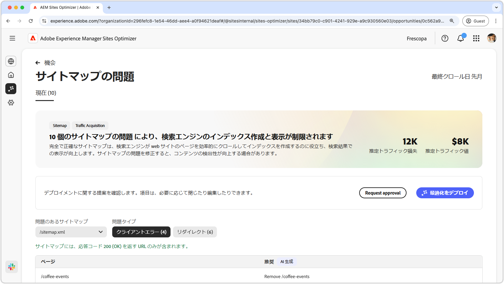
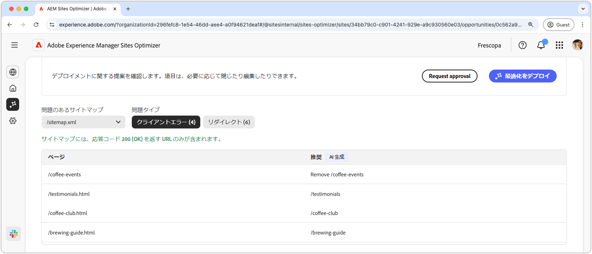
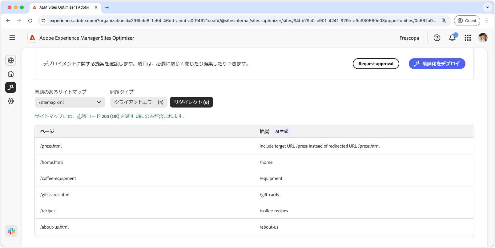
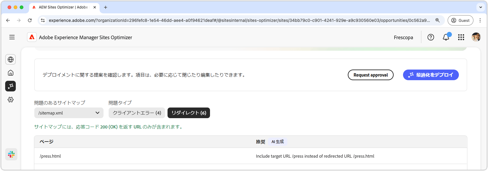

# サイトマップの問題の機会

{align="center"}

完全で正確なサイトマップは、検索エンジンが web サイトのページを効率的にクロールしてインデックスを作成するのに役立ち、検索結果での表示が向上します。サイトマップの機会により、サイトマップの潜在的な問題が特定されます。これらの問題を修正すると、検索エンジンのインデックス作成とサイトのコンテンツの検出性が大幅に向上します。

ページの上部に、問題の概要と、サイトやビジネスに与える影響を含む概要が表示されます。

* **見込みトラフィック損失** - サイトマップの問題による推定トラフィック損失。
* **見込みトラフィック値** - 損失したトラフィックの推定値。

## 自動特定

サイトマップの問題は、次の条件を使用してフィルタリングできます。

* **問題のあるサイトマップ** - 潜在的な問題を含む分析済みのサイトマップ URL。
* **問題タイプ** - サイトマップで特定される問題のタイプ。
   * **クライアントエラー** - `200 Success` 応答を返さないエントリ。
   * **リダイレクト** - 障害が発生したか、誤って設定されたリダイレクト。

>[!BEGINTABS]

>[!TAB クライアントエラー]

{align="center"}

サイトマップ内の URL がこれらを返す場合、検索エンジンはサイトマップが古くなっているか、ページが誤って削除されたと見なす場合があります。クライアントは、クライアント（ブラウザーまたはクローラー）からのリクエストが無効であったことを示します。一般的なエラーを次に示します。

* **404 Not Found** - リクエストされたページが存在しません。
* **403 Forbidden** - サーバーはリクエストされたページへのアクセスを拒否します。
* **410 Gone** - ページは意図的に削除され、返されません。
* **401 Unauthorized** - 認証が必要ですが、提供されていません。

これらのエラーは SEO に悪影響を与える可能性があります。特に重要なページが **404 または 410** を返す場合、検索エンジンによってインデックスが削除される場合があります。

各問題は表形式で表示され、影響を受けるサイトマップエントリが&#x200B;**ページ**&#x200B;列で特定されます。

* **ページ** - 問題が発生したサイトマップエントリの URL。

>[!TAB リダイレクト]

{align="center"}

サイトマップには、リダイレクトする URL ではなく、最終的な宛先 URL のみを含める必要があります。リダイレクトはユーザーとクローラーを正しい場所に誘導することを目的としていますが、誤って設定すると問題が発生する場合があります。

* **302 Found（一時的なリダイレクト）** - **301** の代わりに誤って使用すると、SEO の問題が発生する場合があります。
* **307 一時的なリダイレクト** - 302 に似ていますが、HTTP メソッドが保持されます。
* **リダイレクトループ** - ページが自分自身にリダイレクトされるか、無限ループを作成する場合。
* **破損したリダイレクト** - リダイレクトによって存在しないページまたは 4xx ページに移動する場合。

各問題はテーブルに表示され、影響を受けるサイトマップエントリが&#x200B;**ページ**&#x200B;列で特定されます。

* **ページ** - 問題が発生したサイトマップエントリの URL。

>[!ENDTABS]

## 自動提案

[フィルター条件を満たす](#auto-identify)各サイトマップの問題は、次の列を含むテーブルに一覧表示されます。

* **ページ** - 問題が発生したサイトマップエントリの URL。
* **提案** - 問題に対して推奨される修正。

提案には通常、サイトマップのエントリを修正するための更新されたサイトパスが含まれます。場合によっては、正しいリダイレクトターゲットを指定するなど、より詳細な手順が提供されることもあります。

## 自動最適化

[!BADGE Ultimate]{type=Positive tooltip="Ultimate"}

{align="center"}

Sites Optimizer Ultimate には、サイトマップの自動最適化をデプロイする機能が追加されています。

>[!BEGINTABS]

>[!TAB 最適化のデプロイ]

{{auto-optimize-deploy-optimization-slack}}

>[!TAB 承認のリクエスト]

{{auto-optimize-request-approval}}

>[!ENDTABS]
