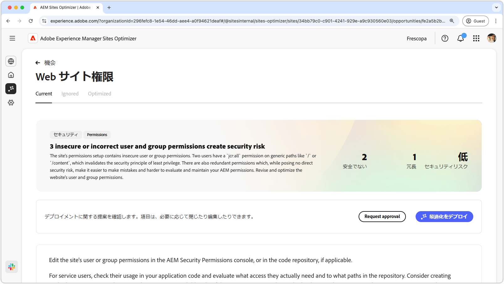
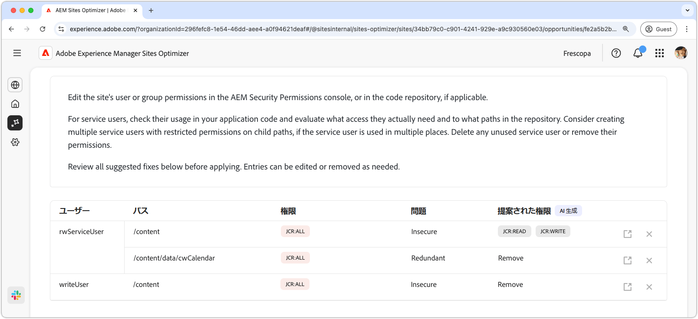
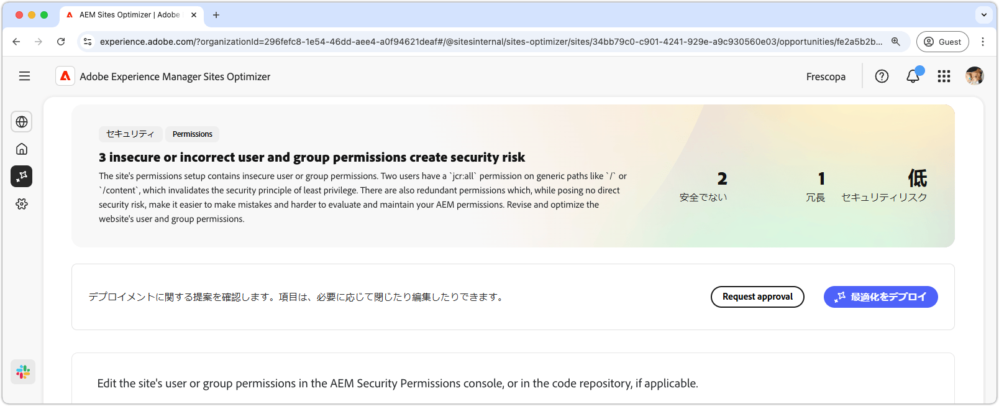

# Web サイト権限のオポチュニティ

{align="center"}

Web サイトの権限のオポチュニティは、安全で管理しやすいAEM環境を維持するために重要な、web サイトの権限を最適化します。 この機会を利用すると、過度に広範な権限（`/` や `/content` などの汎用パスに対する `jcr:all` など）を削除し、最小権限の原則に合わせてユーザーアクセスを調整することで、アクセス制御を絞り込むことができます。 権限を効率化し重複を排除することで、セキュリティリスクを軽減し、メンテナンス性を向上させ、将来的な設定ミスを防ぐことができます。 AEMのセキュリティ権限コンソールまたはコードリポジトリで権限を確認および更新して、アクションを実行し、サービスユーザーが本当に必要なアクセス権のみを持つようにします。

## 自動識別

{align="center"}

**Web サイト権限のオポチュニティ** 機能は、自動的に識別およびリスト表示します

* **ユーザー** – 疑わしい権限を持つユーザーアカウント。
* **Path** – 権限の影響を受けるAEM内のパス。
* **権限** – 疑わしい権限。
* **問題** – 権限に影響を与える問題のタイプを示します。

## 自動候補

{align="center"}

自動提案では、「**推奨権限**」フィールドに AI によって生成されたレコメンデーションが提供され、フラグが設定された権限を安全な代替値に置き換えることができます。

## 自動最適化

[!BADGE Ultimate]{type=Positive tooltip="Ultimate"}

{align="center"}

Sites Optimizer Ultimateには、検出された脆弱性を自動最適化デプロイする機能が追加されています。

>[!BEGINTABS]

>[!TAB  最適化のデプロイ ]

{{auto-optimize-deploy-optimization-slack}}

>[!TAB 承認のリクエスト]

{{auto-optimize-request-approval}}

>[!ENDTABS]
