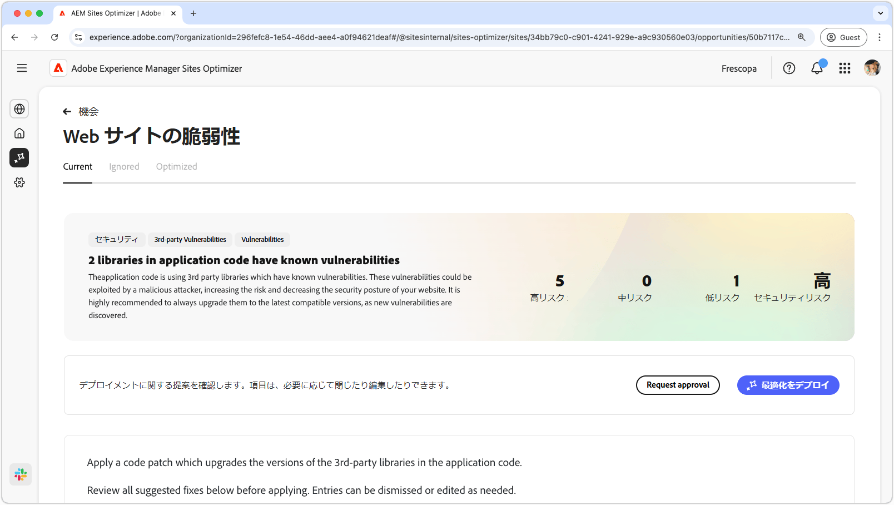

# Web サイトの脆弱性の機会

{align="center"}

Web サイトの脆弱性オポチュニティは、アプリケーションコードで使用されるサードパーティライブラリのセキュリティの脆弱性を特定します。 悪意のある攻撃者は、このような脆弱性を悪用し、Web サイトのリスクを高め、セキュリティ体制を低下させます。

Web サイトの脆弱性の機会では、ページの上部に次の内容を含む概要が表示されます。

* **見つかった問題** - 見つかった脆弱性の数。脆弱性が表すセキュリティリスク（低、中、高）別に分類されます。
* **集約されたセキュリティリスク** - 機会によって発見された脆弱性に基づく、web サイトに対する全体的なセキュリティリスク。

## 自動特定

{align="center"}

**Web サイトの脆弱性の機会**&#x200B;機能は、アプリケーションコードで使用されるサードパーティライブラリで見つかった脆弱性を自動的に特定して一覧表示します。次の詳細を提供します。

* **ライブラリ** - 脆弱性を含むサードパーティライブラリ。1 つのライブラリに複数の脆弱性が存在する場合があります。
* **現在のバージョン** - 現在使用されているライブラリのバージョン。
* **推奨バージョン** - 脆弱性を解決する提案されたバージョン。
* **スコア** - 脆弱性の重要度評価。ページの上部にも概要が表示されます。
* **脆弱性** - 脆弱性識別子、簡単な説明および詳細情報の National Vulnerability Database（NVD）へのリンク。識別子または説明の横にあるリンクをクリックして、NVD リンクにアクセスします。

## 自動提案

{align="center"}

自動提案は、アップグレードが必要な脆弱なライブラリの **推奨バージョン** に対して、AI によって生成された提案を提供します。 各エントリには全体的な重大度を示す&#x200B;**スコア**&#x200B;があり、最も重要な脆弱性を優先順位付けするのに役立ちます。

>[!BEGINTABS]

>[!TAB 脆弱性の詳細]

各脆弱性には、[National Vulnerability Database（NVD）](https://nvd.nist.gov/)の詳細情報へのリンクが含まれています。脆弱性の ID または説明の右側にあるリンク項目をクリックすると、その脆弱性の NVD ページに移動します。

>[!TAB エントリを無視]

脆弱性リストからのエントリを無視することを選択できます。 を選択すると、リストからエントリが削除されます。 無視されたエントリは、機会ページの上部にある「**無視**」タブから再度関与できます。<!---right now it does not seem to be implemented, but the page description mentions this functionality-->

>[!ENDTABS]

## 自動最適化

[!BADGE Ultimate]{type=Positive tooltip="Ultimate"}

{align="center"}

Sites Optimizer Ultimate には、見つかった脆弱性に対して自動最適化をデプロイする機能が追加されています。

>[!BEGINTABS]

>[!TAB 最適化のデプロイ]

{{auto-optimize-deploy-optimization-slack}}

>[!TAB 承認のリクエスト]

{{auto-optimize-request-approval}}

>[!ENDTABS]