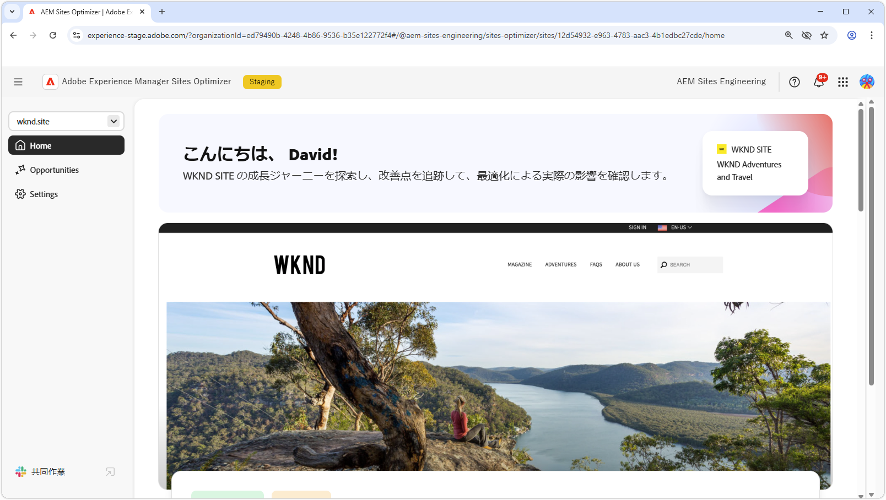

# Sites Optimizer ドキュメント

{align="center"}

このたびは、Sites Optimizer ドキュメントをご利用いただき、誠にありがとうございます。ここでは、Sites Optimizer を使用して AEM Sites を最適化する方法について説明します。

## Site Optimizer の基本

AEM Sites Optimizer のドキュメントを探索して、ホームダッシュボード、設定、最適化のインサイトを得るための機会リストなど、主要な UI コンポーネントについて説明します。

<!-- CARDS 

* ./basics.md
  {title = Basics}
  {image = ./assets/basics/card.png}
* ./opportunities/overview.md
  {title = Opportunities}
* ./settings.md
  {title = Settings}

-->
<!-- START CARDS HTML - DO NOT MODIFY BY HAND -->

    

        

            

                <figure class="image x-is-16by9">
                    
                </figure>
            

            

                

                    

                        <a href="./basics.md" target="_blank" rel="referrer" title="基本">基本</a>
                    

                    
Sites Optimizer の基本とその操作方法について説明します。

                

                <a href="./basics.md" target="_blank" rel="referrer" class="spectrum-Button spectrum-Button--outline spectrum-Button--primary spectrum-Button--sizeM" style="align-self: flex-start; margin-top: 1rem;">
                    詳細情報
                </a>
            

        

    

    

        

            

                <figure class="image x-is-16by9">
                    
                </figure>
            

            

                

                    

                        <a href="./opportunities/overview.md" target="_blank" rel="referrer" title="機会">機会</a>
                    

                    
使用可能なすべての Site Optimizer の機会と、これらを使用してサイトのパフォーマンスを向上させる方法について説明します。

                

                <a href="./opportunities/overview.md" target="_blank" rel="referrer" class="spectrum-Button spectrum-Button--outline spectrum-Button--primary spectrum-Button--sizeM" style="align-self: flex-start; margin-top: 1rem;">
                    詳細情報
                </a>
            

        

    

    

        

            

                <figure class="image x-is-16by9">
                    
                </figure>
            

            

                

                    

                        <a href="./settings.md" target="_blank" rel="referrer" title="設定">設定</a>
                    

                    
Sites Optimizer を設定し、他のツールと統合する方法について説明します。

                

                <a href="./settings.md" target="_blank" rel="referrer" class="spectrum-Button spectrum-Button--outline spectrum-Button--primary spectrum-Button--sizeM" style="align-self: flex-start; margin-top: 1rem;">
                    詳細情報
                </a>
            

        

    

<!-- END CARDS HTML - DO NOT MODIFY BY HAND -->

