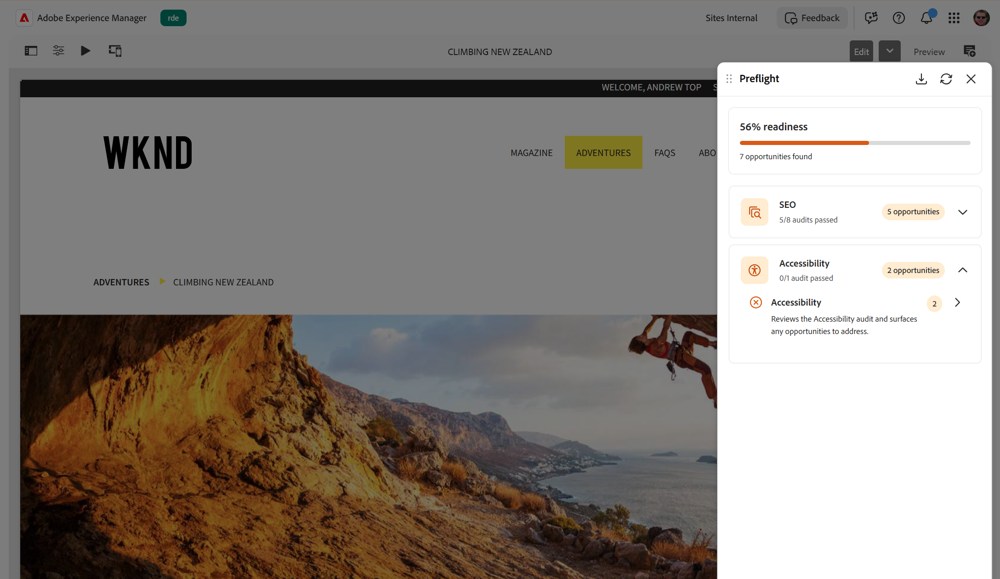

# アクセシビリティ監査

{align="center"}

プリフライトの&#x200B;**アクセシビリティ**&#x200B;監査では、Web コンテンツアクセシビリティガイドライン（WCAG）に照らし合わせてページが評価され、障害のあるユーザーを含むすべてのユーザーがページを確実に使用できるようになります。 プリフライト監査を実行すると、ページがこれらのアクセシビリティ標準に照らして評価され、見つかった問題を、公開前にレビューして解決できる機会にグループ化します。 アクセシビリティチェックとその対象となるガイドラインについて詳しくは、[&#x200B; アクセシビリティに関する問題](/help/documentation/opportunities/accessibility-issues.md)を参照してください。

準備状況ダッシュボードで、**アクセシビリティ** カテゴリを展開して、監査が合格したかどうか、および見つかった商談数を確認します。 監査を選択して詳細ページを開き、商談を処理します。 各商談では、アクセシビリティの問題、その重大度、関連するWCAG ルールおよび準拠レベル、およびページ上の影響を受ける要素について説明します。 エレメントに読み取り可能なテキストがある場合は、プリフライトにそのテキストが表示されるので、エレメントをより簡単に認識できます。それ以外の場合は、エレメントのCSS セレクターが表示されます。 結果を解釈して機会を解決する方法については、[&#x200B; プリフライトでの結果の監査](../audit-results.md)を参照してください。
