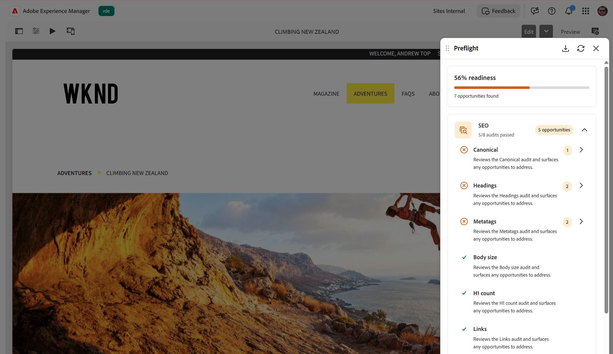

# SEO監査

{align="center"}

プリフライトの&#x200B;**SEO** カテゴリは、ページが検索エンジン向けに最適化されているかどうかを評価する監査をグループ化します。 プリフライト監査を実行すると、これらの監査により、ページのメタデータ、見出し構造、リンク、コンテンツが評価され、公開前にレビューして解決できる機会が表示されます。

準備状況ダッシュボードで、**SEO** カテゴリを展開して、各監査が合格したかどうか、見つかった商談数を確認します。 監査を選択して詳細ページを開き、商談を処理します。 結果を解釈して機会を解決する方法については、[&#x200B; プリフライトでの結果の監査](../audit-results.md)を参照してください。

SEO カテゴリには、次の監査が含まれます。

* [&#x200B; メタタグ &#x200B;](./seo/metatags.md) - ページタイトルとメタディスクリプション タグを確認します。
* [見出し](./seo/headings.md) - ページの見出し構造と順序を確認します。
* [内部リンク &#x200B;](./seo/internal-links.md) – 自分のサイトを示すページ上のリンクを確認します。
* [外部リンク &#x200B;](./seo/external-links.md) – 他のサイトを指すページ上のリンクを確認します。
* [読みやすさ](./seo/readability.md) - ページコンテンツを簡単に読み取れることを確認します。
* [正規](./seo/canonical.md) - ページの正規リンクを確認します。
* [&#x200B; ボディサイズ &#x200B;](./seo/body-size.md) - ページ上のボディコンテンツの量を確認します。
* [Lorem ipsum](./seo/lorem-ipsum.md) - コンテンツに残っているプレースホルダーテキストを検出します。
