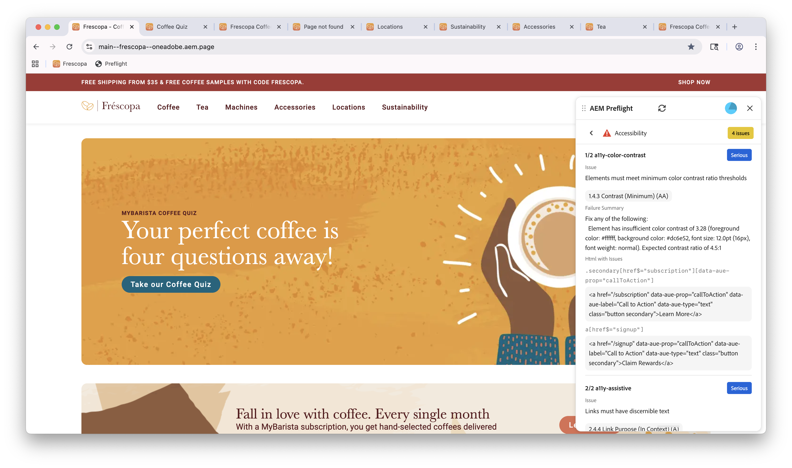
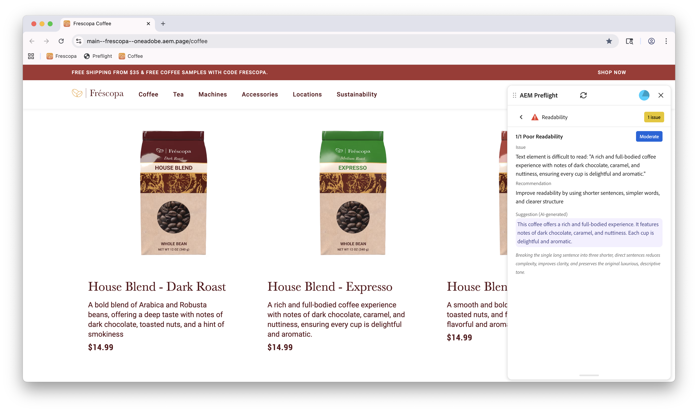

# AEM Sites Optimizer Preflight

{align="center"}

AEM Sites Optimizerのプリフライト機能は、コンテンツと構造を分析し、実用的なレコメンデーションで問題をフラグ付けすることで、公開前にページを検証し、最適化するのに役立ちます。 作成者、マーケター、開発者向けに設計されており、手戻りを減らしながらページの品質とパフォーマンスを高め、すぐに公開できるようにします。

プリフライトの中心となるのはオポチュニティです。このオポチュニティは、公開前にページの主要な側面を評価する一連の監査によって特定されます。 これらの監査は、潜在的な問題を明らかにし、全体的な品質とパフォーマンスを向上させるための明確で実用的な推奨事項を提供します。

## プリフライトの概要

Preflightの使い方は簡単です。 Preflightを設定し、オーサリング環境で開いて、ページの監査を実行するだけで、Preflightが残りの作業を行います。

1. [ プリフライトの設定](./setup.md) - AEM インスタンスにプリフライトを設定する方法について説明します
1. [ プリフライトへのアクセス ](./access-preflight.md) - オーサリング環境でプリフライトが表示される場所を確認します
1. [監査の実行](./audits.md) - プリフライト監査を開始する方法を説明します
1. [監査結果と商談](./audit-results.md) – 監査結果の解釈方法について説明します

## プリフライトのオポチュニティ

<!-- CARDS

* ./opportunities/accessibility.md
* ./opportunities/h1-count.md
* ./opportunities/links.md
* ./opportunities/meta-data.md
* ./opportunities/readability.md
-->
<!-- START CARDS HTML - DO NOT MODIFY BY HAND -->

    

        

            

                <figure class="image x-is-16by9">
                    
                </figure>
            

            

                

                    

                        <a href="./opportunities/accessibility.md" target="_blank" rel="referrer" title="プリフライトのアクセシビリティオポチュニティ">プリフライトのアクセシビリティの機会</a>
                    

                    
Sites Optimizer でのプリフライトのアクセシビリティの機会について説明します。

                

                <a href="./opportunities/accessibility.md" target="_blank" rel="referrer" class="spectrum-Button spectrum-Button--outline spectrum-Button--primary spectrum-Button--sizeM" style="align-self: flex-start; margin-top: 1rem;">
                    詳細情報
                </a>
            

        

    

    

        

            

                <figure class="image x-is-16by9">
                    
                </figure>
            

            

                

                    

                        <a href="./opportunities/h1-count.md" target="_blank" rel="referrer" title="プリフライトの H1 カウントの機会">プリフライトの H1 カウントの機会</a>
                    

                    
Sites Optimizer でのプリフライトのアクセシビリティの機会について説明します。

                

                <a href="./opportunities/h1-count.md" target="_blank" rel="referrer" class="spectrum-Button spectrum-Button--outline spectrum-Button--primary spectrum-Button--sizeM" style="align-self: flex-start; margin-top: 1rem;">
                    詳細情報
                </a>
            

        

    

    

        

            

                <figure class="image x-is-16by9">
                    
                </figure>
            

            

                

                    

                        <a href="./opportunities/links.md" target="_blank" rel="referrer" title="プリフライトのリンクの機会">プリフライトのリンクの機会</a>
                    

                    
Sites Optimizer でのプリフライトのリンクの機会について説明します。

                

                <a href="./opportunities/links.md" target="_blank" rel="referrer" class="spectrum-Button spectrum-Button--outline spectrum-Button--primary spectrum-Button--sizeM" style="align-self: flex-start; margin-top: 1rem;">
                    詳細情報
                </a>
            

        

    

    

        

            

                <figure class="image x-is-16by9">
                    
                </figure>
            

            

                

                    

                        <a href="./opportunities/meta-data.md" target="_blank" rel="referrer" title="プリフライトのメタデータの機会">プリフライトのメタデータの機会</a>
                    

                    
Sites Optimizer でのプリフライトのメタデータの機会について説明します。

                

                <a href="./opportunities/meta-data.md" target="_blank" rel="referrer" class="spectrum-Button spectrum-Button--outline spectrum-Button--primary spectrum-Button--sizeM" style="align-self: flex-start; margin-top: 1rem;">
                    詳細情報
                </a>
            

        

    

    

        

            

                <figure class="image x-is-16by9">
                    
                </figure>
            

            

                

                    

                        <a href="./opportunities/readability.md" target="_blank" rel="referrer" title="プリフライトの読みやすさの機会">プリフライトの読みやすさの機会</a>
                    

                    
Sites Optimizer でのプリフライトの読みやすさの機会について説明します。

                

                <a href="./opportunities/readability.md" target="_blank" rel="referrer" class="spectrum-Button spectrum-Button--outline spectrum-Button--primary spectrum-Button--sizeM" style="align-self: flex-start; margin-top: 1rem;">
                    詳細情報
                </a>
            

        

    

<!-- END CARDS HTML - DO NOT MODIFY BY HAND -->
