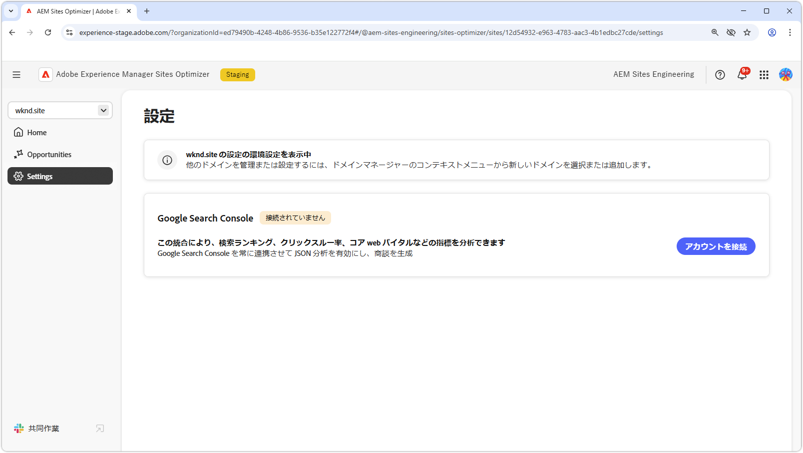
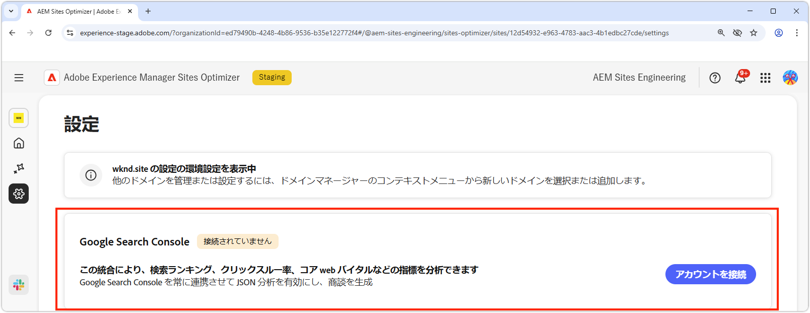

# Sites Optimizer の設定

{align="center"}

Sites Optimizer の設定は、Sites Optimizer エクスペリエンスを設定するための中心的なハブです。

## Google Search Console

{align="center"}

AEM Sites Optimizer の Google Search Console 設定コネクタを使用すると、検索ランキング、クリックスルー率、コア Web バイタルなどの主要な SEO 指標を分析できます。Google Search Console を常時接続しておくことで、JSON 分析を活用して最適化の機会を明らかにし、サイトのパフォーマンスを向上させることができます。

このコネクタを設定するには、ドメインの Google Search Console への管理者アクセス権を持つ資格情報が必要です。
