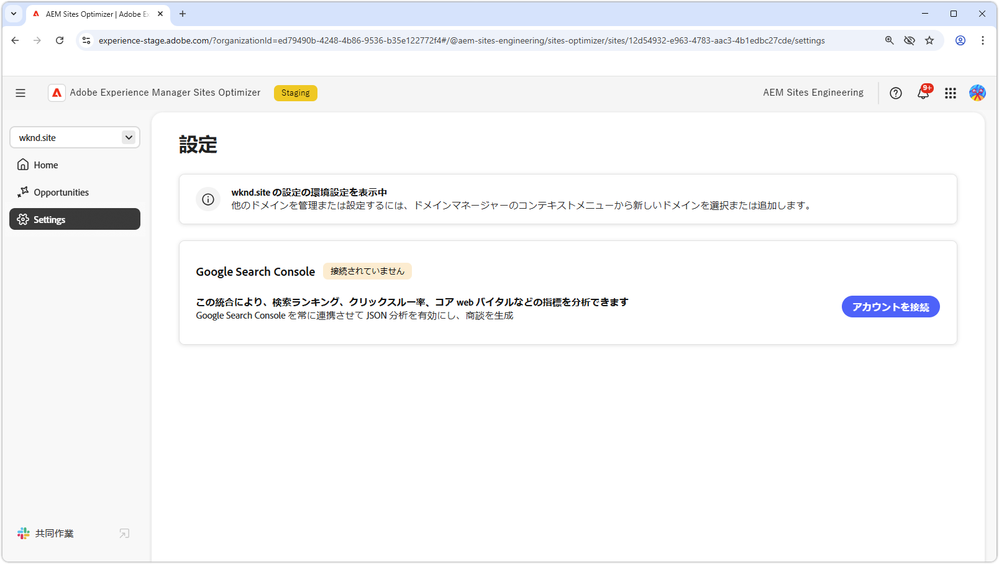
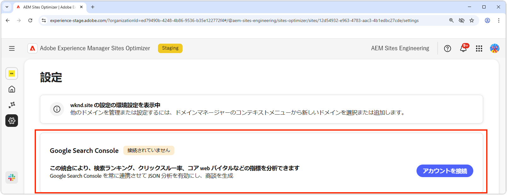
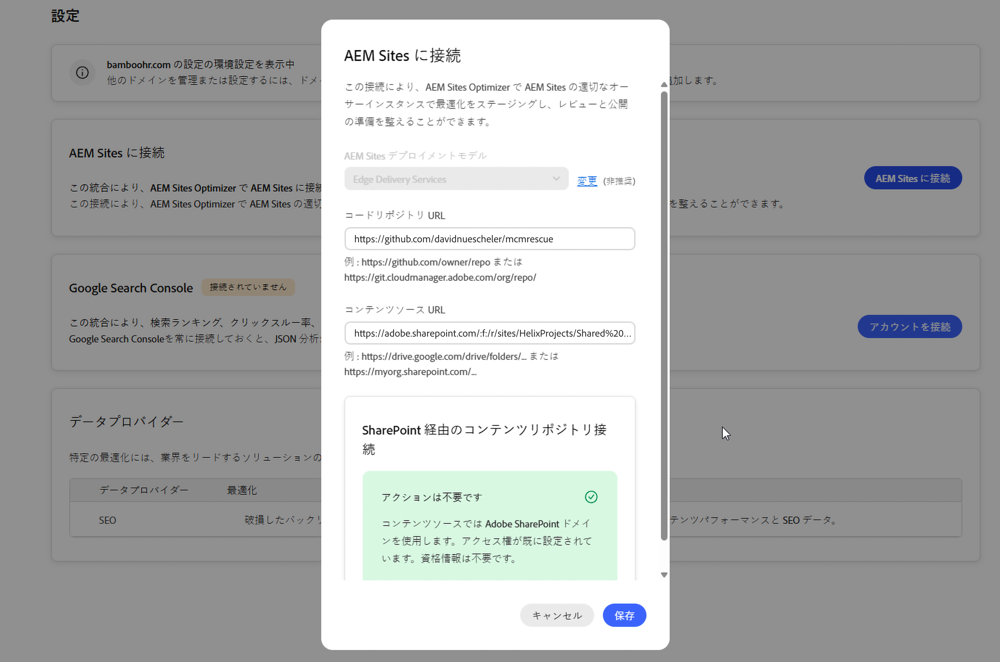
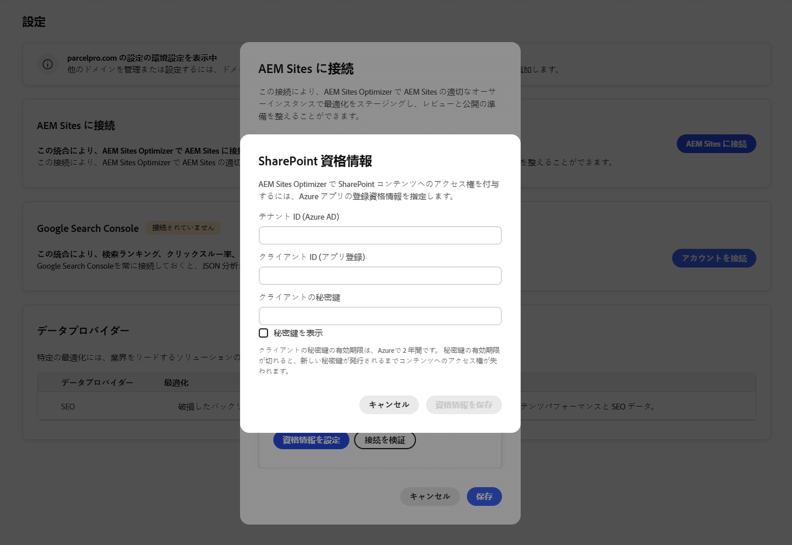
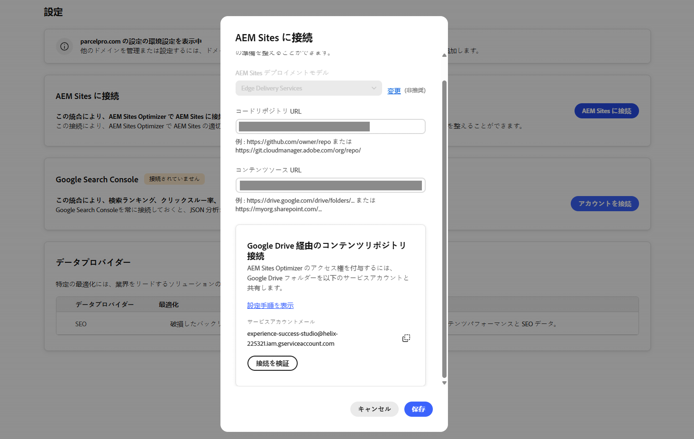

# Sites Optimizer の設定

{align="center"}

Sites Optimizer の設定は、Sites Optimizer エクスペリエンスを設定する中心的なハブです。

## Google Search Console

{align="center"}

AEM Sites Optimizer の Google Search Console 設定コネクタを使用すると、検索ランキング、クリックスルー率、コア Web バイタルなどの主要な SEO 指標を分析できます。 Google Search Console を常時接続しておくことで、JSON 分析を活用して最適化の機会を明らかにし、サイトのパフォーマンスを向上させることができます。

このコネクタを設定するには、ドメインの Google Search Console への管理者アクセス権を持つ資格情報が必要です。

## AEM Sites に接続

この次のガイドでは、既存の Edge Delivery Services（EDS）サイトを AEM Sites Optimizer に接続する方法について説明します。 開始する前に、EDS サイトが既に設定され、動作していることを確認してください。この接続は、AEM Sites Optimizer がコンテンツにアクセスする専用のものです。

接続には次の 2 つの手順が必要です。

1. コードリポジトリ URL とコンテンツソース URL を指定します。
2. AEM Sites Optimizer にコンテンツソースへのアクセス権を付与します。

### 手順 1 - コードリポジトリとコンテンツソースにリンク

AEM Sites Optimizer で、**設定／AEM Sites に接続**&#x200B;に移動し、次を入力します。

- **コードリポジトリ URL** - EDS サイトの GitHub URL。例：
  `https://github.com/owner/repo`

- **コンテンツソース URL** - EDS サイトをバックアップする SharePoint フォルダーまたは Google Drive フォルダーの URL。例：
  `https://drive.google.com/drive/folders/...` か `https://myorg.sharepoint.com/...` のどちらかにする必要があります。

コンテンツソース URLを入力すると、AEM Sites Optimizer がコンテンツソースタイプを検出し、以下の関連するアクセス手順を表示します。

### 手順 2 - コンテンツソースへのアクセス権を付与

コンテンツソースに一致するセクションに従います。

#### SharePoint - Adobe ドメイン

{align="center"}

コンテンツソース URL で Adobe SharePoint ドメインを使用している場合、これ以上のアクションは必要ありません。 アクセス権は既に設定されています。 「**保存**」をクリックして、接続を完了します。

#### SharePoint - カスタムドメイン

コンテンツソース URL で組織独自の SharePoint ドメインを使用している場合、Azure アプリケーションを登録し、この資格情報を AEM Sites Optimizer に指定する必要があります。

##### 必要なもの

- Azure Portal にアプリケーションを登録する権限またはユーザーに代わってアプリケーションを登録できる連絡先。
- API 同意を付与するテナント管理者権限または API 同意を承認できる管理者。

##### 手順 2a - Azureでアプリケーションを登録

1. **Azure Portal／Microsoft Entra ID／アプリの登録／新規登録**&#x200B;に移動します。
2. 名前を付けます（例：`AEM Sites Optimizer`）。
3. その他のすべてをデフォルトのままにして、「**登録**」をクリックします。
4. **概要**&#x200B;ページで、次をメモします。
   - **アプリケーション（クライアント）ID**
   - **ディレクトリ（テナント）ID**

##### 手順 2b - API 権限を追加

1. **API のアクセス許可／アクセス許可の追加／Microsoft Graph／アプリケーションの許可**&#x200B;に移動します。
2. 次の両方を追加します。
   - `Sites.Selected` - 特定の SharePoint サイトコレクションへのスコープ付きアクセス権。
   - `Files.SelectedOperations.Selected` - ログインしていないユーザーによるファイルへのアクセス権。
3. 両方に「**管理者の同意を与えます**」をクリックします。

{align="center"}

>[!NOTE]
>
>管理者の同意を付与するには、テナント管理者権限が必要です。 これがない場合は、先に進む前に、IT 管理者または Azure 管理者にこの手順を完了するように依頼してください。

##### 手順 2c - クライアント秘密鍵を作成

{align="center"}

1. **証明書とシークレット／新しいクライアントシークレット**&#x200B;に移動します。
2. 説明と有効期限を設定し、「**追加**」をクリックします。
3. 秘密鍵の値をすぐにコピーします。1 回のみ表示されます。

##### 手順 2d - SharePoint サイトへのアプリのアクセス権を付与

Microsoft Graph Explorer、PowerShell、Graph API の直接呼び出しを使用して、アプリへのアクセス権を付与できます。

[Microsoft Graph Explorer](https://developer.microsoft.com/graph/graph-explorer) に移動し、Microsoft アカウントでログインして、次のリクエストを実行します。

1. サイト ID を見つけます。

```
GET https://graph.microsoft.com/v1.0/sites/{tenant}.sharepoint.com:/sites/{site-name}
```

1. 応答から `id` をコピーし、サイトレベルのアクセス権を付与します。

```
POST https://graph.microsoft.com/v1.0/sites/{siteId}/permissions
```

本文：

```json
{
  "roles": ["write"],
  "grantedToIdentities": [{
    "application": {
      "id": "{your-client-id}",
      "displayName": "{Your app name}"
    }
  }]
}
```

##### 手順 2e - AEM Sites Optimizer に資格情報を入力

{align="center"}

**AEM Sites に接続**&#x200B;ダイアログに戻り、**SharePoint 経由のコンテンツリポジトリ接続**&#x200B;に次を入力します。

- **テナント ID（Azure AD）** - アプリ登録／概要。
- **クライアント ID（アプリ登録）** - アプリ登録／概要。
- **クライアント秘密鍵** - 手順 2c で作成済み。

「**接続を検証**」をクリックしてアクセス権を確認し、「**保存**」をクリックします。

#### Google Drive

{align="center"}

1. Google Drive で、EDS サイトをバックアップするフォルダーを右クリックし、「**共有**」を選択します。
2. 「**ユーザーやグループを追加**」フィールドに、**AEM Sites に接続** ダイアログに表示されるサービスアカウントのメールを入力します。
   `experience-success-studio@helix-225321.iam.gserviceaccount.com`
3. 権限レベルを&#x200B;**編集者**&#x200B;に設定します。
4. 「**ユーザーに通知する**」をオフにし、「**共有**」をクリックします。

共有が完了したら、ダイアログで「**接続を検証**」をクリックし、「**保存**」をクリックします。
