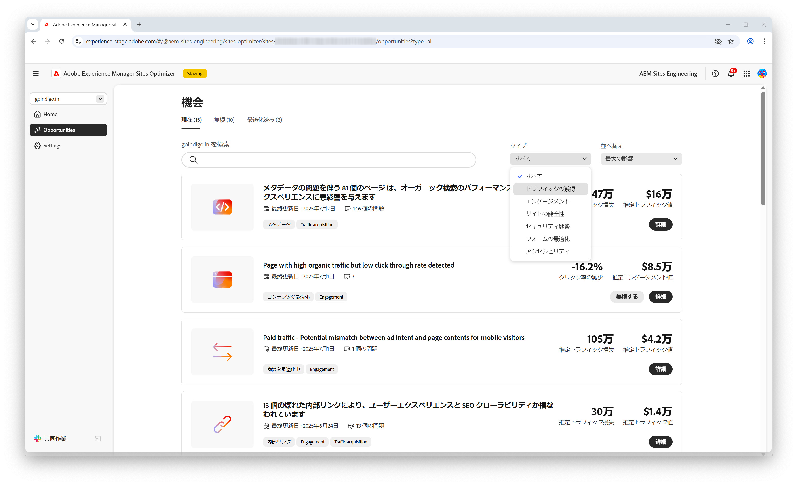

# AEM Sites Optimizer

>[!VIDEO](https://video.tv.adobe.com/v/3455086/?learn=on&enablevpops&captions=jpn)

Adobe Experience Manager（AEM）Sites Optimizer は、AEM 上に作成された web サイトのパフォーマンスを分析して向上させるクラウドベースのサービスです。ページの読み込み、コンポーネントの使用状況、コンテンツ配信に関して、改善が必要な領域を特定します。 この機能は、Web サイトのパフォーマンスを向上させつつ、メンテナンスや更新のコストを削減するのに役立ちます。 Sites Optimizer を使用すると、エンゲージメントとコンバージョン率の維持に重要な、スムーズで信頼性の高いオンラインエクスペリエンスを確保できます。

## Sites Optimizer の基本を学ぶ

<!-- CARDS 

* ./opportunity-types/overview.md
   {title=Opportunity types}
   {description = Learn about the available Site Optimizer opportunities and how to use them to improve your site's performance.}
* ./documentation/overview.md
  * {title=Documentation}
  * {description=Explore the Sites Optimizer documentation to learn about all its capabilities.}

-->
<!-- START CARDS HTML - DO NOT MODIFY BY HAND -->

    

        

            

                <figure class="image x-is-16by9">
                    
                </figure>
            

            

                

                    

                        <a href="./opportunity-types/overview.md" target="_blank" rel="referrer" title="機会タイプ">機会タイプ</a>
                    

                    
使用可能な Site Optimizer の商談と、これらを使用してサイトのパフォーマンスを向上させる方法について説明します。

                

                <a href="./opportunity-types/overview.md" target="_blank" rel="referrer" class="spectrum-Button spectrum-Button--outline spectrum-Button--primary spectrum-Button--sizeM" style="align-self: flex-start; margin-top: 1rem;">
                    詳細情報
                </a>
            

        

    

    

        

            

                <figure class="image x-is-16by9">
                    
                </figure>
            

            

                

                    

                        <a href="./documentation/overview.md" target="_blank" rel="referrer" title="ドキュメント">ドキュメント</a>
                    

                    
Sites Optimizer のドキュメントでは、そのすべての機能について説明します。

                

                <a href="./documentation/overview.md" target="_blank" rel="referrer" class="spectrum-Button spectrum-Button--outline spectrum-Button--primary spectrum-Button--sizeM" style="align-self: flex-start; margin-top: 1rem;">
                    詳細情報
                </a>
            

        

    

<!-- END CARDS HTML - DO NOT MODIFY BY HAND -->
