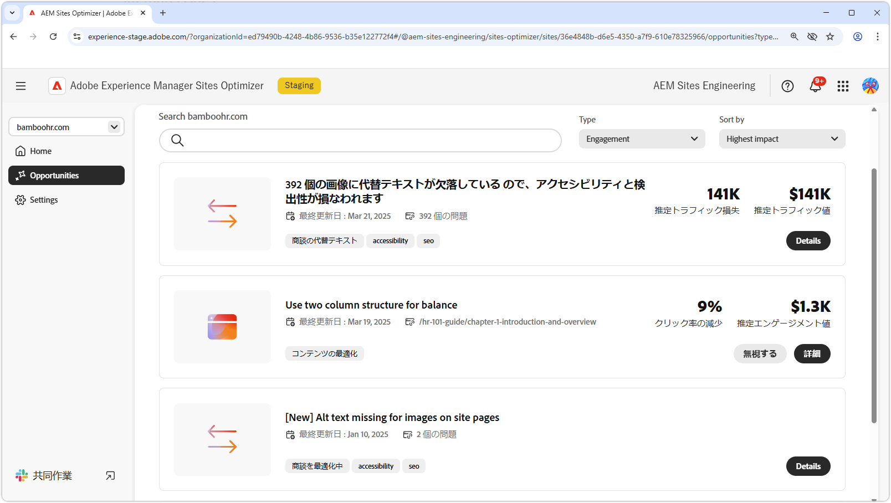

# エンゲージメントチャンス

{align="center"}

AEM Sites Optimizerでのエンゲージメントの機会は、ユーザーが web ページとやり取りする方法に関する実用的なインサイトを提供することで、デジタルエクスペリエンスを強化するために重要です。 アクセシビリティの問題、内部リンクの切断、高いバウンス率、代替テキストの欠落など、改善が必要な領域を特定することで、マーケターとコンテンツ作成者は、サイトを最適化してパフォーマンスとユーザーエンゲージメントを向上させることができます。 これらの機会により、コンテンツが効果的で、検索可能で、説得力のあるものになり、最終的にコンバージョンが高まり、よりシームレスなカスタマージャーニーが促進されます。 AEM Sites Optimizerのレコメンデーションを活用すると、チームはデジタル戦略を継続的に調整し、インパクトの高いエクスペリエンスを大規模に提供できます。

## 機会

<!-- CARDS

* ../documentation/opportunities/accessibility-issues.md
  {title=Accessibility issues}
  {image=../assets/common/card-puzzle.png}
* ../documentation/opportunities//broken-internal-links.md
  {title=Broken internal links}
  {image=../assets/common/card-link.png}
* ../documentation/opportunities//high-bounce-rate.md
  {title=High bounce rate}
  {image=../assets/common/card-arrows.png}
* ../documentation/opportunities/missing-alt-text.md  
  {title=Missing alt text}
  {image=../assets/common/card-arrows.png}

-->
<!-- START CARDS HTML - DO NOT MODIFY BY HAND -->

    

        

            

                <figure class="image x-is-16by9">
                    
                </figure>
            

            

                

                    

                        <a href="../documentation/opportunities/accessibility-issues.md" target="_blank" rel="referrer" title="アクセシビリティの問題"> アクセシビリティの問題 </a>
                    

                    
アクセシビリティの問題のオポチュニティと、それを使用して web サイト上ののセキュリティを強化する方法について説明します。

                

                <a href="../documentation/opportunities/accessibility-issues.md" target="_blank" rel="referrer" class="spectrum-Button spectrum-Button--outline spectrum-Button--primary spectrum-Button--sizeM" style="align-self: flex-start; margin-top: 1rem;">
                    詳細情報
                </a>
            

        

    

    

        

            

                <figure class="image x-is-16by9">
                    
                </figure>
            

            

                

                    

                        <a href="../documentation/opportunities//broken-internal-links.md" target="_blank" rel="referrer" title="壊れた内部リンク"> 壊れた内部リンク </a>
                    

                    
リンク切れの機会と、それを使用して web サイトでのエンゲージメントを向上させる方法について説明します。

                

                <a href="../documentation/opportunities//broken-internal-links.md" target="_blank" rel="referrer" class="spectrum-Button spectrum-Button--outline spectrum-Button--primary spectrum-Button--sizeM" style="align-self: flex-start; margin-top: 1rem;">
                    詳細情報
                </a>
            

        

    

    

        

            

                <figure class="image x-is-16by9">
                    
                </figure>
            

            

                

                    

                        <a href="../documentation/opportunities//high-bounce-rate.md" target="_blank" rel="referrer" title="バウンス率が高い"> 高バウンス率 </a>
                    

                    
ロービューの機会と、それを使用して web サイトでのフォームエンゲージメントを向上させる方法について説明します。

                

                <a href="../documentation/opportunities//high-bounce-rate.md" target="_blank" rel="referrer" class="spectrum-Button spectrum-Button--outline spectrum-Button--primary spectrum-Button--sizeM" style="align-self: flex-start; margin-top: 1rem;">
                    詳細情報
                </a>
            

        

    

    

        

            

                <figure class="image x-is-16by9">
                    
                </figure>
            

            

                

                    

                        <a href="../documentation/opportunities/missing-alt-text.md" target="_blank" rel="referrer" title="代替テキストがありません"> 代替テキストがありません </a>
                    

                    
欠けている代替テキストの機会と、それを使用して web サイトでのエンゲージメントを向上させる方法について説明します。

                

                <a href="../documentation/opportunities/missing-alt-text.md" target="_blank" rel="referrer" class="spectrum-Button spectrum-Button--outline spectrum-Button--primary spectrum-Button--sizeM" style="align-self: flex-start; margin-top: 1rem;">
                    詳細情報
                </a>
            

        

    

<!-- END CARDS HTML - DO NOT MODIFY BY HAND -->
