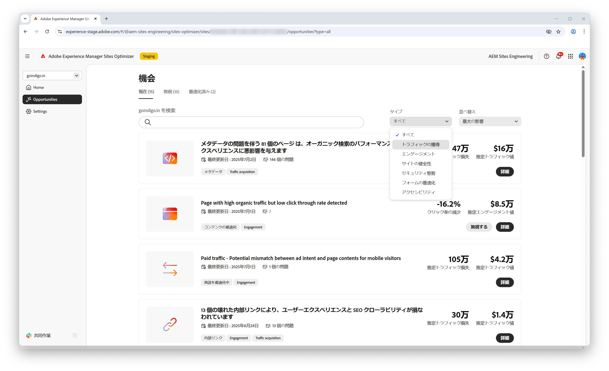
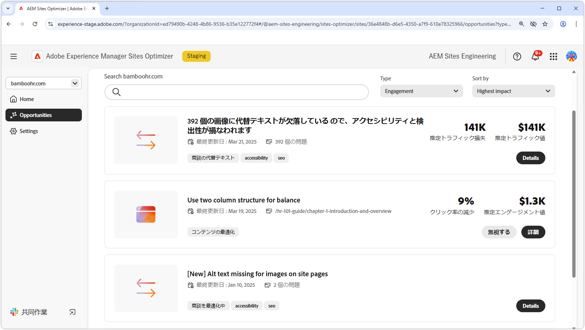
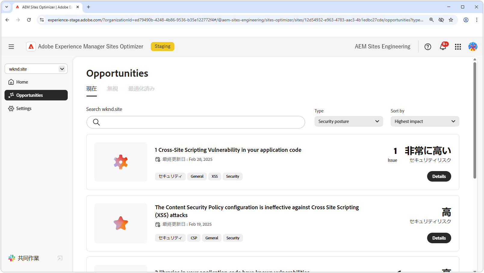
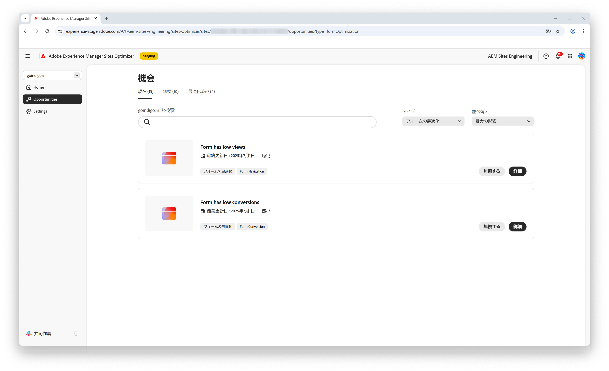

# 商談タイプ

{align="center"}

AEM Sites Optimizerは、web サイトのパフォーマンス、操作性、セキュリティを向上させるのに役立つ、貴重なインサイトと推奨事項を提供します。 これらのインサイトは、エンゲージメント、トラフィック獲得、セキュリティ態勢、サイトの正常性、フォームの最適化などの主要な商談領域にグループ化されます。 各カテゴリでは、訪問者とのやり取りを強化したり、検出性を向上させたり、セキュリティを強化したり、サイトの安定性を維持したり、フォームのパフォーマンスを最適化したりして、サイトを強化する特定の方法を重点的に説明します。

これらの機会を活用することで、ユーザーエクスペリエンスが向上し、適切なオーディエンスを引き付け、サイトの安全性と信頼性を維持できます。 エンゲージメントとトラフィック獲得を強化することでインタラクションと可視性を高め、強力なセキュリティ態勢とサイトヘルスによって信頼と安定性を確保します。 フォームを最適化することで、コンバージョンも向上できます。 以下のリンクを参照して、カテゴリ別に整理された商談を確認し、サイトを改善する方法を見つけます。

## 商談タイプ

<!-- CARDS 

* ./traffic-acquisition.md
   { title = Traffic acquisition }
* ./engagement.md
   { title = Engagement }
* ./site-health.md
   { title = Site health }
* ./security-posture.md
   { title = Security posture }
* ./form-optimization.md
   { title = Form optimization }

-->
<!-- START CARDS HTML - DO NOT MODIFY BY HAND -->

    

        

            

                <figure class="image x-is-16by9">
                    
                </figure>
            

            

                

                    

                        <a href="./traffic-acquisition.md" target="_blank" rel="referrer" title="トラフィックの獲得"> トラフィック獲得 </a>
                    

                    
Sites Optimizerを使用してトラフィック獲得を増やす方法を説明します。

                

                <a href="./traffic-acquisition.md" target="_blank" rel="referrer" class="spectrum-Button spectrum-Button--outline spectrum-Button--primary spectrum-Button--sizeM" style="align-self: flex-start; margin-top: 1rem;">
                    詳細情報
                </a>
            

        

    

    

        

            

                <figure class="image x-is-16by9">
                    
                </figure>
            

            

                

                    

                        <a href="./engagement.md" target="_blank" rel="referrer" title="エンゲージメント"> 婚約 </a>
                    

                    
Sites Optimizerとのエンゲージメントを向上させる方法について説明します。

                

                <a href="./engagement.md" target="_blank" rel="referrer" class="spectrum-Button spectrum-Button--outline spectrum-Button--primary spectrum-Button--sizeM" style="align-self: flex-start; margin-top: 1rem;">
                    詳細情報
                </a>
            

        

    

    

        

            

                <figure class="image x-is-16by9">
                    
                </figure>
            

            

                

                    

                        <a href="./site-health.md" target="_blank" rel="referrer" title="サイトの健全性"> サイトの正常性 </a>
                    

                    
Sites Optimizerを使用してサイトのヘルスを向上させる方法を説明します。

                

                <a href="./site-health.md" target="_blank" rel="referrer" class="spectrum-Button spectrum-Button--outline spectrum-Button--primary spectrum-Button--sizeM" style="align-self: flex-start; margin-top: 1rem;">
                    詳細情報
                </a>
            

        

    

    

        

            

                <figure class="image x-is-16by9">
                    
                </figure>
            

            

                

                    

                        <a href="./security-posture.md" target="_blank" rel="referrer" title="セキュリティ態勢"> セキュリティ体制 </a>
                    

                    
Sites Optimizerを使用してサイトのセキュリティを向上させる方法を説明します。

                

                <a href="./security-posture.md" target="_blank" rel="referrer" class="spectrum-Button spectrum-Button--outline spectrum-Button--primary spectrum-Button--sizeM" style="align-self: flex-start; margin-top: 1rem;">
                    詳細情報
                </a>
            

        

    

    

        

            

                <figure class="image x-is-16by9">
                    
                </figure>
            

            

                

                    

                        <a href="./form-optimization.md" target="_blank" rel="referrer" title="フォームの最適化"> フォームの最適化 </a>
                    

                    
Sites Optimizerを使用したフォームの最適化について説明します。

                

                <a href="./form-optimization.md" target="_blank" rel="referrer" class="spectrum-Button spectrum-Button--outline spectrum-Button--primary spectrum-Button--sizeM" style="align-self: flex-start; margin-top: 1rem;">
                    詳細情報
                </a>
            

        

    

<!-- END CARDS HTML - DO NOT MODIFY BY HAND -->
