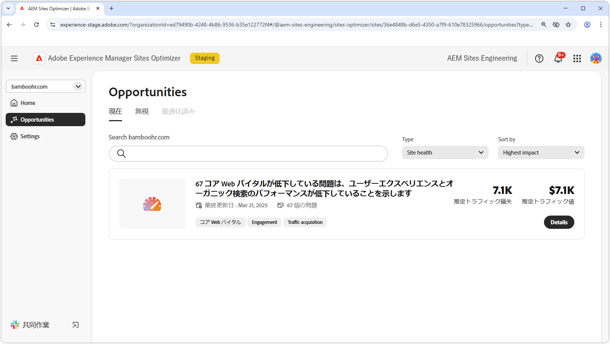
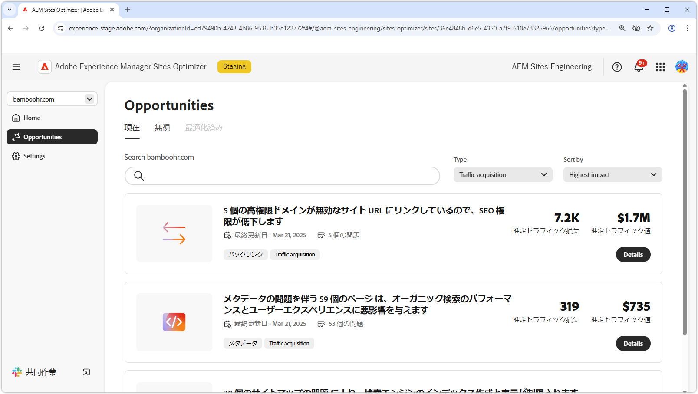

# 機会タイプ

{align="center"}

AEM Sites Optimizer では、web サイトのパフォーマンス、使いやすさ、セキュリティを向上させるのに役立つ貴重なインサイトとレコメンデーションを提供します。これらのインサイトは、次の主要な機会領域にグループ化されます。

* エンゲージメント
* トラフィックの獲得
* セキュリティ態勢
* サイトの健全性
* プリフライト

各カテゴリでは、サイトを強化する様々な方法がハイライト表示されます。1 つのカテゴリでは、訪問者のインタラクションが増加する場合があります。もう 1 つでは、検出性を向上させる場合があります。セキュリティの強化やサイトの安定性の維持に焦点を当てるものもあります。プリフライトは、ページを公開する前に分析および最適化するのに役立ちます。

これらの機会を使用することで、ユーザーエクスペリエンスが向上し、適切なオーディエンスを引き付け、サイトの安全性と信頼性が維持されます。エンゲージメントとトラフィック獲得を強化することでインタラクションと表示が向上し、強力なセキュリティ態勢とサイトの健全性によって信頼性と安定性が確保されます。プリフライト分析により、運用開始前にコンテンツが最適化されることが確保されます。以下のリンクを探索して、カテゴリ別に整理された商談を確認し、サイトを改善する方法を見つけてください。

## 商談タイプ

<!-- CARDS 

* ./engagement.md
   { title = Engagement }
* ./security-posture.md
   { title = Security posture }
* ./site-health.md
   { title = Site health }
* ./traffic-acquisition.md
   { title = Traffic acquisition }
* ./form-optimization.md
   { title = Forms Optimization }
* ./preflight.md
   { title = Preflight }

-->
<!-- START CARDS HTML - DO NOT MODIFY BY HAND -->

    

        

            

                <figure class="image x-is-16by9">
                    
                </figure>
            

            

                

                    

                        <a href="./engagement.md" target="_blank" rel="referrer" title="エンゲージメント">エンゲージメント</a>
                    

                    
Sites Optimizer を使用してエンゲージメントを向上させる方法について説明します。

                

                <a href="./engagement.md" target="_blank" rel="referrer" class="spectrum-Button spectrum-Button--outline spectrum-Button--primary spectrum-Button--sizeM" style="align-self: flex-start; margin-top: 1rem;">
                    詳細情報
                </a>
            

        

    

    

        

            

                <figure class="image x-is-16by9">
                    
                </figure>
            

            

                

                    

                        <a href="./security-posture.md" target="_blank" rel="referrer" title="セキュリティ態勢">セキュリティ態勢</a>
                    

                    
Sites Optimizer を使用してサイトのセキュリティ態勢を向上させる方法について説明します。

                

                <a href="./security-posture.md" target="_blank" rel="referrer" class="spectrum-Button spectrum-Button--outline spectrum-Button--primary spectrum-Button--sizeM" style="align-self: flex-start; margin-top: 1rem;">
                    詳細情報
                </a>
            

        

    

    

        

            

                <figure class="image x-is-16by9">
                    
                </figure>
            

            

                

                    

                        <a href="./site-health.md" target="_blank" rel="referrer" title="サイトの健全性">サイトの健全性</a>
                    

                    
Sites Optimizer を使用してサイトの健全性を向上させる方法について説明します。

                

                <a href="./site-health.md" target="_blank" rel="referrer" class="spectrum-Button spectrum-Button--outline spectrum-Button--primary spectrum-Button--sizeM" style="align-self: flex-start; margin-top: 1rem;">
                    詳細情報
                </a>
            

        

    

    

        

            

                <figure class="image x-is-16by9">
                    
                </figure>
            

            

                

                    

                        <a href="./traffic-acquisition.md" target="_blank" rel="referrer" title="トラフィックの獲得">トラフィックの獲得</a>
                    

                    
Sites Optimizer を使用してトラフィック獲得を増やす方法について説明します。

                

                <a href="./traffic-acquisition.md" target="_blank" rel="referrer" class="spectrum-Button spectrum-Button--outline spectrum-Button--primary spectrum-Button--sizeM" style="align-self: flex-start; margin-top: 1rem;">
                    詳細情報
                </a>
            

        

    

    

        

            

                <figure class="image x-is-16by9">
                    
                </figure>
            

            

                

                    

                        <a href="./form-optimization.md" target="_blank" rel="referrer" title="フォームの最適化">フォームの最適化</a>
                    

                    
フォームの最適化を使用してフォームのコンバージョンを向上させる方法について説明します。

                

                <a href="./form-optimization.md" target="_blank" rel="referrer" class="spectrum-Button spectrum-Button--outline spectrum-Button--primary spectrum-Button--sizeM" style="align-self: flex-start; margin-top: 1rem;">
                    詳細情報
                </a>
            

        

    

    

        

            

                <figure class="image x-is-16by9">
                    
                </figure>
            

            

                

                    

                        <a href="./form-optimization.md" target="_blank" rel="referrer" title="フォームのアクセシビリティ">フォームのアクセシビリティ</a>
                    

                    
フォームの最適化を使用してフォームのアクセシビリティを向上させる方法について説明します。

                

                <a href="./form-optimization.md" target="_blank" rel="referrer" class="spectrum-Button spectrum-Button--outline spectrum-Button--primary spectrum-Button--sizeM" style="align-self: flex-start; margin-top: 1rem;">
                    詳細情報
                </a>
            

        

    

    

        

            

                <figure class="image x-is-16by9">
                    
                </figure>
            

            

                

                    

                        <a href="./preflight.md" target="_blank" rel="referrer" title="プリフライト">プリフライト</a>
                    

                    
プリフライト分析と、Sites Optimizer でプリフライトの機会を設定する方法について説明します。

                

                <a href="./preflight.md" target="_blank" rel="referrer" class="spectrum-Button spectrum-Button--outline spectrum-Button--primary spectrum-Button--sizeM" style="align-self: flex-start; margin-top: 1rem;">
                    詳細情報
                </a>
            

        

    

     

<!-- END CARDS HTML - DO NOT MODIFY BY HAND -->

フォームの最適化機能とフォームのアクセシビリティ機能は、早期アクセスプログラムで利用できます。早期アクセスプログラムに参加し、機能へのアクセスをリクエストするには、公式メール ID から aem-forms-ea@adobe.com にメールを送信してください。
