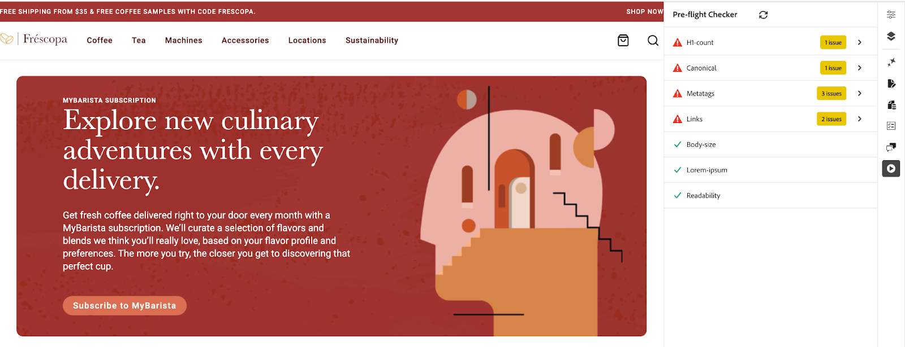

# プリフライトの機会

{align="center"}

AEM Sites Optimizer[ プリフライトの機会 ](../documentation/preflight/overview.md) は、運用開始前に、web ページがパフォーマンス、SEO、ユーザーエクスペリエンスに最適化されていることを確認するのに役立ちます。 リンクの破損、メタタグの欠落、アクセシビリティの問題などの潜在的な問題を特定することで、プリフライトチェックを使用して、コンテンツ作成者やマーケターが公開プロセスの早い段階でこれらの問題に対処できます。このプロアクティブなアプローチにより、最適でないコンテンツを公開するリスクを最小限に抑え、サイト品質を向上させ、デジタルプレゼンス全体を向上させます。プリフライトの機会を活用すると、ワークフローがスムーズになり、公開後の修正が減り、検索エンジンのランキングとユーザー満足度が向上します。

## 機会

<!-- CARDS

* ../documentation/preflight/accessibility.md
  {title=Accessibility}
  {image=../assets/common/card-puzzle.png}
* ../documentation/preflight/h1-count.md
  {title=H1 count}
  {image=../assets/common/card-link.png}
* ../documentation/preflight/links.md
  {title=Links}
  {image=../assets/common/card-link.png}
* ../documentation/preflight/meta-data.md
  {title=Metadata}
  {image=../assets/common/card-code.png}
* ../documentation/preflight/readability.md
  {title=Readability}
  {image=../assets/common/card-people.png}

-->
<!-- START CARDS HTML - DO NOT MODIFY BY HAND -->

    

        

            

                <figure class="image x-is-16by9">
                    
                </figure>
            

            

                

                    

                        <a href="../documentation/preflight/accessibility.md" target="_blank" rel="referrer" title="アクセシビリティ">アクセシビリティ</a>
                    

                    
Sites Optimizerでのプリフライトのアクセシビリティの機会について説明します。

                

                <a href="../documentation/preflight/accessibility.md" target="_blank" rel="referrer" class="spectrum-Button spectrum-Button--outline spectrum-Button--primary spectrum-Button--sizeM" style="align-self: flex-start; margin-top: 1rem;">
                    詳細情報
                </a>
            

        

    

    

        

            

                <figure class="image x-is-16by9">
                    
                </figure>
            

            

                

                    

                        <a href="../documentation/preflight/h1-count.md" target="_blank" rel="referrer" title="H1 カウント">H1 カウント</a>
                    

                    
Sites Optimizerでのプリフライトのアクセシビリティの機会について説明します。

                

                <a href="../documentation/preflight/h1-count.md" target="_blank" rel="referrer" class="spectrum-Button spectrum-Button--outline spectrum-Button--primary spectrum-Button--sizeM" style="align-self: flex-start; margin-top: 1rem;">
                    詳細情報
                </a>
            

        

    

    

        

            

                <figure class="image x-is-16by9">
                    
                </figure>
            

            

                

                    

                        <a href="../documentation/preflight/links.md" target="_blank" rel="referrer" title="リンク">リンク</a>
                    

                    
Sites Optimizerでのプレフライトリンクのオポチュニティについて説明します。

                

                <a href="../documentation/preflight/links.md" target="_blank" rel="referrer" class="spectrum-Button spectrum-Button--outline spectrum-Button--primary spectrum-Button--sizeM" style="align-self: flex-start; margin-top: 1rem;">
                    詳細情報
                </a>
            

        

    

    

        

            

                <figure class="image x-is-16by9">
                    
                </figure>
            

            

                

                    

                        <a href="../documentation/preflight/meta-data.md" target="_blank" rel="referrer" title="メタデータ">メタデータ</a>
                    

                    
Sites Optimizerでのプリフライトメタデータのオポチュニティについて説明します。

                

                <a href="../documentation/preflight/meta-data.md" target="_blank" rel="referrer" class="spectrum-Button spectrum-Button--outline spectrum-Button--primary spectrum-Button--sizeM" style="align-self: flex-start; margin-top: 1rem;">
                    詳細情報
                </a>
            

        

    

    

        

            

                <figure class="image x-is-16by9">
                    
                </figure>
            

            

                

                    

                        <a href="../documentation/preflight/readability.md" target="_blank" rel="referrer" title="読みやすさ"> 読みやすさ </a>
                    

                    
Sites Optimizerにおけるプリフライトのわかりやすさの機会について説明します。

                

                <a href="../documentation/preflight/readability.md" target="_blank" rel="referrer" class="spectrum-Button spectrum-Button--outline spectrum-Button--primary spectrum-Button--sizeM" style="align-self: flex-start; margin-top: 1rem;">
                    詳細情報
                </a>
            

        

    

<!-- END CARDS HTML - DO NOT MODIFY BY HAND -->
