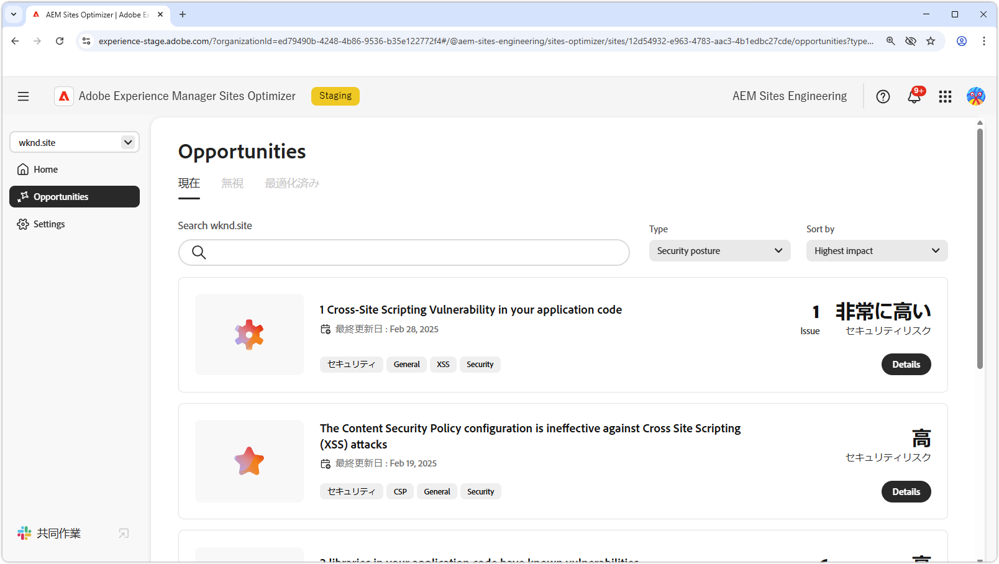

# セキュリティ態勢の機会

{align="center"}

AEM Sites Optimizer で強力なセキュリティ態勢を維持することは、デジタルエクスペリエンスとユーザーデータを保護する上で重要です。CORS 設定、クロスサイトスクリプティング、web サイト権限、web サイトの脆弱性などの改善の機会を特定することで、チームは潜在的なセキュリティリスクに積極的に対処し、ベストプラクティスへの準拠を確保できます。セキュリティ対策を強化すると、機密情報が保護されるだけでなく、ユーザーの信頼とサイトの信頼性も向上します。AEM Sites Optimizer のインサイトを使用することで、組織はセキュリティ態勢を継続的に監視および改善し、リスクを軽減して安全なデジタル環境を維持できます。

## 機会

<!-- CARDS

* ../documentation/opportunities/cors-configuration.md
  {title=CORS configuration}
  {image=../assets/common/card-code.png}
* ../documentation/opportunities/cross-site-scripting.md
  {title=Cross-site scripting}
  {image=../assets/common/card-gear.png}
* ../documentation/opportunities/website-permissions.md  
  {title=Website permissions}
  {image=../assets/common/card-people.png}
* ../documentation/opportunities//website-vulnerabilities.md
  {title=Website vulnerabilities}
  {image=../assets/common/card-puzzle.png}

-->
<!-- START CARDS HTML - DO NOT MODIFY BY HAND -->

    

        

            

                <figure class="image x-is-16by9">
                    
                </figure>
            

            

                

                    

                        <a href="../documentation/opportunities/cors-configuration.md" target="_blank" rel="referrer" title="CORS 設定">CORS 設定</a>
                    

                    
CORS 設定の機会と、サイトのセキュリティの脆弱性を特定して修正する方法について説明します。

                

                <a href="../documentation/opportunities/cors-configuration.md" target="_blank" rel="referrer" class="spectrum-Button spectrum-Button--outline spectrum-Button--primary spectrum-Button--sizeM" style="align-self: flex-start; margin-top: 1rem;">
                    詳細情報
                </a>
            

        

    

    

        

            

                <figure class="image x-is-16by9">
                    
                </figure>
            

            

                

                    

                        <a href="../documentation/opportunities/cross-site-scripting.md" target="_blank" rel="referrer" title="クロスサイトスクリプティング">クロスサイトスクリプティング</a>
                    

                    
クロスサイトスクリプティングの機会と、サイトのセキュリティの脆弱性を特定して修正する方法について説明します。

                

                <a href="../documentation/opportunities/cross-site-scripting.md" target="_blank" rel="referrer" class="spectrum-Button spectrum-Button--outline spectrum-Button--primary spectrum-Button--sizeM" style="align-self: flex-start; margin-top: 1rem;">
                    詳細情報
                </a>
            

        

    

    

        

            

                <figure class="image x-is-16by9">
                    
                </figure>
            

            

                

                    

                        <a href="../documentation/opportunities/website-permissions.md" target="_blank" rel="referrer" title="Web サイト権限">Web サイト権限</a>
                    

                    
Web サイト権限の機会と、これを使用して web サイトのセキュリティを強化する方法について説明します。

                

                <a href="../documentation/opportunities/website-permissions.md" target="_blank" rel="referrer" class="spectrum-Button spectrum-Button--outline spectrum-Button--primary spectrum-Button--sizeM" style="align-self: flex-start; margin-top: 1rem;">
                    詳細情報
                </a>
            

        

    

    

        

            

                <figure class="image x-is-16by9">
                    
                </figure>
            

            

                

                    

                        <a href="../documentation/opportunities//website-vulnerabilities.md" target="_blank" rel="referrer" title="Web サイトの脆弱性">Web サイトの脆弱性</a>
                    

                    
Web サイトの脆弱性の機会と、これを使用して web サイトのセキュリティを強化する方法について説明します。

                

                <a href="../documentation/opportunities//website-vulnerabilities.md" target="_blank" rel="referrer" class="spectrum-Button spectrum-Button--outline spectrum-Button--primary spectrum-Button--sizeM" style="align-self: flex-start; margin-top: 1rem;">
                    詳細情報
                </a>
            

        

    

<!-- END CARDS HTML - DO NOT MODIFY BY HAND -->

