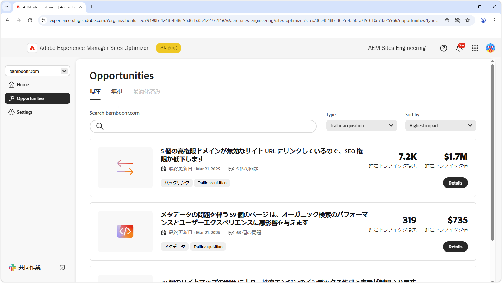

# トラフィック獲得の機会

{align="center"}

トラフィック獲得は、見込み客を web サイトに誘導し、販売やリードジェネレーションの機会を生み出すために不可欠です。 検索エンジン最適化（SEO）などの戦略を活用することで、企業は検索の可視性を向上させ、ユーザーがコンテンツを見つけやすくすることができます。 訪問者の絶え間ない流れは、ブランド認知度と信頼を高めるだけでなく、ユーザーの行動に関する貴重なインサイトを提供し、チームが提供する製品の改良と全体的なエクスペリエンスの向上を支援します。 AEM Sites Optimizerのインサイトを活用することで、継続的な最適化が可能になり、持続的な成長が確保され、時間の経過に伴うコンバージョン率の向上が得られます。

## 機会

<!-- CARDS
 
* ../documentation/opportunities/broken-backlinks.md
  {title=Broken backlinks}
  {image=../assets/common/card-arrows.png}
* ../documentation/opportunities/invalid-or-missing-metadata.md
  {title=Invalid or missing metadata}
  {image=../assets/common/card-code.png}
* ../documentation/opportunities/missing-invalid-structured-data.md
  {title=Missing or invalid structured data}
  {image=../assets/common/card-bag.png}
* ../documentation/opportunities/sitemap-issues.md
  {title=Sitemap issues}
  {image=../assets/common/card-relationship.png}

--->
<!-- START CARDS HTML - DO NOT MODIFY BY HAND -->

    

        

            

                <figure class="image x-is-16by9">
                    
                </figure>
            

            

                

                    

                        <a href="../documentation/opportunities/broken-backlinks.md" target="_blank" rel="referrer" title="破損したバックリンク"> 壊れたバックリンク </a>
                    

                    
壊れたバックリンクの機会と、それを使用してトラフィック獲得を改善する方法について説明します。

                

                <a href="../documentation/opportunities/broken-backlinks.md" target="_blank" rel="referrer" class="spectrum-Button spectrum-Button--outline spectrum-Button--primary spectrum-Button--sizeM" style="align-self: flex-start; margin-top: 1rem;">
                    詳細情報
                </a>
            

        

    

    

        

            

                <figure class="image x-is-16by9">
                    
                </figure>
            

            

                

                    

                        <a href="../documentation/opportunities/invalid-or-missing-metadata.md" target="_blank" rel="referrer" title="メタデータが無効または欠落しています"> メタデータが無効または見つかりません </a>
                    

                    
無効な、または見つからないメタデータのオポチュニティと、そのオポチュニティを使用してトラフィック獲得を改善する方法について説明します。

                

                <a href="../documentation/opportunities/invalid-or-missing-metadata.md" target="_blank" rel="referrer" class="spectrum-Button spectrum-Button--outline spectrum-Button--primary spectrum-Button--sizeM" style="align-self: flex-start; margin-top: 1rem;">
                    詳細情報
                </a>
            

        

    

    

        

            

                <figure class="image x-is-16by9">
                    
                </figure>
            

            

                

                    

                        <a href="../documentation/opportunities/missing-invalid-structured-data.md" target="_blank" rel="referrer" title="構造化データが欠落している、または無効です"> 構造化データがないか無効です </a>
                    

                    
見つからない構造化データのオポチュニティや無効な構造化データのオポチュニティについて、およびトラフィック獲得を向上させるために使用する方法について説明します。

                

                <a href="../documentation/opportunities/missing-invalid-structured-data.md" target="_blank" rel="referrer" class="spectrum-Button spectrum-Button--outline spectrum-Button--primary spectrum-Button--sizeM" style="align-self: flex-start; margin-top: 1rem;">
                    詳細情報
                </a>
            

        

    

    

        

            

                <figure class="image x-is-16by9">
                    
                </figure>
            

            

                

                    

                        <a href="../documentation/opportunities/sitemap-issues.md" target="_blank" rel="referrer" title="サイトマップの問題"> サイトマップの問題 </a>
                    

                    
サイトマップの問題の機会と、それを使用してトラフィック獲得を改善する方法について説明します。

                

                <a href="../documentation/opportunities/sitemap-issues.md" target="_blank" rel="referrer" class="spectrum-Button spectrum-Button--outline spectrum-Button--primary spectrum-Button--sizeM" style="align-self: flex-start; margin-top: 1rem;">
                    詳細情報
                </a>
            

        

    

<!-- END CARDS HTML - DO NOT MODIFY BY HAND -->
